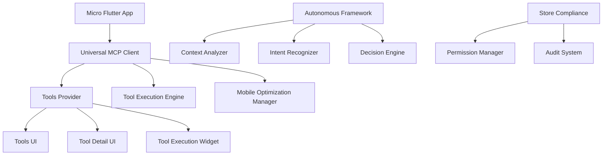
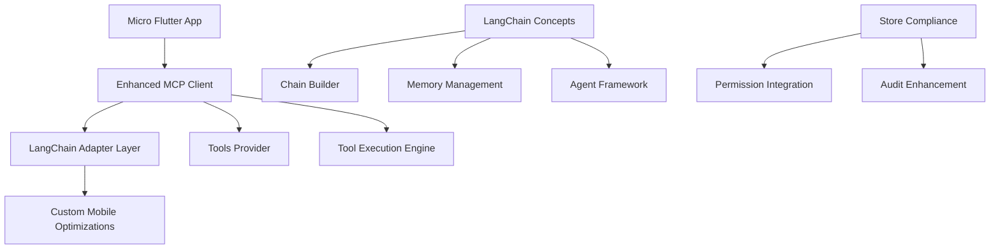

# Micro LangChain Integration Analysis

## Executive Summary

This document analyzes the feasibility and strategic approach for integrating LangChain concepts into Micro's existing MCP (Model Context Protocol) architecture. It evaluates the current custom implementation against LangChain patterns and provides recommendations for a hybrid approach.

## Current State Analysis

### Micro's Existing Architecture



### LangChain Ecosystem Status

| Component | LangChain Support | Status | Notes |
|-----------|----------------|--------|-------|
| Python | ✅ Full | Primary development platform |
| JavaScript/TypeScript | ✅ Full | Web and Node.js support |
| Java | ✅ Full | Enterprise support |
| Dart/Flutter | ❌ Limited | No official support |
| Go | ✅ Growing | Emerging support |
| Rust | ✅ Growing | Emerging support |

## LangChain Limitations in Dart/Flutter

### 1. **No Official Support**
- LangChain team has not released an official Dart/Flutter library
- Community implementations are fragmented and incomplete
- Limited documentation and examples for Flutter integration

### 2. **Package Ecosystem Gaps**
```yaml
# Missing LangChain packages in pubspec.yaml
dependencies:
  # No langchain_core
  # No langchain_community
  # No langchain_llm
  # No langchain_chains
  # No langchain_memory
  # No langchain_agents
```

### 3. **Mobile Optimization Challenges**
- LangChain libraries are primarily designed for server/desktop environments
- Limited mobile-specific optimizations:
  - Battery awareness
  - Memory constraints
  - Network condition adaptation
  - Offline capabilities

### 4. **Store Compliance Integration**
- LangChain doesn't address app store compliance requirements
- Missing:
  - Permission management
  - Privacy controls
  - Audit logging
  - Background execution limits

## Strategic Integration Options

### Option 1: Pure LangChain Migration (High Risk)

**Pros:**
- Standardized patterns and interfaces
- Community knowledge and support
- Rich ecosystem of integrations
- Regular updates and improvements

**Cons:**
- Loss of mobile optimizations
- Store compliance violations
- Large bundle size increase
- Significant development effort
- Potential performance degradation on mobile

### Option 2: Hybrid Approach (Recommended)

**Architecture:**


**Implementation Strategy:**

#### Phase 1: LangChain Adapter Layer
```dart
// LangChain adapter for Micro
class MicroLangChainAdapter {
  final LangChainLLM _llm;
  final LangChainMemory _memory;
  final LangChainChains _chains;
  
  // Bridge between LangChain and MCP
  Future<ToolResult> executeLangChainTool(
    LangChainTool langTool,
    Map<String, dynamic> inputs,
  ) async {
    // Convert LangChain tool to MCP tool call
    final mcpTool = _convertToMcpTool(langTool);
    
    // Apply mobile optimizations
    final optimizedTool = _applyMobileOptimizations(mcpTool);
    
    // Execute through MCP client
    return await _mcpClient.executeToolWithUniversalAdapter(optimizedTool);
  }
}
```

#### Phase 2: Selective LangChain Integration

**High-Value Components:**
1. **Chain Builder** - For complex multi-tool workflows
2. **Memory Management** - For context-aware conversations
3. **Agent Framework** - For autonomous decision making

**Low-Value Components:**
1. **LLM Integration** - Micro already has custom LLM handling
2. **Document Loaders** - Limited mobile benefit
3. **Tool Wrappers** - Micro already has comprehensive tool system

#### Phase 3: Mobile-First Enhancements

```dart
// Mobile-enhanced LangChain integration
class MobileOptimizedLangChain {
  final MobileOptimizationManager _mobileOptimizer;
  
  Future<ChainResult> executeChain(
    List<LangChainTool> tools,
    Map<String, dynamic> context,
  ) async {
    // Apply mobile constraints to chain execution
    final mobileConstraints = _getMobileConstraints(context);
    
    // Execute with battery and memory awareness
    return await _executeWithMobileOptimizations(tools, mobileConstraints);
  }
}
```

## Implementation Roadmap

### Phase 1: Foundation (2-3 weeks)
1. **Create LangChain Adapter Interface**
   - Define abstraction layer between LangChain and MCP
   - Implement core conversion utilities
   - Add mobile optimization hooks

2. **Implement Chain Builder**
   - Multi-tool workflow support
   - Dynamic chain construction
   - Context-aware chain selection

3. **Add Memory Management**
   - Conversation context persistence
   - Tool result caching
   - Mobile-optimized storage

### Phase 2: Integration (3-4 weeks)
1. **Integrate with Tools Provider**
   - Connect LangChain adapter to existing tools provider
   - Maintain backward compatibility
   - Add LangChain-specific state management

2. **Enhance Autonomous Framework**
   - LangChain-powered decision making
   - Improved intent recognition
   - Context-aware tool selection

3. **UI Components**
   - Chain visualization widgets
   - Step-by-step execution display
   - Mobile-optimized controls

### Phase 3: Optimization (2-3 weeks)
1. **Performance Tuning**
   - Bundle size optimization
   - Memory usage profiling
   - Battery efficiency testing

2. **Store Compliance**
   - Permission integration
   - Privacy policy enforcement
   - Audit trail enhancement

## Technical Considerations

### Bundle Size Impact
```yaml
# Estimated bundle size increase
langchain_core: +2.5MB
langchain_community: +1.8MB
langchain_chains: +1.2MB
langchain_memory: +800KB

# Total estimated increase: +6.3MB
```

### Performance Optimizations
```dart
// Mobile-aware LangChain execution
class MobileLangChainExecutor {
  static const int MAX_MEMORY_MB = 50;
  static const int MAX_CONCURRENT_CHAINS = 2;
  
  Future<ChainResult> executeWithConstraints(
    Chain chain,
    MobileContext context,
  ) async {
    // Check memory constraints
    if (_getMemoryUsage() > MAX_MEMORY_MB) {
      throw MobileConstraintException('Memory limit exceeded');
    }
    
    // Optimize for battery
    if (context.batteryLevel < 0.2) {
      return await _executeLowPowerMode(chain);
    }
    
    return await _executeNormalMode(chain);
  }
}
```

### Store Compliance Integration
```dart
// Store-compliant LangChain integration
class StoreCompliantLangChain {
  final PermissionsManager _permissions;
  final AuditLogger _audit;
  
  Future<void> executeChain(Chain chain) async {
    // Check permissions before execution
    final requiredPermissions = _getRequiredPermissions(chain);
    final hasPermissions = await _permissions.checkPermissions(requiredPermissions);
    
    if (!hasPermissions) {
      throw PermissionDeniedException('Required permissions not granted');
    }
    
    // Log for compliance
    _audit.logChainExecution(chain);
    
    return await _executeChain(chain);
  }
}
```

## Recommendations

### 1. **Adopt Hybrid Approach**
- Maintain existing MCP architecture for mobile optimizations
- Add LangChain adapter for complex workflows
- Preserve store compliance features
- Gradual migration to minimize risk

### 2. **Prioritize Mobile Features**
- Implement mobile-first LangChain patterns
- Focus on battery and memory optimization
- Maintain offline capabilities where possible

### 3. **Community Contribution**
- Contribute mobile optimizations back to LangChain
- Share Flutter-specific implementations
- Document mobile integration patterns

### 4. **Performance Monitoring**
- Track bundle size impact
- Monitor memory usage patterns
- Measure battery consumption
- Profile chain execution performance

## Risk Assessment

| Risk | Probability | Impact | Mitigation |
|--------|------------|-------|-----------|
| Bundle size increase | High | User experience | Implement tree-shaking, lazy loading |
| Performance regression | Medium | Functionality | A/B testing, gradual rollout |
| Store compliance issues | High | App rejection | Early compliance testing |
| Development complexity | High | Timeline | Incremental implementation, phased rollout |

## Conclusion

Micro should adopt a **hybrid approach** to LangChain integration:

1. **Preserve** the existing mobile-optimized MCP architecture
2. **Extend** with LangChain adapter for complex workflows
3. **Enhance** with mobile-aware LangChain patterns
4. **Maintain** store compliance throughout integration

This approach provides the best balance between innovation and stability while respecting Micro's mobile-first and privacy-focused design principles.

## Next Steps

1. **Evaluate** community LangChain Dart implementations
2. **Prototype** mobile-optimized LangChain adapter
3. **Test** bundle size and performance impact
4. **Plan** phased implementation roadmap
5. **Engage** with LangChain community for mobile contributions