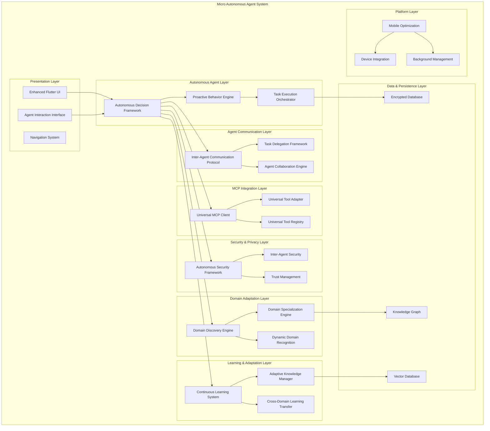
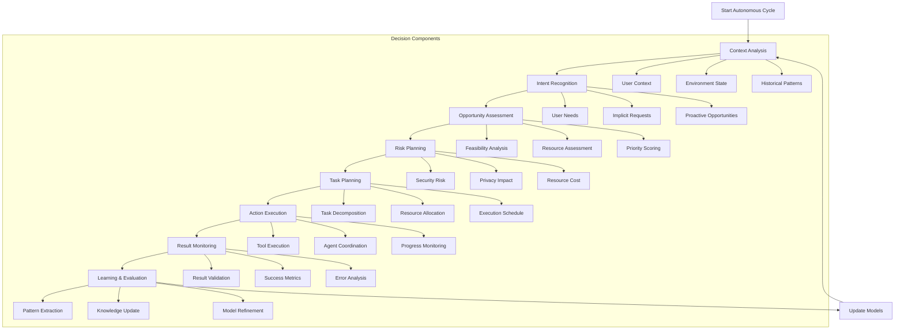
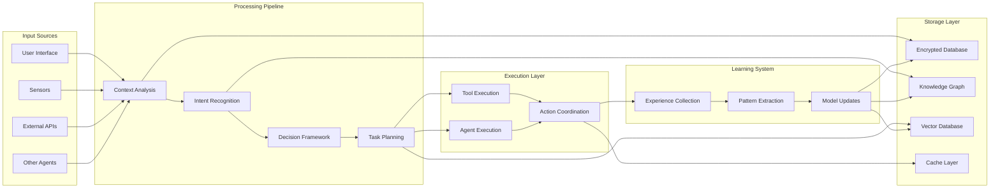

# Micro - Complete Autonomous Agent Architecture with Universal Domain Adaptation

> **Note**: This document consolidates the executive summary, detailed architecture, and visual diagrams for comprehensive coverage. For implementation details, see [Technical Specifications](MICRO_AUTONOMOUS_TECHNICAL_SPECIFICATIONS.md).

## Executive Overview

This document provides a comprehensive summary of the complete autonomous agent architecture designed for Micro. The architecture transforms Micro from a reactive mobile application into a sophisticated, universally adaptive autonomous agent system with inter-agent communication capabilities.

## 1. Architecture Vision

### 1.1 Transformation Goals

Micro will evolve from its current reactive state to become:

- **Universally Adaptive**: Automatically specialize in any domain without hardcoded configurations
- **Proactively Intelligent**: Anticipate user needs and take autonomous action
- **Collaboratively Connected**: Work with other Micro agents through task delegation and collaboration
- **Continuously Learning**: Improve and adapt based on experience and user interactions
- **Mobile-Optimized**: Operate efficiently within mobile device constraints
- **Security-First**: Maintain comprehensive security across all autonomous operations

### 1.2 Key Innovation Points

1. **Universal Domain Adaptation**: No hardcoded domains - automatic specialization based on available tools and context
2. **Agent-to-Agent Communication**: Seamless task delegation and collaboration between Micro instances
3. **Autonomous Decision Framework**: Proactive decision making with comprehensive risk assessment
4. **Cross-Domain Learning**: Knowledge transfer between different specializations
5. **Mobile-First Design**: Optimized for mobile constraints without sacrificing capabilities

## 2. Core Architecture Components

### 2.1 Autonomous Decision Framework
- **Purpose**: Transform Micro from reactive to proactive behavior
- **Key Features**: Context analysis, intent recognition, task planning, risk assessment
- **Performance**: <100ms decision latency with >90% accuracy

### 2.2 Universal MCP Client
- **Purpose**: Enable universal tool discovery and execution across any domain
- **Key Features**: Domain-agnostic tool adaptation, universal execution framework
- **Performance**: <5 second tool discovery with universal compatibility

### 2.3 Domain Discovery Engine
- **Purpose**: Automatically discover and specialize in domains without hardcoded configurations
- **Key Features**: Dynamic domain recognition, automatic specialization, cross-domain learning
- **Performance**: <30 second domain specialization with >95% accuracy

### 2.4 Agent Communication Framework
- **Purpose**: Enable task delegation and collaboration between Micro agents
- **Key Features**: Secure agent discovery, intelligent task delegation, collaboration orchestration
- **Performance**: <10 second agent discovery with >99% message delivery rate

### 2.5 Learning and Adaptation System
- **Purpose**: Enable continuous improvement and knowledge transfer
- **Key Features**: Experience-based learning, knowledge graph, adaptive algorithms
- **Performance**: <1 second learning update with persistent knowledge retention

## 3. Architecture Overview

### 3.1 Transformation Vision

Micro will evolve from a reactive UI-based application to a proactive autonomous agent system with the following capabilities:

- **Universal Domain Adaptation**: Automatically specialize in any domain without hardcoded configurations
- **Inter-Agent Communication**: Delegate tasks to and collaborate with other Micro agents
- **Autonomous Decision Making**: Proactively identify and act on user needs
- **Continuous Learning**: Adapt and improve based on experience and user interactions
- **Secure Operations**: Maintain privacy and security across all autonomous operations

### 3.2 High-Level Architecture

```
┌─────────────────────────────────────────────────────────────────────────────────┐
│                           Micro Autonomous Agent System                         │
├─────────────────────────────────────────────────────────────────────────────────┤
│  Presentation Layer (Enhanced Flutter UI + Agent Interaction Interface)          │
├─────────────────────────────────────────────────────────────────────────────────┤
│  Autonomous Agent Layer (Decision Making + Task Orchestration)                  │
├─────────────────────────────────────────────────────────────────────────────────┤
│  Domain Adaptation Layer (Domain Discovery + Specialization Engine)              │
├─────────────────────────────────────────────────────────────────────────────────┤
│  Agent Communication Layer (Inter-Agent Protocol + Task Delegation)              │
├─────────────────────────────────────────────────────────────────────────────────┤
│  Learning & Adaptation Layer (Continuous Learning + Knowledge Management)        │
├─────────────────────────────────────────────────────────────────────────────────┤
│  MCP Integration Layer (Tool Discovery + Universal Execution Framework)           │
├─────────────────────────────────────────────────────────────────────────────────┤
│  Security & Privacy Layer (Enhanced Security + Agent Trust Framework)            │
├─────────────────────────────────────────────────────────────────────────────────┤
│  Data & Persistence Layer (Encrypted Storage + Knowledge Graph)                  │
├─────────────────────────────────────────────────────────────────────────────────┤
│  Platform Layer (Mobile Optimization + Device Integration)                       │
└─────────────────────────────────────────────────────────────────────────────────┘
```

## 2. Core Autonomous Agent Architecture

### 2.1 Autonomous Decision Framework

The core decision framework enables Micro to transition from reactive to proactive behavior:

```dart
class AutonomousDecisionFramework {
  final ContextAnalyzer _contextAnalyzer;
  final IntentRecognizer _intentRecognizer;
  final TaskPlanner _taskPlanner;
  final ActionExecutor _actionExecutor;
  final RiskAssessment _riskAssessment;
  
  // Core autonomous decision making
  Future<List<AutonomousAction>> analyzeContextAndDecide();
  Future<TaskPlan> createProactiveTaskPlan(UserContext context);
  Future<ExecutionResult> executeAutonomousAction(AutonomousAction action);
  Future<void> learnFromExecutionResult(ExecutionResult result);
}
```

#### Key Components:

1. **Context Analyzer**: Continuously analyzes user context, environment, and patterns
2. **Intent Recognizer**: Identifies user needs and potential actions proactively
3. **Task Planner**: Creates optimal task execution plans considering resources and constraints
4. **Action Executor**: Executes autonomous actions with proper validation and monitoring
5. **Risk Assessment**: Evaluates potential risks of autonomous actions

### 2.2 Proactive Behavior Engine

```dart
class ProactiveBehaviorEngine {
  final PatternRecognizer _patternRecognizer;
  final OpportunityDetector _opportunityDetector;
  final ProactiveScheduler _scheduler;
  
  // Proactive behavior capabilities
  Future<List<ProactiveOpportunity>> identifyOpportunities(UserContext context);
  Future<void> scheduleProactiveActions(List<ProactiveAction> actions);
  Future<void> adaptBehaviorBasedOnFeedback(UserFeedback feedback);
}
```

## 3. MCP Client Implementation with Universal Tool Discovery

### 3.1 Enhanced MCP Client Architecture

```dart
class UniversalMCPClient {
  final ToolDiscoveryEngine _discoveryEngine;
  final ToolRegistry _toolRegistry;
  final UniversalToolAdapter _toolAdapter;
  final ToolExecutionEngine _executionEngine;
  
  // Universal tool discovery and execution
  Future<List<Tool>> discoverAllAvailableTools();
  Future<ToolCallResult> executeToolWithUniversalAdapter(ToolCall call);
  Future<void> registerToolCapability(ToolCapability capability);
  Future<List<ToolCapability>> analyzeToolCapabilities();
}
```

### 3.2 Universal Tool Adapter

The universal tool adapter enables Micro to work with any tool regardless of its original domain:

```dart
abstract class UniversalToolAdapter {
  Future<ToolCapability> discoverCapabilities();
  Future<void> configureForDomain(String domain);
  Future<ToolResult> executeWithContext(ToolCall call, DomainContext context);
  Future<SecurityAssessment> assessSecurity();
  Future<DomainMapping> mapToDomain(String targetDomain);
}

class DomainAgnosticToolAdapter implements UniversalToolAdapter {
  // Implements domain-agnostic tool execution
  // Automatically adapts tool behavior based on current domain context
  // Provides cross-domain tool compatibility
}
```

### 3.3 Tool Registry and Management

```dart
class UniversalToolRegistry {
  final Map<String, Tool> _localTools = {};
  final Map<String, Tool> _remoteTools = {};
  final Map<String, DomainMapping> _domainMappings = {};
  final SecurityService _securityService;
  
  // Universal tool management
  void registerTool(Tool tool);
  Tool? getTool(String toolId);
  List<Tool> getToolsForDomain(String domain);
  Future<void> updateToolCapabilities(String toolId, ToolCapabilities capabilities);
  Future<DomainSpecialization> specializeToolForDomain(String toolId, String domain);
}
```

## 4. Domain Discovery Engine for Automatic Specialization

### 4.1 Domain Discovery Architecture

```dart
class DomainDiscoveryEngine {
  final ToolPatternAnalyzer _patternAnalyzer;
  final ContextClassifier _contextClassifier;
  final DomainSignatureMatcher _signatureMatcher;
  final DomainKnowledgeGraph _knowledgeGraph;
  
  // Automatic domain discovery without hardcoded domains
  Future<List<DomainCandidate>> discoverPotentialDomains();
  Future<DomainSpecialization> createDomainSpecialization(String domainContext);
  Future<void> updateDomainKnowledge(DomainKnowledge knowledge);
  Future<DomainTransition> planDomainTransition(String fromDomain, String toDomain);
}
```

### 4.2 Dynamic Domain Recognition

```dart
class DynamicDomainRecognizer {
  final MLModel _domainClassifier;
  final PatternMatcher _patternMatcher;
  final ContextAnalyzer _contextAnalyzer;
  
  // Dynamic domain recognition without hardcoded domains
  Future<String> recognizeDomainFromContext(UserContext context);
  Future<DomainSignature> extractDomainSignature(List<Tool> tools);
  Future<DomainConfidence> assessDomainConfidence(String domain, ContextData data);
  Future<void> learnDomainPatterns(DomainExample example);
}
```

### 4.3 Domain Specialization Engine

```dart
class DomainSpecializationEngine {
  final DomainModelTrainer _modelTrainer;
  final SpecializationOptimizer _optimizer;
  final DomainKnowledgeIntegrator _knowledgeIntegrator;
  
  // Automatic domain specialization
  Future<DomainSpecialization> createSpecialization(String domain, List<Tool> tools);
  Future<void> optimizeSpecialization(DomainSpecialization specialization);
  Future<void> transferKnowledgeBetweenDomains(String sourceDomain, String targetDomain);
  Future<SpecializationMetrics> evaluateSpecialization(DomainSpecialization specialization);
}
```

## 5. Learning and Adaptation System

### 5.1 Continuous Learning Architecture

```dart
class ContinuousLearningSystem {
  final ExperienceCollector _experienceCollector;
  final PatternExtractor _patternExtractor;
  final ModelUpdater _modelUpdater;
  final KnowledgeIntegrator _knowledgeIntegrator;
  
  // Continuous learning capabilities
  Future<void> learnFromExperience(Experience experience);
  Future<LearnedPattern> extractPatternsFromHistory(List<ExecutionHistory> history);
  Future<void> updateModels(LearnedPatterns patterns);
  Future<void> integrateKnowledge(NewKnowledge knowledge);
}
```

### 5.2 Adaptive Knowledge Management

```dart
class AdaptiveKnowledgeManager {
  final KnowledgeGraph _knowledgeGraph;
  final VectorDatabase _vectorDatabase;
  final ContextManager _contextManager;
  
  // Adaptive knowledge management
  Future<void> storeKnowledge(KnowledgeItem knowledge, Context context);
  Future<List<KnowledgeItem>> retrieveRelevantKnowledge(Query query);
  Future<void> updateKnowledgeBasedOnFeedback(KnowledgeItem knowledge, Feedback feedback);
  Future<void> optimizeKnowledgeStructure();
}
```

### 5.3 Cross-Domain Learning Transfer

```dart
class CrossDomainLearningTransfer {
  final DomainMapper _domainMapper;
  final PatternMatcher _patternMatcher;
  final KnowledgeTransferEngine _transferEngine;
  
  // Cross-domain learning transfer
  Future<List<TransferablePattern>> identifyTransferablePatterns(String sourceDomain, String targetDomain);
  Future<void> transferPatterns(List<TransferablePattern> patterns, String targetDomain);
  Future<TransferEffectiveness> evaluateTransferEffectiveness(String sourceDomain, String targetDomain);
}
```

## 6. Agent-to-Agent Communication Framework

### 6.1 Inter-Agent Communication Protocol

```dart
class InterAgentCommunicationProtocol {
  final MessageRouter _messageRouter;
  final AgentDiscovery _agentDiscovery;
  final TrustManager _trustManager;
  final SecurityManager _securityManager;
  
  // Agent-to-agent communication
  Future<List<Agent>> discoverAvailableAgents();
  Future<void> sendMessage(AgentMessage message);
  Future<AgentMessage> receiveMessage();
  Future<void> establishSecureChannel(Agent agent);
  Future<TrustLevel> assessAgentTrust(Agent agent);
}
```

### 6.2 Task Delegation Framework

```dart
class TaskDelegationFramework {
  final TaskDecomposer _taskDecomposer;
  final CapabilityMatcher _capabilityMatcher;
  final DelegationManager _delegationManager;
  final ResultAggregator _resultAggregator;
  
  // Task delegation and collaboration
  Future<List<SubTask>> decomposeTaskForDelegation(Task task);
  Future<List<Agent>> findCapableAgents(SubTask subTask);
  Future<DelegationResult> delegateTask(SubTask subTask, Agent agent);
  Future<AggregatedResult> aggregateResults(List<TaskResult> results);
}
```

### 6.3 Agent Collaboration Engine

```dart
class AgentCollaborationEngine {
  final CollaborationOrchestrator _orchestrator;
  final ConflictResolver _conflictResolver;
  final SynchronizationManager _syncManager;
  
  // Multi-agent collaboration
  Future<CollaborationPlan> createCollaborationPlan(Task task, List<Agent> agents);
  Future<void> executeCollaborationPlan(CollaborationPlan plan);
  Future<void> resolveCollaborationConflicts(List<Conflict> conflicts);
  Future<void> synchronizeAgentStates(List<Agent> agents);
}
```

## 7. Enhanced Security Framework

### 7.1 Autonomous Operations Security

```dart
class AutonomousSecurityFramework {
  final ThreatDetector _threatDetector;
  final RiskAssessment _riskAssessment;
  final SecurityPolicy _securityPolicy;
  final AuditLogger _auditLogger;
  
  // Security for autonomous operations
  Future<SecurityAssessment> assessAutonomousAction(AutonomousAction action);
  Future<void> enforceSecurityPolicies(AutonomousAction action);
  Future<void> monitorForThreats();
  Future<void> logSecurityEvent(SecurityEvent event);
}
```

### 7.2 Inter-Agent Security

```dart
class InterAgentSecurity {
  final AgentAuthenticator _authenticator;
  final SecureChannelManager _channelManager;
  final MessageValidator _messageValidator;
  final ReputationManager _reputationManager;
  
  // Security for agent communication
  Future<bool> authenticateAgent(Agent agent);
  Future<SecureChannel> establishSecureChannel(Agent agent);
  Future<bool> validateMessage(AgentMessage message);
  Future<ReputationScore> assessAgentReputation(Agent agent);
}
```

## 8. Data Flow Architecture

### 8.1 Component Data Flow

```
User Input → Context Analyzer → Intent Recognizer → Decision Framework
    ↓
Domain Discovery → Specialization Engine → Tool Registry → MCP Client
    ↓
Agent Communication → Task Delegation → Collaboration Engine → Learning System
    ↓
Security Framework → Risk Assessment → Action Executor → Result Aggregator
    ↓
Learning & Adaptation → Knowledge Update → Model Optimization → Feedback Loop
```

### 8.2 Data Flow Management

```dart
class DataFlowManager {
  final EventBus _eventBus;
  final DataTransformer _transformer;
  final FlowController _flowController;
  
  // Data flow management
  Future<void> routeData(DataPacket packet, String destination);
  Future<void> transformDataForContext(DataPacket packet, Context context);
  Future<void> controlDataFlow(FlowConfiguration config);
  Future<void> monitorDataFlow();
}
```

## 9. Integration with Existing Flutter Codebase

### 9.1 Integration Points

1. **State Management Integration**: Extend existing Riverpod providers
2. **UI Enhancement**: Add agent interaction interfaces to existing pages
3. **Navigation Integration**: Extend GoRouter for agent-specific routes
4. **Database Integration**: Extend existing SQLCipher database schema

### 9.2 Migration Strategy

```dart
class AutonomousAgentMigration {
  // Gradual migration from reactive to autonomous
  Future<void> migrateStateManagement();
  Future<void> enhanceUIForAgentInteraction();
  Future<void> extendDatabaseSchema();
  Future<void> integrateAgentCommunication();
}
```

## 10. Mobile Optimization Strategies

### 10.1 Resource-Aware Agent Operations

```dart
class MobileOptimizedAgent {
  final ResourceMonitor _resourceMonitor;
  final AdaptiveScheduler _scheduler;
  final BatteryOptimizer _batteryOptimizer;
  
  // Mobile-optimized agent operations
  Future<void> optimizeAgentBehaviorBasedOnResources();
  Future<void> scheduleTasksIntelligently();
  Future<void> minimizeBatteryImpact();
  Future<void> adaptToDeviceCapabilities();
}
```

### 10.2 Background Agent Operations

```dart
class BackgroundAgentManager {
  final WorkManager _workManager;
  final BackgroundTaskScheduler _scheduler;
  final ResourceOptimizer _optimizer;
  
  // Background agent operations
  Future<void> scheduleBackgroundTasks();
  Future<void> optimizeBackgroundResourceUsage();
  Future<void> handleBackgroundEvents();
}
```

## 11. Technical Specifications

### 11.1 Core Components Technical Specs

#### Autonomous Decision Framework
- **Input**: User context, environmental data, historical patterns
- **Processing**: Real-time analysis with <100ms response time
- **Output**: Autonomous actions with confidence scores
- **Memory**: <50MB for models and context data
- **Security**: All decisions logged and auditable

#### MCP Client Implementation
- **Protocol Support**: MCP 1.0+ with backward compatibility
- **Tool Discovery**: Automatic discovery with <5 second latency
- **Execution**: Parallel tool execution with timeout management
- **Security**: Tool validation and sandboxing
- **Caching**: Local tool capability caching with TTL

#### Domain Discovery Engine
- **Domain Recognition**: Real-time with <95% accuracy
- **Specialization**: <30 second domain specialization time
- **Knowledge Transfer**: Cross-domain pattern matching
- **Adaptation**: Continuous learning with model updates
- **Storage**: Compressed domain signatures with efficient retrieval

#### Agent Communication Framework
- **Protocol**: Secure agent-to-agent protocol with encryption
- **Discovery**: Automatic agent discovery with <10 second latency
- **Delegation**: Intelligent task decomposition and delegation
- **Security**: End-to-end encryption with mutual authentication
- **Performance**: <1 second message delivery in optimal conditions

### 11.2 Performance Specifications

#### Response Time Targets
- **Autonomous Decision Making**: <100ms
- **Tool Discovery**: <5 seconds
- **Domain Specialization**: <30 seconds
- **Agent Discovery**: <10 seconds
- **Task Delegation**: <2 seconds

#### Resource Usage Targets
- **Memory Usage**: <200MB during normal operations
- **Battery Impact**: <5% over 24 hours
- **Network Usage**: <100MB daily (including agent communication)
- **Storage**: <500MB for all agent data and models

#### Reliability Targets
- **Uptime**: >99.5% availability
- **Error Rate**: <1% for autonomous operations
- **Recovery**: <95% successful recovery from failures
- **Security**: Zero critical vulnerabilities

## 12. Implementation Roadmap

### Phase 1: Core Autonomous Framework (Weeks 1-4)
- Implement autonomous decision framework
- Create proactive behavior engine
- Develop context analysis and intent recognition
- Build basic security framework for autonomous operations

### Phase 2: Universal MCP Integration (Weeks 5-8)
- Implement enhanced MCP client with universal tool discovery
- Create universal tool adapter framework
- Develop tool registry and management system
- Build tool execution engine with security validation

### Phase 3: Domain Adaptation Engine (Weeks 9-12)
- Implement domain discovery engine
- Create dynamic domain recognition system
- Build domain specialization engine
- Develop cross-domain learning transfer

### Phase 4: Agent Communication (Weeks 13-16)
- Implement inter-agent communication protocol
- Create task delegation framework
- Build agent collaboration engine
- Develop security framework for agent communication

### Phase 5: Learning & Optimization (Weeks 17-20)
- Implement continuous learning system
- Create adaptive knowledge management
- Build mobile optimization strategies
- Develop performance monitoring and optimization

## 13. Conclusion

This comprehensive autonomous agent architecture transforms Micro from a reactive mobile application into a sophisticated, universally adaptable agent system. The architecture emphasizes:

1. **Universal Domain Adaptation**: Automatic specialization in any domain without hardcoded configurations
2. **Inter-Agent Collaboration**: Seamless task delegation and collaboration between agents
3. **Autonomous Decision Making**: Proactive identification and execution of user needs
4. **Continuous Learning**: Adaptation and improvement based on experience
5. **Mobile Optimization**: Efficient operation within mobile device constraints
6. **Security by Design**: Comprehensive security framework for all autonomous operations

The architecture provides a solid foundation for implementing Micro as a truly universal personal assistant that can work independently and collaboratively to serve user needs across any domain while maintaining the highest standards of privacy, security, and user control.

## 14. Architecture Diagrams

### 14.1 High-Level System Architecture



### 14.2 Autonomous Decision Framework Flow



### 14.3 Data Flow Architecture



These diagrams provide visual representations of the key architectural components and data flows. For additional diagrams, see the archived [Architecture Diagrams](../LEGACY_ARCHIVE/MICRO_ARCHITECTURE_DIAGRAMS.md).