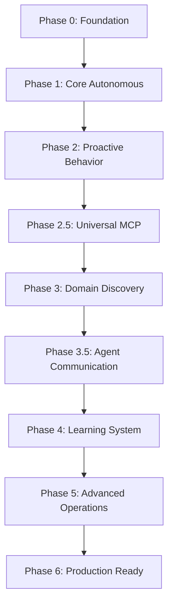

# Micro - Migration Strategy: From Reactive to Autonomous

## Executive Overview

This document outlines a comprehensive migration strategy for transforming Micro from its current reactive UI-based application into a fully autonomous general-purpose agent. The strategy ensures a smooth transition while maintaining existing functionality and user experience.

## Current State Analysis

### Existing Architecture
```
┌─────────────────────────────────────────────────────────────────┐
│                    Current Micro Architecture                    │
├─────────────────────────────────────────────────────────────────┤
│  Presentation Layer (Flutter UI + Riverpod State Management)    │
├─────────────────────────────────────────────────────────────────┤
│  Navigation Layer (GoRouter + Route Management)                 │
├─────────────────────────────────────────────────────────────────┤
│  Configuration Layer (App Config + Constants)                   │
├─────────────────────────────────────────────────────────────────┤
│  Basic Utility Layer (Logger + Exceptions)                      │
├─────────────────────────────────────────────────────────────────┤
│  Empty Infrastructure Layer (Most Components Unimplemented)      │
└─────────────────────────────────────────────────────────────────┘
```

### Current Components Status
- **UI Layer**: ✅ Fully implemented with Material Design 3
- **State Management**: ✅ Riverpod providers implemented
- **Navigation**: ✅ GoRouter with all routes configured
- **Database**: ❌ Structure exists but no implementation
- **MCP Client**: ❌ Not implemented
- **Security**: ❌ Basic dependencies only
- **Autonomous Features**: ❌ None implemented

## Target Autonomous Architecture

```
┌─────────────────────────────────────────────────────────────────────────────────┐
│                         Target Autonomous Architecture                           │
├─────────────────────────────────────────────────────────────────────────────────┤
│  Presentation Layer (Enhanced Flutter UI + Agent Interaction Interface)          │
├─────────────────────────────────────────────────────────────────────────────────┤
│  Autonomous Agent Layer (Decision Making + Task Orchestration)                  │
├─────────────────────────────────────────────────────────────────────────────────┤
│  Domain Adaptation Layer (Domain Discovery + Specialization Engine)              │
├─────────────────────────────────────────────────────────────────────────────────┤
│  Agent Communication Layer (Inter-Agent Protocol + Task Delegation)              │
├─────────────────────────────────────────────────────────────────────────────────┤
│  Learning & Adaptation Layer (Continuous Learning + Knowledge Management)        │
├─────────────────────────────────────────────────────────────────────────────────┤
│  MCP Integration Layer (Tool Discovery + Universal Execution Framework)           │
├─────────────────────────────────────────────────────────────────────────────────┤
│  Security & Privacy Layer (Enhanced Security + Agent Trust Framework)            │
├─────────────────────────────────────────────────────────────────────────────────┤
│  Data & Persistence Layer (Encrypted Storage + Knowledge Graph)                  │
├─────────────────────────────────────────────────────────────────────────────────┤
│  Platform Layer (Mobile Optimization + Device Integration)                       │
└─────────────────────────────────────────────────────────────────────────────────┘
```

## Migration Strategy Overview

### Migration Principles
1. **Incremental Transformation**: Gradual evolution from reactive to autonomous
2. **Backward Compatibility**: Maintain existing UI functionality throughout migration
3. **Feature Flagging**: Enable autonomous features progressively
4. **User Control**: Allow users to opt-in/out of autonomous features
5. **Performance Preservation**: Ensure migration doesn't impact app performance

### Migration Phases


## Detailed Migration Plan

### Phase 0: Autonomous Foundation (Week 0)
**Objective**: Establish foundation for autonomous transformation

#### Migration Tasks
1. **Architecture Preparation**
   ```dart
   // Create new autonomous layer structure
   lib/
   ├── autonomous/
   │   ├── decision_framework/
   │   ├── proactive_behavior/
   │   ├── context_analysis/
   │   └── security_framework/
   ├── domain_adaptation/
   ├── agent_communication/
   ├── learning_system/
   └── mcp_integration/
   ```

2. **State Management Extension**
   ```dart
   // Extend existing Riverpod providers
   final autonomousStateProvider = StateNotifierProvider<AutonomousNotifier, AutonomousState>((ref) {
     return AutonomousNotifier();
   });
   
   class AutonomousNotifier extends StateNotifier<AutonomousState> {
     AutonomousNotifier() : super(AutonomousState.disabled());
     
     Future<void> enableAutonomousFeatures() async {
       state = AutonomousState.enabling();
       // Initialize autonomous components
       state = AutonomousState.enabled();
     }
   }
   ```

3. **Feature Flag Implementation**
   ```dart
   class AutonomousFeatureFlags {
     static const String autonomousDecisions = 'autonomous_decisions';
     static const String proactiveBehavior = 'proactive_behavior';
     static const String domainAdaptation = 'domain_adaptation';
     static const String agentCommunication = 'agent_communication';
     static const String continuousLearning = 'continuous_learning';
   }
   ```

#### Integration Points
- Extend existing `app_providers.dart` with autonomous state providers
- Add autonomous settings to existing settings page
- Create autonomous status indicators for existing UI

---

### Phase 1: Core Autonomous Framework (Weeks 1-4)
**Objective**: Implement basic autonomous decision-making capabilities

#### Migration Tasks
1. **Context Analyzer Integration**
   ```dart
   // Integrate with existing UI state
   class EnhancedAppStateNotifier extends AppStateNotifier {
     final ContextAnalyzer _contextAnalyzer;
     
     @override
     Future<void> _initializeApp() async {
       // Existing initialization
       await super._initializeApp();
       
       // Add autonomous context analysis
       await _contextAnalyzer.initialize();
       _startContinuousContextAnalysis();
     }
     
     void _startContinuousContextAnalysis() {
       Timer.periodic(Duration(seconds: 30), (timer) async {
         final context = await _contextAnalyzer.analyzeUserContext();
         state = state.copyWith(currentContext: context);
       });
     }
   }
   ```

2. **Autonomous Decision Framework**
   ```dart
   // Add to existing home page
   class HomePage extends ConsumerWidget {
     @override
     Widget build(BuildContext context, WidgetRef ref) {
       final autonomousState = ref.watch(autonomousStateProvider);
       final suggestions = ref.watch(autonomousSuggestionsProvider);
       
       return Scaffold(
         body: Column(
           children: [
             // Existing UI components
             _buildExistingUI(context, ref),
             
             // Add autonomous suggestions
             if (autonomousState.isEnabled && suggestions.isNotEmpty)
               _buildAutonomousSuggestions(context, ref, suggestions),
           ],
         ),
       );
     }
   }
   ```

3. **Basic Security Integration**
   ```dart
   // Extend existing authentication
   class EnhancedAuthNotifier extends AuthNotifier {
     final AutonomousSecurityFramework _securityFramework;
     
     @override
     Future<void> login(String token) async {
       // Existing login logic
       await super.login(token);
       
       // Initialize autonomous security
       await _securityFramework.initialize();
     }
   }
   ```

#### UI Migration Steps
1. Add autonomous status indicator to existing app bar
2. Create autonomous suggestions section in home page
3. Add autonomous settings to existing settings page
4. Implement autonomous action confirmation dialogs

---

### Phase 2: Proactive Behavior (Weeks 5-8)
**Objective**: Add proactive capabilities to existing reactive UI

#### Migration Tasks
1. **Proactive Behavior Engine**
   ```dart
   // Enhance existing workflow system
   class EnhancedWorkflowNotifier extends WorkflowNotifier {
     final ProactiveBehaviorEngine _proactiveEngine;
     
     @override
     Future<void> loadWorkflows() async {
       // Load existing workflows
       await super.loadWorkflows();
       
       // Generate proactive workflow suggestions
       final suggestions = await _proactiveEngine.generateProactiveWorkflows();
       state = state.copyWith(proactiveSuggestions: suggestions);
     }
   }
   ```

2. **Context-Aware UI Adaptation**
   ```dart
   // Make existing UI context-aware
   class ContextAwareHomePage extends ConsumerWidget {
     @override
     Widget build(BuildContext context, WidgetRef ref) {
       final context = ref.watch(userContextProvider);
       
       return Scaffold(
         body: _buildAdaptiveUI(context, ref),
       );
     }
     
     Widget _buildAdaptiveUI(UserContext context, WidgetRef ref) {
       // Adapt UI based on context
       switch (context.timeOfDay) {
         case TimeOfDay.morning:
           return _buildMorningLayout(ref);
         case TimeOfDay.evening:
           return _buildEveningLayout(ref);
         default:
           return _buildDefaultLayout(ref);
       }
     }
   }
   ```

3. **Predictive Action Suggestions**
   ```dart
   // Add to existing chat interface
   class EnhancedChatPage extends ConsumerWidget {
     @override
     Widget build(BuildContext context, WidgetRef ref) {
       final predictions = ref.watch(actionPredictionsProvider);
       
       return Scaffold(
         body: Column(
           children: [
             // Existing chat interface
             _buildChatInterface(context, ref),
             
             // Add predictive suggestions
             if (predictions.isNotEmpty)
               _buildPredictiveSuggestions(context, ref, predictions),
           ],
         ),
       );
     }
   }
   ```

#### UI Migration Steps
1. Make existing home page context-aware
2. Add proactive suggestions to existing chat interface
3. Implement predictive action recommendations
4. Create time-based UI adaptations

---

### Phase 2.5: Universal MCP Client (Weeks 9-10)
**Objective**: Integrate universal tool capabilities with existing UI

#### Migration Tasks
1. **Tool Discovery Integration**
   ```dart
   // Enhance existing tools page
   class EnhancedToolsPage extends ConsumerWidget {
     @override
     Widget build(BuildContext context, WidgetRef ref) {
       final discoveredTools = ref.watch(discoveredToolsProvider);
       final universalTools = ref.watch(universalToolsProvider);
       
       return Scaffold(
         body: Column(
           children: [
             // Existing tools interface
             _buildExistingTools(context, ref),
             
             // Add discovered tools section
             _buildDiscoveredTools(context, ref, discoveredTools),
             
             // Add universal tools section
             _buildUniversalTools(context, ref, universalTools),
           ],
         ),
       );
     }
   }
   ```

2. **Universal Tool Execution**
   ```dart
   // Integrate with existing workflow execution
   class EnhancedWorkflowExecutor {
     final UniversalMCPClient _mcpClient;
     
     Future<void> executeWorkflow(Workflow workflow) async {
       // Existing workflow execution
       await _executeExistingSteps(workflow);
       
       // Add universal tool execution
       await _executeUniversalToolSteps(workflow);
     }
   }
   ```

#### UI Migration Steps
1. Add discovered tools section to existing tools page
2. Create universal tool configuration interface
3. Integrate tool execution with existing workflow system
4. Add tool capability visualization

---

### Phase 3: Domain Discovery (Weeks 11-14)
**Objective**: Add domain adaptation capabilities to existing system

#### Migration Tasks
1. **Domain Discovery Integration**
   ```dart
   // Add to existing app state
   class EnhancedAppStateNotifier extends AppStateNotifier {
     final DomainDiscoveryEngine _domainEngine;
     
     @override
     Future<void> _initializeApp() async {
       await super._initializeApp();
       
       // Initialize domain discovery
       await _domainEngine.initialize();
       _startDomainMonitoring();
     }
     
     void _startDomainMonitoring() {
       Timer.periodic(Duration(hours: 1), (timer) async {
         final currentDomain = await _domainEngine.recognizeCurrentDomain();
         state = state.copyWith(currentDomain: currentDomain);
       });
     }
   }
   ```

2. **Domain-Specific UI Adaptation**
   ```dart
   // Make existing UI domain-aware
   class DomainAwareDashboard extends ConsumerWidget {
     @override
     Widget build(BuildContext context, WidgetRef ref) {
       final currentDomain = ref.watch(currentDomainProvider);
       
       return Scaffold(
         body: _buildDomainSpecificUI(currentDomain, ref),
       );
     }
     
     Widget _buildDomainSpecificUI(String domain, WidgetRef ref) {
       switch (domain) {
         case 'productivity':
           return _buildProductivityDashboard(ref);
         case 'communication':
           return _buildCommunicationDashboard(ref);
         case 'assistance':
           return _buildAssistanceDashboard(ref);
         default:
           return _buildGeneralDashboard(ref);
       }
     }
   }
   ```

#### UI Migration Steps
1. Add domain status indicator to existing UI
2. Create domain-specific dashboard layouts
3. Implement domain-based tool recommendations
4. Add domain transition animations

---

### Phase 3.5: Agent Communication (Weeks 15-16)
**Objective**: Add agent collaboration capabilities to existing system

#### Migration Tasks
1. **Agent Discovery Integration**
   ```dart
   // Add to existing settings
   class EnhancedSettingsPage extends ConsumerWidget {
     @override
     Widget build(BuildContext context, WidgetRef ref) {
       final availableAgents = ref.watch(availableAgentsProvider);
       
       return Scaffold(
         body: ListView(
           children: [
             // Existing settings
             _buildExistingSettings(context, ref),
             
             // Add agent management section
             _buildAgentManagement(context, ref, availableAgents),
           ],
         ),
       );
     }
   }
   ```

2. **Task Delegation UI**
   ```dart
   // Add to existing workflow interface
   class EnhancedWorkflowInterface {
     Widget buildWorkflowOptions(Workflow workflow) {
       return Column(
         children: [
           // Existing workflow options
           _buildExistingOptions(workflow),
           
           // Add delegation option
           _buildDelegationOption(workflow),
         ],
       );
     }
   }
   ```

#### UI Migration Steps
1. Add agent discovery to existing settings
2. Create agent management interface
3. Add task delegation options to existing workflows
4. Implement agent collaboration visualization

---

### Phase 4: Learning and Adaptation (Weeks 17-20)
**Objective**: Add continuous learning capabilities to existing system

#### Migration Tasks
1. **Learning System Integration**
   ```dart
   // Add to existing app initialization
   class EnhancedAppInitialization {
     Future<void> initializeApp() async {
       // Existing initialization
       await _initializeExistingComponents();
       
       // Initialize learning system
       await _learningSystem.initialize();
       _startContinuousLearning();
     }
     
     void _startContinuousLearning() {
       Timer.periodic(Duration(hours: 6), (timer) async {
         await _learningSystem.performLearningCycle();
       });
     }
   }
   ```

2. **Adaptive UI Components**
   ```dart
   // Make existing UI adaptive
   class AdaptiveUIComponent extends ConsumerWidget {
     @override
     Widget build(BuildContext context, WidgetRef ref) {
       final userPreferences = ref.watch(learnedPreferencesProvider);
       
       return _buildPersonalizedUI(userPreferences, ref);
     }
   }
   ```

#### UI Migration Steps
1. Add learning status to existing UI
2. Create preference learning interface
3. Implement adaptive UI components
4. Add learning progress visualization

---

### Phase 5: Advanced Autonomous Operations (Weeks 21-22)
**Objective**: Add advanced autonomous capabilities to existing system

#### Migration Tasks
1. **Advanced Decision Making**
   ```dart
   // Enhance existing decision system
   class AdvancedDecisionSystem {
     Future<void> makeAutonomousDecisions() async {
       // Analyze current context
       final context = await _contextAnalyzer.analyzeUserContext();
       
       // Generate advanced decisions
       final decisions = await _advancedDecisionEngine.generateDecisions(context);
       
       // Execute with user confirmation
       await _executeDecisionsWithConfirmation(decisions);
     }
   }
   ```

2. **Autonomous Task Orchestration**
   ```dart
   // Add to existing task management
   class AutonomousTaskManager {
     Future<void> orchestrateAutonomousTasks() async {
       // Discover autonomous opportunities
       final opportunities = await _discoverAutonomousOpportunities();
       
       // Create execution plan
       final plan = await _createExecutionPlan(opportunities);
       
       // Execute with monitoring
       await _executeWithMonitoring(plan);
     }
   }
   ```

#### UI Migration Steps
1. Add advanced autonomous controls
2. Create autonomous task visualization
3. Implement autonomous operation monitoring
4. Add autonomous performance metrics

---

### Phase 6: Production Deployment (Weeks 23-24)
**Objective**: Prepare autonomous system for production deployment

#### Migration Tasks
1. **Production Optimization**
   ```dart
   // Optimize autonomous operations for production
   class ProductionOptimizer {
     Future<void> optimizeForProduction() async {
       // Optimize performance
       await _optimizeAutonomousPerformance();
       
       // Optimize battery usage
       await _optimizeBatteryUsage();
       
       // Optimize memory usage
       await _optimizeMemoryUsage();
     }
   }
   ```

2. **Production Monitoring**
   ```dart
   // Add production monitoring
   class ProductionMonitor {
     Future<void> monitorProductionPerformance() async {
       // Monitor autonomous operations
       await _monitorAutonomousOperations();
       
       // Monitor user satisfaction
       await _monitorUserSatisfaction();
       
       // Monitor system health
       await _monitorSystemHealth();
     }
   }
   ```

#### UI Migration Steps
1. Add production monitoring dashboard
2. Create performance optimization interface
3. Implement autonomous operation controls
4. Add production analytics visualization

## Backward Compatibility Strategy

### Feature Flag Implementation
```dart
class AutonomousFeatureManager {
  static bool isFeatureEnabled(String feature) {
    // Check feature flag
    return _featureFlags[feature] ?? false;
  }
  
  static void enableFeature(String feature) {
    // Enable feature with user consent
    if (_getUserConsent(feature)) {
      _featureFlags[feature] = true;
      _initializeFeature(feature);
    }
  }
  
  static void disableFeature(String feature) {
    // Disable feature gracefully
    _featureFlags[feature] = false;
    _cleanupFeature(feature);
  }
}
```

### Gradual Feature Rollout
1. **Phase 1**: Enable basic autonomous decisions for power users
2. **Phase 2**: Roll out proactive behavior to beta users
3. **Phase 3**: Enable domain discovery for all users
4. **Phase 4**: Roll out agent communication gradually
5. **Phase 5**: Enable continuous learning with opt-in
6. **Phase 6**: Full autonomous capabilities for all users

### User Control Mechanisms
```dart
class UserControlPanel {
  Widget buildAutonomousControls() {
    return Column(
      children: [
        // Autonomous decision control
        SwitchListTile(
          title: Text('Autonomous Decisions'),
          subtitle: Text('Allow Micro to make autonomous decisions'),
          value: _autonomousDecisionsEnabled,
          onChanged: (value) => _toggleAutonomousDecisions(value),
        ),
        
        // Proactive behavior control
        SwitchListTile(
          title: Text('Proactive Behavior'),
          subtitle: Text('Allow Micro to suggest proactive actions'),
          value: _proactiveBehaviorEnabled,
          onChanged: (value) => _toggleProactiveBehavior(value),
        ),
        
        // Learning control
        SwitchListTile(
          title: Text('Continuous Learning'),
          subtitle: Text('Allow Micro to learn from your behavior'),
          value: _continuousLearningEnabled,
          onChanged: (value) => _toggleContinuousLearning(value),
        ),
      ],
    );
  }
}
```

## Data Migration Strategy

### Existing Data Preservation
```dart
class DataMigrationManager {
  Future<void> migrateExistingData() async {
    // Preserve existing user preferences
    await _migrateUserPreferences();
    
    // Preserve existing workflows
    await _migrateWorkflows();
    
    // Preserve existing settings
    await _migrateSettings();
    
    // Initialize new autonomous data structures
    await _initializeAutonomousData();
  }
}
```

### Autonomous Data Initialization
```dart
class AutonomousDataInitializer {
  Future<void> initializeAutonomousData() async {
    // Initialize context history
    await _initializeContextHistory();
    
    // Initialize learning data
    await _initializeLearningData();
    
    // Initialize domain knowledge
    await _initializeDomainKnowledge();
    
    // Initialize agent communication data
    await _initializeAgentCommunicationData();
  }
}
```

## Testing Strategy

### Migration Testing
```dart
class MigrationTestSuite {
  Future<void> runMigrationTests() async {
    // Test backward compatibility
    await _testBackwardCompatibility();
    
    // Test feature flag functionality
    await _testFeatureFlags();
    
    // Test gradual rollout
    await _testGradualRollout();
    
    // Test user control mechanisms
    await _testUserControls();
  }
}
```

### Autonomous Feature Testing
```dart
class AutonomousFeatureTestSuite {
  Future<void> runAutonomousTests() async {
    // Test autonomous decision making
    await _testAutonomousDecisions();
    
    // Test proactive behavior
    await _testProactiveBehavior();
    
    // Test domain discovery
    await _testDomainDiscovery();
    
    // Test agent communication
    await _testAgentCommunication();
    
    // Test continuous learning
    await _testContinuousLearning();
  }
}
```

## Risk Mitigation

### Migration Risks
1. **Performance Degradation**
   - **Risk**: Autonomous features impacting app performance
   - **Mitigation**: Performance monitoring and optimization
   - **Rollback Plan**: Disable autonomous features if performance degrades

2. **User Experience Disruption**
   - **Risk**: Autonomous features confusing users
   - **Mitigation**: Gradual rollout with user education
   - **Rollback Plan**: Revert to reactive mode if negative feedback

3. **Security Vulnerabilities**
   - **Risk**: Autonomous features creating security risks
   - **Mitigation**: Comprehensive security testing
   - **Rollback Plan**: Disable autonomous features if security issues detected

### Rollback Strategy
```dart
class RollbackManager {
  Future<void> rollbackToReactiveMode() async {
    // Disable all autonomous features
    await _disableAllAutonomousFeatures();
    
    // Clear autonomous data
    await _clearAutonomousData();
    
    // Restore reactive UI
    await _restoreReactiveUI();
    
    // Notify user of rollback
    await _notifyUserOfRollback();
  }
}
```

## Success Metrics

### Migration Success Metrics
- **Feature Adoption Rate**: >70% of users enable autonomous features
- **User Satisfaction**: >4.5/5 for autonomous features
- **Performance Impact**: <5% performance degradation
- **Migration Success**: 100% successful migration without data loss

### Autonomous Feature Metrics
- **Decision Accuracy**: >90% appropriate autonomous decisions
- **Proactive Action Success**: >85% successful proactive suggestions
- **Domain Recognition**: >95% accurate domain identification
- **Learning Effectiveness**: >80% improvement over baseline

## Conclusion

This migration strategy provides a comprehensive approach to transforming Micro from a reactive UI application into a fully autonomous general-purpose agent. The strategy ensures:

1. **Smooth Transition**: Gradual evolution with backward compatibility
2. **User Control**: Complete user control over autonomous features
3. **Performance Preservation**: Maintaining app performance throughout migration
4. **Risk Mitigation**: Comprehensive risk assessment and rollback strategies
5. **Success Measurement**: Clear metrics for migration success

Following this strategy will enable Micro to become a truly autonomous agent while maintaining the excellent user experience of the existing reactive interface.