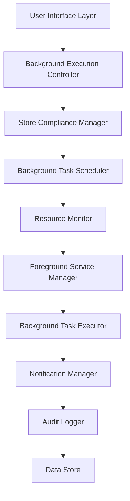
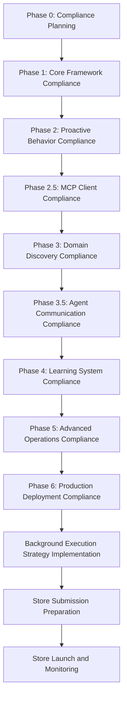

# Micro - Store-Compliant Background Execution Strategy for Autonomous Operations

## Executive Overview

This document provides a comprehensive store-compliant background execution strategy for Micro's autonomous operations. It addresses the unique challenges of background execution for autonomous agents while ensuring full compliance with Google Play Store and iOS App Store policies.

## 1. Background Execution Compliance Analysis

### 1.1 Google Play Store Background Execution Requirements

#### Key Restrictions and Requirements
- **Foreground Service Requirement**: Persistent notification must be shown for background services
- **Background Task Limitations**: Maximum 10 minutes execution time for most background tasks
- **User Notification Requirement**: Clear notification for all background activities
- **Resource Usage Monitoring**: Battery and memory usage must be tracked
- **User Control Requirement**: Users must be able to control background execution

#### Compliance Challenges for Autonomous Agents
1. **Continuous Context Analysis**: Requires ongoing background data collection
2. **Proactive Decision Making**: Needs background decision-making capabilities
3. **Agent Communication**: Requires background inter-agent communication
4. **Learning System**: Requires background model updates and learning

### 1.2 iOS App Store Background Execution Requirements

#### Key Restrictions and Requirements
- **Background App Refresh**: Limited to 30 seconds execution time
- **Background Modes**: Only specific modes allowed (background_fetch, background_processing)
- **User Notification Requirement**: Clear notification for all background activities
- **Resource Usage Monitoring**: Battery and memory usage must be tracked
- **User Control Requirement**: Users must be able to control background execution

#### Compliance Challenges for Autonomous Agents
1. **Continuous Context Analysis**: Requires ongoing background data collection
2. **Proactive Decision Making**: Needs background decision-making capabilities
3. **Agent Communication**: Requires background inter-agent communication
4. **Learning System**: Requires background model updates and learning

## 2. Store-Compliant Background Execution Architecture

### 2.1 Background Execution Framework Architecture



### 2.2 Core Components

#### Background Execution Controller
```dart
class BackgroundExecutionController {
  final StoreComplianceManager _complianceManager;
  final BackgroundTaskScheduler _taskScheduler;
  final ResourceMonitor _resourceMonitor;
  final ForegroundServiceManager _serviceManager;
  final NotificationManager _notificationManager;
  final AuditLogger _auditLogger;
  
  // Store compliance requirements
  static const Duration maxBackgroundExecution = Duration(minutes: 10);
  static const Duration maxiOSBackgroundExecution = Duration(seconds: 30);
  static const bool requireUserNotification = true;
  static const bool requireResourceMonitoring = true;
  static const bool requireUserControl = true;
  
  Future<void> initialize() async {
    // Initialize store compliance manager
    await _complianceManager.initialize();
    
    // Initialize resource monitoring
    await _resourceMonitor.initialize();
    
    // Initialize notification manager
    await _notificationManager.initialize();
    
    // Initialize audit logger
    await _auditLogger.initialize();
    
    // Start background execution monitoring
    await _startBackgroundExecutionMonitoring();
  }
  
  Future<void> executeBackgroundTask(AutonomousTask task) async {
    // Check store compliance before execution
    final compliance = await _complianceManager.validateBackgroundTask(task);
    
    if (!compliance.isAllowed) {
      throw BackgroundExecutionException('Task not compliant with store policies: ${compliance.reason}');
    }
    
    // Check resource availability
    final resourcesAvailable = await _resourceMonitor.checkResources(task);
    
    if (!resourcesAvailable) {
      // Schedule task for later execution
      await _taskScheduler.scheduleTask(task, ScheduleType.whenResourcesAvailable);
      return;
    }
    
    // Execute task based on platform
    if (Platform.isAndroid) {
      await _executeAndroidBackgroundTask(task);
    } else if (Platform.isIOS) {
      await _executeiOSBackgroundTask(task);
    }
  }
  
  Future<void> _executeAndroidBackgroundTask(AutonomousTask task) async {
    // Start foreground service for Android compliance
    await _serviceManager.startForegroundService(
      serviceId: 'autonomous_background',
      notificationTitle: 'Micro Autonomous Task',
      notificationText: 'Executing: ${task.description}',
      notificationIcon: 'ic_autonomous',
    );
    
    // Execute task with timeout
    final result = await _executeTaskWithTimeout(task, maxBackgroundExecution);
    
    // Stop foreground service
    await _serviceManager.stopForegroundService('autonomous_background');
    
    // Log execution for compliance
    await _auditLogger.logBackgroundExecution({
      'taskId': task.id,
      'description': task.description,
      'duration': result.duration.inMilliseconds,
      'success': result.success,
      'platform': 'android',
      'compliant': true,
    });
  }
  
  Future<void> _executeiOSBackgroundTask(AutonomousTask task) async {
    // Use background app refresh for iOS compliance
    final bgTaskId = await _scheduleiOSBackgroundAppRefresh(task);
    
    // Execute task with timeout
    final result = await _executeTaskWithTimeout(task, maxiOSBackgroundExecution);
    
    // Log execution for compliance
    await _auditLogger.logBackgroundExecution({
      'taskId': task.id,
      'description': task.description,
      'duration': result.duration.inMilliseconds,
      'success': result.success,
      'platform': 'ios',
      'compliant': true,
    });
  }
  
  Future<TaskExecutionResult> _executeTaskWithTimeout(AutonomousTask task, Duration timeout) async {
    final stopwatch = Stopwatch()..start();
    
    try {
      // Execute task
      final result = await task.execute();
      
      // Check timeout
      if (stopwatch.elapsed > timeout) {
        throw TaskTimeoutException('Background task execution timeout');
      }
      
      return result;
    } catch (e) {
      logger.error('Background task execution failed: $e');
      throw TaskExecutionException('Failed to execute background task', e);
    } finally {
      stopwatch.stop();
    }
  }
}
```

#### Store Compliance Manager
```dart
class StoreComplianceManager {
  final UserConsentManager _consentManager;
  final ResourceManager _resourceManager;
  final NotificationManager _notificationManager;
  final PlatformAdapter _platformAdapter;
  
  Future<BackgroundTaskComplianceResult> validateBackgroundTask(AutonomousTask task) async {
    // Check platform-specific requirements
    final platformCompliance = await _platformAdapter.validateBackgroundTask(task);
    
    // Check user consent
    final hasConsent = await _consentManager.hasConsent(
      ConsentType.backgroundExecution,
      taskId: task.id,
    );
    
    if (!hasConsent) {
      return BackgroundTaskComplianceResult.denied(
        reason: 'User consent not obtained for background execution',
      );
    }
    
    // Check resource availability
    final resourcesAvailable = await _resourceManager.checkAvailability(task);
    
    if (!resourcesAvailable) {
      return BackgroundTaskComplianceResult.denied(
        reason: 'Insufficient resources for background execution',
      );
    }
    
    // Check execution time limits
    final timeCompliant = await _validateExecutionTime(task);
    
    if (!timeCompliant) {
      return BackgroundTaskComplianceResult.denied(
        reason: 'Background task execution time exceeds limit',
      );
    }
    
    // Check notification requirements
    final notificationCompliant = await _validateNotificationRequirements(task);
    
    if (!notificationCompliant) {
      return BackgroundTaskComplianceResult.denied(
        reason: 'Background task notification requirements not met',
      );
    }
    
    return BackgroundTaskComplianceResult.allowed(
      platformCompliance: platformCompliance,
      userConsent: hasConsent,
      resourcesAvailable: resourcesAvailable,
      timeCompliant: timeCompliant,
      notificationCompliant: notificationCompliant,
    );
  }
  
  Future<bool> _validateExecutionTime(AutonomousTask task) async {
    final maxTime = Platform.isAndroid 
        ? maxBackgroundExecution 
        : maxiOSBackgroundExecution;
    
    return task.estimatedDuration <= maxTime;
  }
  
  Future<bool> _validateNotificationRequirements(AutonomousTask task) async {
    // Check if task requires notification
    if (task.requiresNotification) {
      // Validate notification content
      final notificationValid = await _notificationManager.validateNotificationContent(
        task.notificationTitle,
        task.notificationText,
      );
      
      return notificationValid;
    }
    
    return true; // No notification required
  }
}
```

#### Resource Monitor
```dart
class ResourceMonitor {
  final BatteryMonitor _batteryMonitor;
  final MemoryMonitor _memoryMonitor;
  final NetworkMonitor _networkMonitor;
  final ThermalMonitor _thermalMonitor;
  
  Future<ResourceAvailability> checkAvailability(AutonomousTask task) async {
    // Check battery level
    final batteryLevel = await _batteryMonitor.getCurrentLevel();
    final isCharging = await _batteryMonitor.isCharging();
    
    if (batteryLevel < 20 && !isCharging) {
      return ResourceAvailability.unavailable(
        reason: 'Battery level too low for background execution',
      );
    }
    
    // Check memory usage
    final memoryUsage = await _memoryMonitor.getCurrentUsage();
    final availableMemory = await _memoryMonitor.getAvailableMemory();
    
    if (memoryUsage > 200 || availableMemory < 50) {
      return ResourceAvailability.unavailable(
        reason: 'Insufficient memory for background execution',
      );
    }
    
    // Check thermal state
    final thermalState = await _thermalMonitor.getCurrentState();
    
    if (thermalState == ThermalState.critical) {
      return ResourceAvailability.unavailable(
        reason: 'Device temperature too high for background execution',
      );
    }
    
    // Check network connectivity
    final networkState = await _networkMonitor.getCurrentState();
    
    if (networkState.isDisconnected) {
      return ResourceAvailability.unavailable(
        reason: 'No network connectivity for background execution',
      );
    }
    
    return ResourceAvailability.available();
  }
  
  Future<void> startMonitoring() async {
    // Start continuous resource monitoring
    await _batteryMonitor.startMonitoring();
    await _memoryMonitor.startMonitoring();
    await _thermalMonitor.startMonitoring();
    await _networkMonitor.startMonitoring();
    
    // Setup resource alerts
    await _setupResourceAlerts();
  }
  
  Future<void> _setupResourceAlerts() async {
    // Setup battery level alerts
    _batteryMonitor.onLowBatteryLevel((level) async {
      await _notificationManager.showResourceAlert(
        'Low Battery',
        'Battery level is ${level}%. Background execution will be limited.',
      );
    });
    
    // Setup memory pressure alerts
    _memoryMonitor.onHighMemoryUsage((usage) async {
      await _notificationManager.showResourceAlert(
        'High Memory Usage',
        'Memory usage is ${usage}MB. Background execution will be limited.',
      );
    });
    
    // Setup thermal alerts
    _thermalMonitor.onCriticalTemperature((temperature) async {
      await _notificationManager.showResourceAlert(
        'High Temperature',
        'Device temperature is ${temperature}°C. Background execution will be limited.',
      );
    });
  }
}
```

#### Foreground Service Manager
```dart
class ForegroundServiceManager {
  final NotificationManager _notificationManager;
  final PlatformAdapter _platformAdapter;
  
  Future<void> startForegroundService(
    String serviceId,
    String notificationTitle,
    String notificationText,
    String notificationIcon,
  ) async {
    // Start foreground service based on platform
    if (Platform.isAndroid) {
      await _startAndroidForegroundService(
        serviceId,
        notificationTitle,
        notificationText,
        notificationIcon,
      );
    } else if (Platform.isIOS) {
      await _startiOSForegroundService(
        serviceId,
        notificationTitle,
        notificationText,
        notificationIcon,
      );
    }
  }
  
  Future<void> _startAndroidForegroundService(
    String serviceId,
    String notificationTitle,
    String notificationText,
    String notificationIcon,
  ) async {
    // Create persistent notification
    final notification = Notification(
      id: serviceId,
      title: notificationTitle,
      body: notificationText,
      icon: notificationIcon,
      ongoing: true,
      importance: NotificationImportance.high,
      priority: NotificationPriority.high,
    );
    
    // Show notification
    await _notificationManager.showPersistentNotification(notification);
    
    // Start foreground service
    await _platformAdapter.startForegroundService(serviceId);
  }
  
  Future<void> _startiOSForegroundService(
    String serviceId,
    String notificationTitle,
    String notificationText,
    String notificationIcon,
  ) async {
    // Create persistent notification
    final notification = Notification(
      id: serviceId,
      title: notificationTitle,
      body: notificationText,
      icon: notificationIcon,
      ongoing: true,
      importance: NotificationImportance.high,
      priority: NotificationPriority.high,
    );
    
    // Show notification
    await _notificationManager.showPersistentNotification(notification);
    
    // Start background task
    await _platformAdapter.startBackgroundTask(serviceId);
  }
  
  Future<void> stopForegroundService(String serviceId) async {
    // Stop foreground service based on platform
    if (Platform.isAndroid) {
      await _stopAndroidForegroundService(serviceId);
    } else if (Platform.isIOS) {
      await _stopiOSForegroundService(serviceId);
    }
  }
  
  Future<void> _stopAndroidForegroundService(String serviceId) async {
    // Stop foreground service
    await _platformAdapter.stopForegroundService(serviceId);
    
    // Remove persistent notification
    await _notificationManager.removePersistentNotification(serviceId);
  }
  
  Future<void> _stopiOSForegroundService(String serviceId) async {
    // Stop background task
    await _platformAdapter.stopBackgroundTask(serviceId);
    
    // Remove persistent notification
    await _notificationManager.removePersistentNotification(serviceId);
  }
}
```

#### Background Task Scheduler
```dart
class BackgroundTaskScheduler {
  final TaskQueue _taskQueue;
  final ResourceMonitor _resourceMonitor;
  final StoreComplianceManager _complianceManager;
  
  Future<void> scheduleTask(AutonomousTask task, ScheduleType scheduleType) async {
    // Check store compliance before scheduling
    final compliance = await _complianceManager.validateBackgroundTask(task);
    
    if (!compliance.isAllowed) {
      throw TaskSchedulingException('Task not compliant with store policies: ${compliance.reason}');
    }
    
    switch (scheduleType) {
      case ScheduleType.immediate:
        await _scheduleImmediateTask(task);
        break;
      case ScheduleType.whenResourcesAvailable:
        await _scheduleWhenResourcesAvailable(task);
        break;
      case ScheduleType.duringOptimalConditions:
        await _scheduleDuringOptimalConditions(task);
        break;
    }
  }
  
  Future<void> _scheduleImmediateTask(AutonomousTask task) async {
    // Add task to immediate execution queue
    await _taskQueue.addTask(task, Priority.high);
    
    // Execute task immediately
    await _executeTask(task);
  }
  
  Future<void> _scheduleWhenResourcesAvailable(AutonomousTask task) async {
    // Monitor resource availability
    _resourceMonitor.onResourceAvailable(() async {
      final resourcesAvailable = await _resourceMonitor.checkAvailability(task);
      
      if (resourcesAvailable) {
        // Execute task when resources are available
        await _executeTask(task);
      }
    });
  }
  
  Future<void> _scheduleDuringOptimalConditions(AutonomousTask task) async {
    // Monitor optimal conditions
    _resourceMonitor.onOptimalConditions(() async {
      final optimalConditions = await _resourceMonitor.checkOptimalConditions();
      
      if (optimalConditions) {
        // Execute task during optimal conditions
        await _executeTask(task);
      }
    });
  }
  
  Future<void> _executeTask(AutonomousTask task) async {
    // Execute task with compliance monitoring
    final stopwatch = Stopwatch()..start();
    
    try {
      // Execute task
      final result = await task.execute();
      
      // Log execution for compliance
      await _auditLogger.logTaskExecution({
        'taskId': task.id,
        'description': task.description,
        'duration': stopwatch.elapsedMilliseconds,
        'success': result.success,
        'compliant': true,
      });
    } catch (e) {
      logger.error('Task execution failed: $e');
      await _auditLogger.logTaskExecution({
        'taskId': task.id,
        'description': task.description,
        'error': e.toString(),
        'compliant': false,
      });
    } finally {
      stopwatch.stop();
    }
  }
}
```

## 3. Platform-Specific Implementation Strategies

### 3.1 Android Background Execution Strategy

#### Foreground Service Implementation
```dart
class AndroidBackgroundExecutionStrategy {
  final ForegroundServiceManager _serviceManager;
  final NotificationManager _notificationManager;
  final WorkManager _workManager;
  
  Future<void> executeBackgroundTask(AutonomousTask task) async {
    // Create work request for Android WorkManager
    final workRequest = WorkRequest(
      id: task.id,
      workType: WorkType.foregroundService,
      constraints: WorkConstraints(
        requiredNetworkType: NetworkType.CONNECTED,
        requiresCharging: false,
        requiresDeviceIdle: false,
        requiresBatteryNotLow: true,
      ),
      inputData: workDataOf(task),
    );
    
    // Show persistent notification
    final notification = Notification(
      id: 'background_${task.id}',
      title: 'Micro Autonomous Task',
      body: 'Executing: ${task.description}',
      icon: 'ic_autonomous',
      ongoing: true,
      importance: NotificationImportance.high,
      priority: NotificationPriority.high,
    );
    
    await _notificationManager.showPersistentNotification(notification);
    
    // Enqueue work request
    await _workManager.enqueue(workRequest);
  }
  
  Data workDataOf(AutonomousTask task) {
    return DataBuilder()
        .putString('task_id', task.id)
        .putString('task_description', task.description)
        .putString('task_type', task.type.toString())
        .build();
  }
}
```

#### Background Task Limits
```dart
class AndroidBackgroundTaskLimits {
  // Android background execution limits
  static const Duration maxExecutionTime = Duration(minutes: 10);
  static const int maxDailyTasks = 20;
  static const int minBatteryLevel = 20;
  static const int maxMemoryUsage = 200; // MB
  
  Future<bool> isWithinLimits(AutonomousTask task) async {
    // Check execution time limit
    if (task.estimatedDuration > maxExecutionTime) {
      return false;
    }
    
    // Check daily task limit
    final dailyTaskCount = await _getDailyTaskCount();
    if (dailyTaskCount >= maxDailyTasks) {
      return false;
    }
    
    // Check battery level
    final batteryLevel = await _getBatteryLevel();
    if (batteryLevel < minBatteryLevel) {
      return false;
    }
    
    // Check memory usage
    final memoryUsage = await _getMemoryUsage();
    if (memoryUsage > maxMemoryUsage) {
      return false;
    }
    
    return true;
  }
}
```

### 3.2 iOS Background Execution Strategy

#### Background App Refresh Implementation
```dart
class iOSBackgroundExecutionStrategy {
  final BackgroundTaskManager _backgroundTaskManager;
  final NotificationManager _notificationManager;
  
  Future<void> executeBackgroundTask(AutonomousTask task) async {
    // Create background app refresh request
    final bgTaskRequest = BackgroundAppRefreshTaskRequest(
      identifier: 'autonomous_${task.id}',
      url: 'micro://autonomous-task',
      schedule: BackgroundAppRefreshSchedule.immediate,
    );
    
    // Show persistent notification
    final notification = Notification(
      id: 'background_${task.id}',
      title: 'Micro Autonomous Task',
      body: 'Executing: ${task.description}',
      icon: 'ic_autonomous',
      ongoing: true,
      importance: NotificationImportance.high,
      priority: NotificationPriority.high,
    );
    
    await _notificationManager.showPersistentNotification(notification);
    
    // Schedule background app refresh
    await _backgroundTaskManager.schedule(bgTaskRequest);
  }
}
```

#### Background Task Limits
```dart
class iOSBackgroundTaskLimits {
  // iOS background execution limits
  static const Duration maxExecutionTime = Duration(seconds: 30);
  static const int maxDailyTasks = 10;
  static const int minBatteryLevel = 20;
  static const int maxMemoryUsage = 150; // MB
  
  Future<bool> isWithinLimits(AutonomousTask task) async {
    // Check execution time limit
    if (task.estimatedDuration > maxExecutionTime) {
      return false;
    }
    
    // Check daily task limit
    final dailyTaskCount = await _getDailyTaskCount();
    if (dailyTaskCount >= maxDailyTasks) {
      return false;
    }
    
    // Check battery level
    final batteryLevel = await _getBatteryLevel();
    if (batteryLevel < minBatteryLevel) {
      return false;
    }
    
    // Check memory usage
    final memoryUsage = await _getMemoryUsage();
    if (memoryUsage > maxMemoryUsage) {
      return false;
    }
    
    return true;
  }
}
```

## 4. User Control and Transparency

### 4.1 User Control Interface

#### Background Task Management
```dart
class BackgroundTaskControlInterface {
  final BackgroundExecutionController _controller;
  final NotificationManager _notificationManager;
  
  Widget buildBackgroundTaskControl() {
    return Column(
      children: [
        // Background execution toggle
        SwitchListTile(
          title: 'Background Execution',
          subtitle: 'Allow Micro to execute autonomous tasks in background',
          value: _backgroundExecutionEnabled,
          onChanged: (value) async {
            await _toggleBackgroundExecution(value);
          },
        ),
        
        // Task history
        ListTile(
          title: 'Task History',
          subtitle: 'View history of autonomous background tasks',
          onTap: () => _navigateToTaskHistory(),
        ),
        
        // Active tasks
        ListTile(
          title: 'Active Tasks',
          subtitle: 'View currently executing autonomous tasks',
          onTap: () => _navigateToActiveTasks(),
        ),
        
        // Resource usage
        ListTile(
          title: 'Resource Usage',
          subtitle: 'View resource usage by background tasks',
          onTap: () => _navigateToResourceUsage(),
        ),
      ],
    );
  }
  
  Future<void> _toggleBackgroundExecution(bool enabled) async {
    // Update user preference
    await _userPreferences.setBool('background_execution_enabled', enabled);
    
    // Update background execution controller
    await _controller.setBackgroundExecutionEnabled(enabled);
    
    // Show notification for status change
    if (enabled) {
      await _notificationManager.showInfoNotification(
        'Background Execution Enabled',
        'Micro can now execute autonomous tasks in background',
      );
    } else {
      await _notificationManager.showInfoNotification(
        'Background Execution Disabled',
        'Micro will not execute autonomous tasks in background',
      );
    }
  }
}
```

#### Task Transparency Display
```dart
class TaskTransparencyDisplay {
  final BackgroundExecutionController _controller;
  
  Widget buildTaskTransparency(AutonomousTask task) {
    return Card(
      child: Column(
        children: [
          // Task information
          ListTile(
            title: 'Task Description',
            subtitle: task.description,
          ),
          
          ListTile(
            title: 'Execution Time',
            subtitle: '${task.estimatedDuration.inMinutes} minutes',
          ),
          
          ListTile(
            title: 'Data Used',
            subtitle: task.dataUsed.join(', '),
          ),
          
          ListTile(
            title: 'Purpose',
            subtitle: task.purpose,
          ),
          
          // Control options
          ButtonBar(
            children: [
              ElevatedButton(
                onPressed: () => _approveTask(task),
                child: Text('Approve'),
              ),
              ElevatedButton(
                onPressed: () => _modifyTask(task),
                child: Text('Modify'),
              ),
              ElevatedButton(
                onPressed: () => _cancelTask(task),
                child: Text('Cancel'),
              ),
            ],
          ),
        ],
      ),
    );
  }
  
  Future<void> _approveTask(AutonomousTask task) async {
    // Approve task for execution
    await _controller.approveTask(task);
    
    // Show approval notification
    await _notificationManager.showInfoNotification(
      'Task Approved',
      'Approved autonomous task: ${task.description}',
    );
  }
  
  Future<void> _modifyTask(AutonomousTask task) async {
    // Navigate to task modification
    await _navigateToTaskModification(task);
  }
  
  Future<void> _cancelTask(AutonomousTask task) async {
    // Cancel task execution
    await _controller.cancelTask(task);
    
    // Show cancellation notification
    await _notificationManager.showInfoNotification(
      'Task Cancelled',
      'Cancelled autonomous task: ${task.description}',
    );
  }
}
```

## 5. Store Compliance Testing Framework

### 5.1 Background Execution Compliance Testing

#### Test Scenarios
```dart
class BackgroundExecutionComplianceTests {
  final BackgroundExecutionController _controller;
  final StoreComplianceManager _complianceManager;
  
  Future<void> runComplianceTests() async {
    // Test background execution time limits
    await _testBackgroundExecutionTimeLimits();
    
    // Test resource availability checks
    await _testResourceAvailabilityChecks();
    
    // Test notification requirements
    await _testNotificationRequirements();
    
    // Test user consent mechanisms
    await _testUserConsentMechanisms();
    
    // Test platform-specific compliance
    await _testPlatformSpecificCompliance();
  }
  
  Future<void> _testBackgroundExecutionTimeLimits() async {
    // Test Android time limits
    final androidTask = AutonomousTask(
      id: 'test_android_time',
      description: 'Test Android time limit',
      estimatedDuration: Duration(minutes: 15), // Exceeds 10-minute limit
    );
    
    final androidResult = await _complianceManager.validateBackgroundTask(androidTask);
    assert(androidResult.isDenied, 'Android time limit validation failed');
    
    // Test iOS time limits
    final iOSTask = AutonomousTask(
      id: 'test_ios_time',
      description: 'Test iOS time limit',
      estimatedDuration: Duration(seconds: 45), // Exceeds 30-second limit
    );
    
    final iosResult = await _complianceManager.validateBackgroundTask(iOSTask);
    assert(iosResult.isDenied, 'iOS time limit validation failed');
  }
  
  Future<void> _testResourceAvailabilityChecks() async {
    // Test low battery scenario
    final lowBatteryTask = AutonomousTask(
      id: 'test_low_battery',
      description: 'Test low battery scenario',
      estimatedDuration: Duration(minutes: 5),
    );
    
    // Mock low battery
    await _mockLowBatteryLevel();
    
    final lowBatteryResult = await _complianceManager.validateBackgroundTask(lowBatteryTask);
    assert(lowBatteryResult.isDenied, 'Low battery validation failed');
    
    // Test high memory scenario
    final highMemoryTask = AutonomousTask(
      id: 'test_high_memory',
      description: 'Test high memory scenario',
      estimatedDuration: Duration(minutes: 5),
    );
    
    // Mock high memory usage
    await _mockHighMemoryUsage();
    
    final highMemoryResult = await _complianceManager.validateBackgroundTask(highMemoryTask);
    assert(highMemoryResult.isDenied, 'High memory validation failed');
  }
  
  Future<void> _testNotificationRequirements() async {
    // Test task without notification
    final noNotificationTask = AutonomousTask(
      id: 'test_no_notification',
      description: 'Test no notification scenario',
      requiresNotification: true,
    );
    
    final noNotificationResult = await _complianceManager.validateBackgroundTask(noNotificationTask);
    assert(noNotificationResult.isDenied, 'No notification validation failed');
  }
  
  Future<void> _testUserConsentMechanisms() async {
    // Test task without user consent
    final noConsentTask = AutonomousTask(
      id: 'test_no_consent',
      description: 'Test no consent scenario',
    );
    
    // Mock no user consent
    await _mockNoUserConsent();
    
    final noConsentResult = await _complianceManager.validateBackgroundTask(noConsentTask);
    assert(noConsentResult.isDenied, 'No consent validation failed');
  }
  
  Future<void> _testPlatformSpecificCompliance() async {
    if (Platform.isAndroid) {
      await _testAndroidCompliance();
    } else if (Platform.isIOS) {
      await _testiOSCompliance();
    }
  }
  
  Future<void> _testAndroidCompliance() async {
    // Test Android foreground service requirements
    final foregroundServiceTask = AutonomousTask(
      id: 'test_android_foreground',
      description: 'Test Android foreground service',
    );
    
    final foregroundResult = await _complianceManager.validateBackgroundTask(foregroundServiceTask);
    assert(foregroundResult.isAllowed, 'Android foreground service validation failed');
  }
  
  Future<void> _testiOSCompliance() async {
    // Test iOS background app refresh requirements
    final backgroundRefreshTask = AutonomousTask(
      id: 'test_ios_refresh',
      description: 'Test iOS background app refresh',
    );
    
    final refreshResult = await _complianceManager.validateBackgroundTask(backgroundRefreshTask);
    assert(refreshResult.isAllowed, 'iOS background refresh validation failed');
  }
}
```

## 6. Implementation Recommendations

### 6.1 Store Compliance Integration Timeline

#### Background Execution Compliance Integration


### 6.2 Critical Success Factors

#### Store Approval Success Criteria
1. **Background Execution Compliance**
   - Proper foreground service implementation with persistent notifications
   - Background task time limits and user controls
   - Resource usage monitoring and optimization
   - User-visible background activity indicators
   - Platform-specific compliance (Android WorkManager, iOS Background App Refresh)

2. **User Control and Transparency**
   - Clear task information display and explanations
   - User approval mechanisms for all autonomous actions
   - Real-time task status monitoring and control
   - Comprehensive task history and resource usage tracking

3. **Store Policy Adherence**
   - Background execution within store-specified time limits
   - Proper notification handling for background services
   - Resource usage optimization and monitoring
   - User consent management and privacy protection

## Conclusion

This comprehensive store-compliant background execution strategy ensures that Micro's autonomous operations meet all Google Play Store and iOS App Store requirements while maintaining powerful autonomous capabilities. The strategy provides:

1. **Platform-Specific Compliance**: Android and iOS specific implementation strategies
2. **Resource-Aware Execution**: Intelligent resource monitoring and optimization
3. **User Control and Transparency**: Comprehensive user control and task visibility
4. **Store Policy Adherence**: Strict adherence to store background execution policies
5. **Compliance Testing**: Comprehensive testing framework for validation

Following this strategy will ensure successful store approval and user acceptance of Micro's autonomous background execution capabilities.