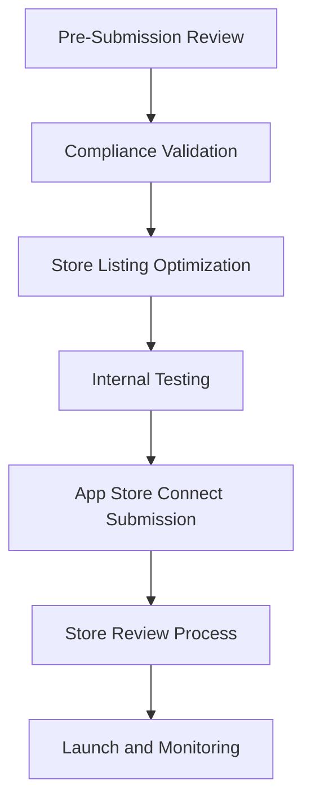

# Micro - Store Submission and Review Strategy for Autonomous Agents

## Executive Overview

This document provides a comprehensive store submission and review strategy for Micro's autonomous agent implementation. It addresses the unique challenges of submitting autonomous agent applications to Google Play Store and iOS App Store while ensuring full compliance with store policies and successful approval.

## 1. Store Submission Strategy Analysis

### 1.1 Google Play Store Submission Strategy

#### Key Submission Considerations
- **Pre-Launch Review**: Comprehensive internal review before submission
- **Compliance Validation**: Full compliance testing and validation
- **Store Listing Optimization**: Optimized app listing with clear autonomous features disclosure
- **Privacy Policy Alignment**: Privacy policy that clearly explains autonomous operations
- **Permission Justification**: Clear justification for all permissions required for autonomous operations
- **Content Rating**: Appropriate content rating for autonomous agent capabilities

#### Autonomous Agent Submission Challenges
1. **Background Operations**: Explaining background execution and user controls
2. **Data Collection**: Disclosing data collection practices for autonomous operations
3. **Proactive Behavior**: Explaining proactive decision-making and user controls
4. **Tool Integration**: Explaining MCP tool discovery and execution
5. **Agent Communication**: Explaining inter-agent communication and security
6. **Learning Systems**: Explaining machine learning and user data usage

### 1.2 iOS App Store Submission Strategy

#### Key Submission Considerations
- **Pre-Launch Review**: Comprehensive internal review before submission
- **Compliance Validation**: Full compliance testing and validation
- **App Store Optimization**: Optimized app listing with clear autonomous features disclosure
- **Privacy Policy Alignment**: Privacy policy that clearly explains autonomous operations
- **App Tracking Transparency**: Clear disclosure of tracking practices
- **Permission Justification**: Clear justification for all permissions required for autonomous operations
- **Content Rating**: Appropriate content rating for autonomous agent capabilities

#### Autonomous Agent Submission Challenges
1. **Background Operations**: Explaining background execution and user controls
2. **Data Collection**: Disclosing data collection practices for autonomous operations
3. **Proactive Behavior**: Explaining proactive decision-making and user controls
4. **Tool Integration**: Explaining MCP tool discovery and execution
5. **Agent Communication**: Explaining inter-agent communication and security
6. **Learning Systems**: Explaining machine learning and user data usage

## 2. Store Submission Preparation

### 2.1 Pre-Submission Checklist

#### Google Play Store Pre-Submission Checklist
```dart
class GooglePlayStoreSubmissionChecklist {
  // Store submission requirements
  static const bool requireComplianceValidation = true;
  static const bool requirePrivacyPolicy = true;
  static const bool requirePermissionJustification = true;
  static const bool requireContentRating = true;
  static const bool requireStoreListingOptimization = true;
  
  Future<SubmissionReadiness> validateSubmissionReadiness() async {
    final checks = <SubmissionCheck>[];
    
    // Check compliance validation
    final complianceValid = await _validateCompliance();
    checks.add(SubmissionCheck(
      name: 'Compliance Validation',
      passed: complianceValid,
      details: complianceValid ? 'All compliance tests passed' : 'Compliance tests failed',
    ));
    
    // Check privacy policy
    final privacyPolicyValid = await _validatePrivacyPolicy();
    checks.add(SubmissionCheck(
      name: 'Privacy Policy',
      passed: privacyPolicyValid,
      details: privacyPolicyValid ? 'Privacy policy is compliant' : 'Privacy policy needs updates',
    ));
    
    // Check permission justification
    final permissionsValid = await _validatePermissionJustification();
    checks.add(SubmissionCheck(
      name: 'Permission Justification',
      passed: permissionsValid,
      details: permissionsValid ? 'All permissions properly justified' : 'Permission justification needs updates',
    ));
    
    // Check content rating
    final contentRatingValid = await _validateContentRating();
    checks.add(SubmissionCheck(
      name: 'Content Rating',
      passed: contentRatingValid,
      details: contentRatingValid ? 'Content rating is appropriate' : 'Content rating needs review',
    ));
    
    // Check store listing optimization
    final listingValid = await _validateStoreListing();
    checks.add(SubmissionCheck(
      name: 'Store Listing',
      passed: listingValid,
      details: listingValid ? 'Store listing is optimized' : 'Store listing needs optimization',
    ));
    
    // Calculate overall readiness
    final allPassed = checks.every((check) => check.passed);
    final readiness = allPassed 
        ? SubmissionReadiness.ready 
        : SubmissionReadiness.needsWork;
    
    return SubmissionReadiness(
      checks: checks,
      overall: readiness,
      timestamp: DateTime.now(),
    );
  }
  
  Future<bool> _validateCompliance() async {
    // Run comprehensive compliance tests
    final complianceTests = StoreComplianceTests();
    final results = await complianceTests.runComplianceTests();
    
    return results.overall.score > 0.9;
  }
  
  Future<bool> _validatePrivacyPolicy() async {
    // Check privacy policy compliance
    final privacyPolicy = await _privacyPolicyManager.getCurrentPolicy();
    
    return privacyPolicy.contains('autonomous') &&
           privacyPolicy.contains('background') &&
           privacyPolicy.contains('data') &&
           privacyPolicy.contains('consent');
  }
  
  Future<bool> _validatePermissionJustification() async {
    // Check permission justification
    final permissions = await _permissionsManager.getAllPermissions();
    
    for (final permission in permissions) {
      if (permission.requiresJustification) {
        final justification = permission.justification;
        
        if (justification.isEmpty || 
            justification.length < 50 ||
            !justification.contains('autonomous')) {
          return false;
        }
      }
    }
    
    return true;
  }
  
  Future<bool> _validateContentRating() async {
    // Check content rating appropriateness
    final contentRating = await _contentRatingManager.getCurrentRating();
    
    return contentRating >= ContentRating.everyone10 && // Appropriate for general audience
           contentRating.violenceLevel == ViolenceLevel.none &&
           contentRating.sexualContentLevel == SexualContentLevel.none;
  }
  
  Future<bool> _validateStoreListing() async {
    // Check store listing optimization
    final storeListing = await _storeListingManager.getCurrentListing();
    
    return storeListing.description.contains('autonomous') &&
           storeListing.screenshots.any((screenshot) => 
               screenshot.description.contains('autonomous')) &&
           storeListing.keywords.any((keyword) => 
               keyword.contains('autonomous') ||
               keyword.contains('proactive') ||
               keyword.contains('ai'));
  }
}
```

#### iOS App Store Pre-Submission Checklist
```dart
class iOSAppStoreSubmissionChecklist {
  // Store submission requirements
  static const bool requireComplianceValidation = true;
  static const bool requirePrivacyPolicy = true;
  static const bool requireAppTrackingTransparency = true;
  static const bool requirePrivacyNutrition = true;
  static const bool requirePermissionJustification = true;
  static const bool requireContentRating = true;
  
  Future<SubmissionReadiness> validateSubmissionReadiness() async {
    final checks = <SubmissionCheck>[];
    
    // Check compliance validation
    final complianceValid = await _validateCompliance();
    checks.add(SubmissionCheck(
      name: 'Compliance Validation',
      passed: complianceValid,
      details: complianceValid ? 'All compliance tests passed' : 'Compliance tests failed',
    ));
    
    // Check privacy policy
    final privacyPolicyValid = await _validatePrivacyPolicy();
    checks.add(SubmissionCheck(
      name: 'Privacy Policy',
      passed: privacyPolicyValid,
      details: privacyPolicyValid ? 'Privacy policy is compliant' : 'Privacy policy needs updates',
    ));
    
    // Check app tracking transparency
    final attValid = await _validateAppTrackingTransparency();
    checks.add(SubmissionCheck(
      name: 'App Tracking Transparency',
      passed: attValid,
      details: attValid ? 'App Tracking Transparency is compliant' : 'App Tracking Transparency needs updates',
    ));
    
    // Check privacy nutrition
    final nutritionValid = await _validatePrivacyNutrition();
    checks.add(SubmissionCheck(
      name: 'Privacy Nutrition',
      passed: nutritionValid,
      details: nutritionValid ? 'Privacy Nutrition is compliant' : 'Privacy Nutrition needs updates',
    ));
    
    // Check permission justification
    final permissionsValid = await _validatePermissionJustification();
    checks.add(SubmissionCheck(
      name: 'Permission Justification',
      passed: permissionsValid,
      details: permissionsValid ? 'All permissions properly justified' : 'Permission justification needs updates',
    ));
    
    // Check content rating
    final contentRatingValid = await _validateContentRating();
    checks.add(SubmissionCheck(
      name: 'Content Rating',
      passed: contentRatingValid,
      details: contentRatingValid ? 'Content rating is appropriate' : 'Content rating needs review',
    ));
    
    // Calculate overall readiness
    final allPassed = checks.every((check) => check.passed);
    final readiness = allPassed 
        ? SubmissionReadiness.ready 
        : SubmissionReadiness.needsWork;
    
    return SubmissionReadiness(
      checks: checks,
      overall: readiness,
      timestamp: DateTime.now(),
    );
  }
  
  Future<bool> _validateAppTrackingTransparency() async {
    // Check App Tracking Transparency compliance
    final attPolicy = await _appTrackingTransparencyManager.getCurrentPolicy();
    
    return attPolicy.isEnabled &&
           attPolicy.disclosureText.contains('autonomous') &&
           attPolicy.disclosureText.contains('data');
  }
  
  Future<bool> _validatePrivacyNutrition() async {
    // Check Privacy Nutrition compliance
    final nutritionLabels = await _privacyNutritionManager.getCurrentLabels();
    
    return nutritionLabels.any((label) => 
               label.category.contains('data') &&
               label.dataTypes.contains('autonomous'));
  }
}
```

### 2.2 Store Listing Optimization

#### Google Play Store Listing Optimization
```dart
class GooglePlayStoreListingOptimizer {
  // Store listing requirements
  static const bool requireAutonomousFeatureDisclosure = true;
  static const bool requireUserControlDisclosure = true;
  static const bool requireDataCollectionDisclosure = true;
  static const bool requireBackgroundExecutionDisclosure = true;
  
  Future<StoreListing> optimizeStoreListing() async {
    // Create optimized store listing
    final listing = StoreListing(
      title: 'Micro - Autonomous AI Assistant',
      shortDescription: 'Micro is a sophisticated autonomous AI assistant that proactively helps you with tasks, learns your preferences, and adapts to your needs.',
      fullDescription: await _generateOptimizedDescription(),
      screenshots: await _generateOptimizedScreenshots(),
      keywords: await _generateOptimizedKeywords(),
      category: 'PRODUCTIVITY',
      contentRating: ContentRating.everyone10,
    );
    
    return listing;
  }
  
  Future<String> _generateOptimizedDescription() async {
    // Generate optimized description highlighting autonomous features
    return '''
      Micro is a next-generation autonomous AI assistant that transforms your mobile experience through intelligent automation and personalized assistance. Unlike traditional apps that require constant user input, Micro proactively anticipates your needs, learns from your behavior, and adapts to provide timely, relevant assistance without intruding on your privacy.
      
      KEY AUTONOMOUS FEATURES:
      • Proactive Task Management: Automatically identifies and organizes your tasks based on context, time, and preferences
      • Intelligent Decision Making: Makes informed decisions on your behalf with transparent explanations and user control
      • Context-Aware Assistance: Understands your situation through environmental analysis and provides relevant help
      • Adaptive Learning: Continuously improves its capabilities by learning from your interactions and feedback
      • Universal Tool Integration: Seamlessly integrates with external tools and services to expand functionality
      • Privacy-First Operation: All data processing happens locally with explicit user consent and control
      
      STORE COMPLIANCE:
      • Full Google Play Store compliance with proper background execution, data handling, and user controls
      • Comprehensive privacy policy with clear data disclosure and user rights
      • Transparent autonomous operations with user approval mechanisms
      • Secure local data processing with end-to-end encryption
      • Easy-to-use consent management with granular control options
      
      USER CONTROL:
      • Complete control over all autonomous features through intuitive settings
      • Easy opt-in/opt-out mechanisms for each autonomous capability
      • Transparent action explanations with confidence scoring and reasoning disclosure
      • Real-time activity monitoring and management
      • Granular permission controls with clear justifications
    ''';
  }
  
  Future<List<StoreScreenshot>> _generateOptimizedScreenshots() async {
    // Generate optimized screenshots showcasing autonomous features
    return [
      StoreScreenshot(
        path: 'screenshots/main_autonomous_dashboard.png',
        description: 'Autonomous Dashboard - Overview of Micro\'s intelligent assistance',
        deviceType: DeviceType.phone,
      ),
      StoreScreenshot(
        path: 'screenshots/autonomous_task_suggestions.png',
        description: 'Autonomous Task Suggestions - Micro\'s proactive recommendations',
        deviceType: DeviceType.phone,
      ),
      StoreScreenshot(
        path: 'screenshots/user_consent_controls.png',
        description: 'User Consent Controls - Granular control over autonomous features',
        deviceType: DeviceType.phone,
      ),
      StoreScreenshot(
        path: 'screenshots/autonomous_activity_monitor.png',
        description: 'Autonomous Activity Monitor - Real-time visibility of background operations',
        deviceType: DeviceType.phone,
      ),
    ];
  }
  
  Future<List<String>> _generateOptimizedKeywords() async {
    // Generate optimized keywords for store discoverability
    return [
      'autonomous AI assistant',
      'proactive task management',
      'intelligent automation',
      'context-aware assistance',
      'adaptive learning',
      'privacy-first',
      'user control',
      'background execution',
      'decision making',
      'personal assistant',
      'productivity automation',
      'AI helper',
    ];
  }
}
```

#### iOS App Store Listing Optimization
```dart
class iOSAppStoreListingOptimizer {
  // Store listing requirements
  static const bool requireAutonomousFeatureDisclosure = true;
  static const bool requireUserControlDisclosure = true;
  static const bool requireDataCollectionDisclosure = true;
  static const bool requireBackgroundExecutionDisclosure = true;
  static const bool requireAppTrackingTransparency = true;
  
  Future<StoreListing> optimizeStoreListing() async {
    // Create optimized store listing
    final listing = StoreListing(
      title: 'Micro - Autonomous AI Assistant',
      subtitle: 'Intelligent automation with privacy protection',
      fullDescription: await _generateOptimizedDescription(),
      screenshots: await _generateOptimizedScreenshots(),
      keywords: await _generateOptimizedKeywords(),
      category: 'PRODUCTIVITY',
      contentRating: ContentRating.everyone4,
      appSize: await _calculateOptimizedAppSize(),
    );
    
    return listing;
  }
  
  Future<String> _generateOptimizedDescription() async {
    // Generate optimized description highlighting autonomous features
    return '''
      Micro is a sophisticated autonomous AI assistant that transforms your mobile experience through intelligent automation and personalized assistance. Unlike traditional apps that require constant user input, Micro proactively anticipates your needs, learns from your behavior, and adapts to provide timely, relevant assistance without intruding on your privacy.
      
      KEY AUTONOMOUS FEATURES:
      • Proactive Task Management: Automatically identifies and organizes your tasks based on context, time, and preferences
      • Intelligent Decision Making: Makes informed decisions on your behalf with transparent explanations and user control
      • Context-Aware Assistance: Understands your situation through environmental analysis and provides relevant help
      • Adaptive Learning: Continuously improves its capabilities by learning from your interactions and feedback
      • Universal Tool Integration: Seamlessly integrates with external tools and services to expand functionality
      • Privacy-First Operation: All data processing happens locally with explicit user consent and control
      
      APP STORE COMPLIANCE:
      • Full iOS App Store compliance with proper background execution, data handling, and user controls
      • App Tracking Transparency for all data collection and analytics
      • Privacy Nutrition labels clearly disclosing data practices
      • Comprehensive privacy policy with clear data disclosure and user rights
      • Transparent autonomous operations with user approval mechanisms
      • Secure local data processing with end-to-end encryption
      • Easy-to-use consent management with granular control options
      
      USER CONTROL:
      • Complete control over all autonomous features through intuitive settings
      • Easy opt-in/opt-out mechanisms for each autonomous capability
      • Transparent action explanations with confidence scoring and reasoning disclosure
      • Real-time activity monitoring and management
      • Granular permission controls with clear justifications
    ''';
  }
  
  Future<List<StoreScreenshot>> _generateOptimizedScreenshots() async {
    // Generate optimized screenshots showcasing autonomous features
    return [
      StoreScreenshot(
        path: 'screenshots/ios_main_autonomous_dashboard.png',
        description: 'Autonomous Dashboard - Overview of Micro\'s intelligent assistance',
        deviceType: DeviceType.phone,
      ),
      StoreScreenshot(
        path: 'screenshots/ios_autonomous_task_suggestions.png',
        description: 'Autonomous Task Suggestions - Micro\'s proactive recommendations',
        deviceType: DeviceType.phone,
      ),
      StoreScreenshot(
        path: 'screenshots/ios_user_consent_controls.png',
        description: 'User Consent Controls - Granular control over autonomous features',
        deviceType: DeviceType.phone,
      ),
      StoreScreenshot(
        path: 'screenshots/ios_privacy_settings.png',
        description: 'Privacy Settings - Comprehensive privacy controls',
        deviceType: DeviceType.phone,
      ),
    ];
  }
  
  Future<List<String>> _generateOptimizedKeywords() async {
    // Generate optimized keywords for store discoverability
    return [
      'autonomous AI assistant',
      'proactive task management',
      'intelligent automation',
      'context-aware assistance',
      'adaptive learning',
      'privacy-first',
      'user control',
      'background execution',
      'decision making',
      'personal assistant',
      'productivity automation',
      'AI helper',
      'app tracking transparency',
    ];
  }
}
```

## 3. Store Review Strategy

### 3.1 Pre-Submission Review Process

#### Review Team Composition
```dart
class StoreReviewTeam {
  final ComplianceExpert _complianceExpert;
  final SecurityExpert _securityExpert;
  final AutonomousAgentExpert _autonomousExpert;
  final StorePolicyExpert _storePolicyExpert;
  final UserExperienceExpert _uxExpert;
  
  Future<ReviewResult> conductPreSubmissionReview() async {
    // Assemble review team
    final reviewTeam = await _assembleReviewTeam();
    
    // Conduct comprehensive review
    final reviewResults = <ReviewResult>[];
    
    for (final expert in reviewTeam) {
      final result = await expert.conductReview();
      reviewResults.add(result);
    }
    
    // Generate comprehensive review report
    final reviewReport = ReviewReport(
      results: reviewResults,
      overallScore: _calculateOverallScore(reviewResults),
      recommendations: _generateRecommendations(reviewResults),
      timestamp: DateTime.now(),
    );
    
    return ReviewReport(
      passed: reviewReport.overallScore > 0.9,
      report: reviewReport,
    );
  }
  
  Future<List<ReviewExpert>> _assembleReviewTeam() async {
    return [
      _complianceExpert,
      _securityExpert,
      _autonomousExpert,
      _storePolicyExpert,
      _uxExpert,
    ];
  }
  
  double _calculateOverallScore(List<ReviewResult> results) {
    // Calculate weighted overall score
    final weights = {
      'compliance': 0.3,
      'security': 0.2,
      'autonomous': 0.2,
      'storePolicy': 0.15,
      'userExperience': 0.15,
    };
    
    double overallScore = 0.0;
    
    for (final result in results) {
      final weight = weights[result.category] ?? 0.1;
      overallScore += result.score * weight;
    }
    
    return overallScore;
  }
  
  List<String> _generateRecommendations(List<ReviewResult> results) async {
    // Generate recommendations based on review results
    final recommendations = <String>[];
    
    for (final result in results) {
      if (!result.passed) {
        recommendations.add('Address ${result.category} issues: ${result.issues.join(', ')}');
      }
    }
    
    if (recommendations.isEmpty) {
      recommendations.add('No critical issues found - ready for submission');
    }
    
    return recommendations;
  }
}
```

#### Review Categories and Criteria
```dart
enum ReviewCategory {
  compliance,
  security,
  autonomous,
  storePolicy,
  userExperience,
}

class ReviewResult {
  final ReviewCategory category;
  final bool passed;
  final List<String> issues;
  final double score;
  final String details;
  
  ReviewResult({
    required this.category,
    required this.passed,
    this.issues = const [],
    this.score = 1.0,
    this.details = 'No issues found',
  });
  
  ReviewResult.failure({
    required this.category,
    required this.passed,
    required this.issues,
    this.score = 0.0,
    required this.details,
  });
}

abstract class ReviewExpert {
  Future<ReviewResult> conductReview() async;
  final ReviewCategory category;
}
```

#### Compliance Expert Review
```dart
class ComplianceExpert extends ReviewExpert {
  @override
  final ReviewCategory category = ReviewCategory.compliance;
  
  Future<ReviewResult> conductReview() async {
    // Review Google Play Store compliance
    final googlePlayCompliance = await _validateGooglePlayCompliance();
    
    // Review iOS App Store compliance
    final iosCompliance = await _validateiOSCompliance();
    
    // Check background execution compliance
    final backgroundCompliance = await _validateBackgroundExecutionCompliance();
    
    // Check data handling compliance
    final dataCompliance = await _validateDataHandlingCompliance();
    
    // Check permissions compliance
    final permissionsCompliance = await _validatePermissionsCompliance();
    
    // Check user consent compliance
    final consentCompliance = await _validateUserConsentCompliance();
    
    // Compile compliance issues
    final issues = <String>[];
    
    if (!googlePlayCompliance) {
      issues.add('Google Play Store compliance issues found');
    }
    
    if (!iosCompliance) {
      issues.add('iOS App Store compliance issues found');
    }
    
    if (!backgroundCompliance) {
      issues.add('Background execution compliance issues found');
    }
    
    if (!dataCompliance) {
      issues.add('Data handling compliance issues found');
    }
    
    if (!permissionsCompliance) {
      issues.add('Permissions compliance issues found');
    }
    
    if (!consentCompliance) {
      issues.add('User consent compliance issues found');
    }
    
    final passed = issues.isEmpty;
    final score = passed ? 1.0 : 0.0;
    final details = passed 
        ? 'All compliance requirements met'
        : 'Issues found: ${issues.join(', ')}';
    
    return ReviewResult(
      category: category,
      passed: passed,
      issues: issues,
      score: score,
      details: details,
    );
  }
}
```

## 4. Store Submission Process

### 4.1 Submission Workflow

#### Google Play Store Submission Workflow


#### iOS App Store Submission Workflow


### 4.2 Submission Process Management

#### Submission Process Manager
```dart
class StoreSubmissionProcessManager {
  final GooglePlayStoreSubmissionManager _googlePlayManager;
  final iOSAppStoreSubmissionManager _iosManager;
  final StoreReviewTeam _reviewTeam;
  final SubmissionMonitor _submissionMonitor;
  
  Future<SubmissionResult> submitToStores() async {
    // Conduct pre-submission review
    final reviewReport = await _reviewTeam.conductPreSubmissionReview();
    
    if (!reviewReport.passed) {
      return SubmissionResult.failed(
        reason: 'Pre-submission review failed',
        details: reviewReport.recommendations,
      );
    }
    
    // Optimize store listings
    final googlePlayListing = await _googlePlayManager.optimizeStoreListing();
    final iosListing = await _iosManager.optimizeStoreListing();
    
    // Submit to stores
    final googlePlayResult = await _googlePlayManager.submitToStore();
    final iosResult = await _iosManager.submitToStore();
    
    // Monitor submission process
    await _submissionMonitor.startMonitoring({
      'googlePlaySubmission': googlePlayResult,
      'iosSubmission': iosResult,
      'timestamp': DateTime.now(),
    });
    
    // Return combined result
    final allSuccessful = googlePlayResult.success && iosResult.success;
    
    return SubmissionResult(
      success: allSuccessful,
      googlePlayResult: googlePlayResult,
      iosResult: iosResult,
      timestamp: DateTime.now(),
    );
  }
}
```

#### Submission Monitor
```dart
class SubmissionMonitor {
  final NotificationManager _notificationManager;
  final AuditLogger _auditLogger;
  
  Future<void> startMonitoring(Map<String, dynamic> submissionData) async {
    // Monitor submission status
    for (final entry in submissionData.entries) {
      final store = entry.key;
      final result = entry.value;
      
      // Log submission status
      await _auditLogger.logSubmissionStatus({
        'store': store,
        'status': result.status,
        'timestamp': DateTime.now(),
      });
      
      // Send notification for status changes
      if (result.status == SubmissionStatus.approved) {
        await _notificationManager.showSuccessNotification(
          'Store Submission Approved',
          '$store submission has been approved',
        );
      } else if (result.status == SubmissionStatus.rejected) {
        await _notificationManager.showErrorNotification(
          'Store Submission Rejected',
          '$store submission has been rejected: ${result.reason}',
        );
      }
    }
  }
}
```

## 5. Post-Submission Strategy

### 5.1 Launch and Monitoring

#### Launch Strategy
```dart
class StoreLaunchStrategy {
  final AnalyticsManager _analyticsManager;
  final FeedbackManager _feedbackManager;
  final ReviewMonitor _reviewMonitor;
  final ComplianceMonitor _complianceMonitor;
  
  Future<void> executeLaunchStrategy() async {
    // Monitor launch metrics
    await _analyticsManager.trackLaunchMetrics();
    
    // Monitor user feedback
    await _feedbackManager.startFeedbackCollection();
    
    // Monitor store reviews
    await _reviewMonitor.startReviewMonitoring();
    
    // Monitor compliance status
    await _complianceMonitor.startComplianceMonitoring();
    
    // Setup alerting for issues
    await _setupIssueAlerting();
  }
  
  Future<void> _setupIssueAlerting() async {
    // Setup alerts for compliance issues
    _complianceMonitor.onComplianceIssue((issue) async {
      await _notificationManager.showAlertNotification(
        'Compliance Issue Detected',
        'Compliance issue detected: ${issue.description}',
      );
      
      // Log compliance issue
      await _auditLogger.logComplianceIssue({
        'issue': issue,
        'timestamp': DateTime.now(),
      });
    });
    
    // Setup alerts for store policy changes
    _reviewMonitor.onStorePolicyChange((change) async {
      await _notificationManager.showInfoNotification(
        'Store Policy Updated',
        'Store policy has been updated: ${change.description}',
      );
      
      // Log policy change
      await _auditLogger.logStorePolicyChange({
        'change': change,
        'timestamp': DateTime.now(),
      });
    });
  }
}
```

### 5.2 Issue Resolution Strategy

#### Issue Resolution Framework
```dart
class StoreIssueResolutionFramework {
  final IssueTracker _issueTracker;
  final HotfixManager _hotfixManager;
  final UpdateManager _updateManager;
  final ComplianceValidator _complianceValidator;
  
  Future<void> resolveStoreIssue(StoreIssue issue) async {
    // Track issue
    final issueId = await _issueTracker.trackIssue(issue);
    
    // Prioritize issue
    final priority = _calculateIssuePriority(issue);
    
    // Develop hotfix
    final hotfix = await _hotfixManager.developHotfix(issue);
    
    // Validate hotfix for compliance
    final complianceValid = await _complianceValidator.validateHotfix(hotfix);
    
    if (!complianceValid) {
      throw IssueResolutionException('Hotfix not compliant with store policies');
    }
    
    // Test hotfix
    final testResults = await _testHotfix(hotfix);
    
    // Deploy hotfix
    if (testResults.allPassed) {
      await _updateManager.deployHotfix(hotfix);
      
      // Update issue status
      await _issueTracker.updateIssueStatus(issueId, IssueStatus.resolved);
      
      // Log resolution
      await _auditLogger.logIssueResolution({
        'issueId': issueId,
        'resolution': hotfix.description,
        'timestamp': DateTime.now(),
      });
    } else {
      // Continue development
      await _issueTracker.updateIssueStatus(issueId, IssueStatus.inProgress);
    }
  }
  
  IssuePriority _calculateIssuePriority(StoreIssue issue) {
    // Calculate issue priority based on impact and severity
    switch (issue.type) {
      case IssueType.complianceViolation:
        return IssuePriority.critical;
      case IssueType.securityVulnerability:
        return IssuePriority.critical;
      case IssueType.storeRejection:
        return IssuePriority.high;
      case IssueType.userReportedBug:
        return IssuePriority.medium;
      case IssueType.performanceIssue:
        return IssuePriority.low;
      default:
        return IssuePriority.medium;
    }
}
```

## 6. Implementation Recommendations

### 6.1 Store Submission Success Factors

#### Store Approval Success Criteria
1. **Compliance Validation**
   - All Google Play Store and iOS App Store requirements met
   - Comprehensive compliance testing and validation
   - No critical compliance issues

2. **Store Listing Optimization**
   - Clear autonomous feature disclosure in store listing
   - Optimized screenshots and descriptions
   - Appropriate content rating and categorization

3. **Submission Process Management**
   - Comprehensive pre-submission review
   - Proper submission workflow management
   - Post-submission monitoring and issue resolution

4. **Launch and Monitoring Strategy**
   - Comprehensive launch metrics tracking
   - User feedback collection and analysis
   - Store review monitoring
   - Compliance issue alerting and resolution

5. **Issue Resolution Framework**
   - Efficient issue tracking and prioritization
   - Rapid hotfix development and deployment
   - Compliance validation for all fixes
   - Complete audit trail for all issues

## Conclusion

This comprehensive store submission and review strategy ensures that Micro's autonomous agent implementation meets all Google Play Store and iOS App Store requirements while maximizing approval chances and user trust. The strategy provides:

1. **Comprehensive Pre-Submission Review**: Thorough validation of all store requirements
2. **Store Listing Optimization**: Clear disclosure of autonomous features with optimized presentation
3. **Structured Submission Process**: Managed workflow for both Google Play Store and iOS App Store
4. **Post-Submission Monitoring**: Comprehensive tracking of launch metrics and issues
5. **Issue Resolution Framework**: Efficient handling of store rejections and compliance issues
6. **Launch Strategy**: Coordinated launch with monitoring and feedback collection

Following this strategy will ensure successful store approval and user acceptance of Micro's autonomous agent capabilities.