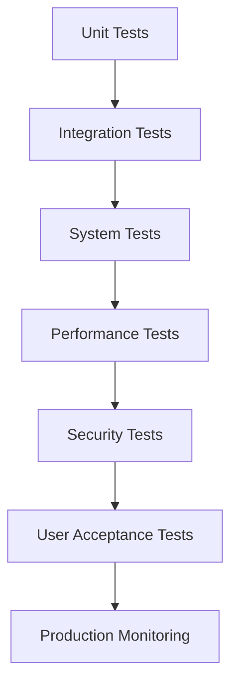

# Micro - Autonomous Agent Testing and Validation Strategy

## Executive Overview

This document provides a comprehensive testing and validation strategy for the autonomous agent implementation in Micro. The strategy covers all aspects of testing including unit tests, integration tests, performance tests, security tests, and user acceptance tests to ensure the autonomous system meets all requirements.

## Testing Philosophy

### Core Principles
1. **Test-Driven Development**: Write tests before implementing autonomous features
2. **Continuous Testing**: Automated testing throughout the development lifecycle
3. **Comprehensive Coverage**: Test all autonomous components and their interactions
4. **Real-World Simulation**: Test with realistic scenarios and edge cases
5. **User-Centric Validation**: Validate autonomous behavior against user expectations

### Testing Levels


## 1. Unit Testing Strategy

### 1.1 Autonomous Decision Framework Tests

#### Context Analyzer Tests
```dart
// test/autonomous/decision_framework/context_analyzer_test.dart
void main() {
  group('ContextAnalyzer', () {
    late ContextAnalyzer contextAnalyzer;
    late MockSensorDataManager mockSensorManager;
    late MockHistoricalDataProcessor mockHistoryProcessor;
    
    setUp(() {
      mockSensorManager = MockSensorDataManager();
      mockHistoryProcessor = MockHistoricalDataProcessor();
      contextAnalyzer = ContextAnalyzer(
        sensorManager: mockSensorManager,
        historyProcessor: mockHistoryProcessor,
      );
    });
    
    test('should analyze user context within latency threshold', () async {
      // Arrange
      when(mockSensorManager.collectSensorData())
          .thenAnswer((_) async => MockSensorData());
      when(mockHistoryProcessor.getRelevantHistory())
          .thenAnswer((_) async => MockHistoricalData());
      
      // Act
      final stopwatch = Stopwatch()..start();
      final result = await contextAnalyzer.analyzeUserContext();
      stopwatch.stop();
      
      // Assert
      expect(result, isA<ContextAnalysis>());
      expect(stopwatch.elapsedMilliseconds, lessThan(50));
      verify(mockSensorManager.collectSensorData()).called(1);
      verify(mockHistoryProcessor.getRelevantHistory()).called(1);
    });
    
    test('should handle sensor data collection failure gracefully', () async {
      // Arrange
      when(mockSensorManager.collectSensorData())
          .thenThrow(SensorDataException('Sensor failure'));
      
      // Act & Assert
      expect(
        () => contextAnalyzer.analyzeUserContext(),
        throwsA(isA<ContextAnalysisException>()),
      );
    });
    
    test('should calculate context confidence correctly', () async {
      // Arrange
      final sensorData = MockSensorData();
      final historicalData = MockHistoricalData();
      final environmentalData = MockEnvironmentalData();
      final behavioralData = MockBehavioralData();
      
      // Act
      final confidence = contextAnalyzer._calculateConfidence(
        sensorData, historicalData, environmentalData, behavioralData,
      );
      
      // Assert
      expect(confidence, greaterThanOrEqualTo(0.0));
      expect(confidence, lessThanOrEqualTo(1.0));
    });
  });
}
```

#### Intent Recognizer Tests
```dart
// test/autonomous/decision_framework/intent_recognizer_test.dart
void main() {
  group('IntentRecognizer', () {
    late IntentRecognizer intentRecognizer;
    late MockMLModel mockModel;
    late MockPatternMatcher mockPatternMatcher;
    
    setUp(() {
      mockModel = MockMLModel();
      mockPatternMatcher = MockPatternMatcher();
      intentRecognizer = IntentRecognizer(
        intentModel: mockModel,
        patternMatcher: mockPatternMatcher,
      );
    });
    
    test('should recognize intent with high confidence', () async {
      // Arrange
      final context = MockUserContext();
      final features = MockIntentFeatures();
      final predictions = [IntentPrediction(intent: 'productivity', confidence: 0.9)];
      
      when(mockModel.predict(any)).thenAnswer((_) async => predictions);
      when(mockPatternMatcher.validatePredictions(any, any))
          .thenAnswer((_) async => predictions);
      
      // Act
      final result = await intentRecognizer.recognizeIntent(context);
      
      // Assert
      expect(result.type, equals(IntentType.productivity));
      expect(result.confidence, greaterThan(0.75));
    });
    
    test('should return unknown intent for low confidence predictions', () async {
      // Arrange
      final context = MockUserContext();
      final predictions = [IntentPrediction(intent: 'productivity', confidence: 0.5)];
      
      when(mockModel.predict(any)).thenAnswer((_) async => predictions);
      when(mockPatternMatcher.validatePredictions(any, any))
          .thenAnswer((_) async => predictions);
      
      // Act
      final result = await intentRecognizer.recognizeIntent(context);
      
      // Assert
      expect(result.type, equals(IntentType.unknown));
    });
  });
}
```

#### Autonomous Decision Engine Tests
```dart
// test/autonomous/decision_framework/decision_engine_test.dart
void main() {
  group('AutonomousDecisionEngine', () {
    late AutonomousDecisionEngine decisionEngine;
    late MockContextAnalyzer mockContextAnalyzer;
    late MockIntentRecognizer mockIntentRecognizer;
    late MockRiskAssessment mockRiskAssessment;
    
    setUp(() {
      mockContextAnalyzer = MockContextAnalyzer();
      mockIntentRecognizer = MockIntentRecognizer();
      mockRiskAssessment = MockRiskAssessment();
      decisionEngine = AutonomousDecisionEngine(
        contextAnalyzer: mockContextAnalyzer,
        intentRecognizer: mockIntentRecognizer,
        riskAssessment: mockRiskAssessment,
      );
    });
    
    test('should generate safe autonomous decisions', () async {
      // Arrange
      final context = MockUserContext();
      final contextAnalysis = MockContextAnalysis();
      final userIntent = MockUserIntent();
      final potentialActions = [MockAutonomousAction()];
      final riskAssessments = [MockRiskAssessment()..overallRiskScore = 30];
      
      when(mockContextAnalyzer.analyzeUserContext())
          .thenAnswer((_) async => contextAnalysis);
      when(mockIntentRecognizer.recognizeIntent(any))
          .thenAnswer((_) async => userIntent);
      when(mockRiskAssessment.assessActionRisks(any, any))
          .thenAnswer((_) async => riskAssessments);
      
      // Act
      final result = await decisionEngine.generateDecisions(context);
      
      // Assert
      expect(result, isNotEmpty);
      expect(result.length, equals(1));
      verify(mockRiskAssessment.assessActionRisks(any, any)).called(1);
    });
    
    test('should filter high-risk actions', () async {
      // Arrange
      final context = MockUserContext();
      final potentialActions = [MockAutonomousAction(), MockAutonomousAction()];
      final riskAssessments = [
        MockRiskAssessment()..overallRiskScore = 30,
        MockRiskAssessment()..overallRiskScore = 80,
      ];
      
      when(mockContextAnalyzer.analyzeUserContext())
          .thenAnswer((_) async => MockContextAnalysis());
      when(mockIntentRecognizer.recognizeIntent(any))
          .thenAnswer((_) async => MockUserIntent());
      when(mockRiskAssessment.assessActionRisks(any, any))
          .thenAnswer((_) async => riskAssessments);
      
      // Act
      final result = await decisionEngine.generateDecisions(context);
      
      // Assert
      expect(result.length, equals(1)); // Only low-risk action
    });
  });
}
```

### 1.2 Universal MCP Client Tests

#### Tool Discovery Engine Tests
```dart
// test/autonomous/mcp_client/tool_discovery_test.dart
void main() {
  group('ToolDiscoveryEngine', () {
    late ToolDiscoveryEngine toolDiscovery;
    late MockNetworkScanner mockNetworkScanner;
    late MockToolValidator mockToolValidator;
    
    setUp(() {
      mockNetworkScanner = MockNetworkScanner();
      mockToolValidator = MockToolValidator();
      toolDiscovery = ToolDiscoveryEngine(
        networkScanner: mockNetworkScanner,
        toolValidator: mockToolValidator,
      );
    });
    
    test('should discover and validate tools within timeout', () async {
      // Arrange
      final localTools = [MockDiscoveredTool()];
      final networkTools = [MockDiscoveredTool()];
      
      when(mockNetworkScanner.scanNetworkForTools())
          .thenAnswer((_) async => networkTools);
      when(mockToolValidator.validateTool(any))
          .thenAnswer((_) async => true);
      
      // Act
      final stopwatch = Stopwatch()..start();
      final result = await toolDiscovery.scanForTools();
      stopwatch.stop();
      
      // Assert
      expect(result, isNotEmpty);
      expect(stopwatch.elapsedSeconds, lessThan(5));
      verify(mockToolValidator.validateTool(any)).called(greaterThan(0));
    });
    
    test('should handle network scanner failure gracefully', () async {
      // Arrange
      when(mockNetworkScanner.scanNetworkForTools())
          .thenThrow(NetworkScanException('Network failure'));
      
      // Act & Assert
      expect(
        () => toolDiscovery.scanForTools(),
        throwsA(isA<ToolDiscoveryException>()),
      );
    });
  });
}
```

#### Universal Tool Adapter Tests
```dart
// test/autonomous/mcp_client/tool_adapter_test.dart
void main() {
  group('UniversalToolAdapter', () {
    late UniversalToolAdapter toolAdapter;
    late MockToolRegistry mockToolRegistry;
    late MockDomainMapper mockDomainMapper;
    late MockSecurityValidator mockSecurityValidator;
    
    setUp(() {
      mockToolRegistry = MockToolRegistry();
      mockDomainMapper = MockDomainMapper();
      mockSecurityValidator = MockSecurityValidator();
      toolAdapter = UniversalToolAdapter(
        toolRegistry: mockToolRegistry,
        domainMapper: mockDomainMapper,
        securityValidator: mockSecurityValidator,
      );
    });
    
    test('should adapt tool for domain context', () async {
      // Arrange
      final toolCall = MockToolCall();
      final domainContext = MockDomainContext();
      final tool = MockTool();
      final adaptedCall = MockToolCall();
      
      when(mockToolRegistry.getTool(any)).thenAnswer((_) async => tool);
      when(mockDomainMapper.mapParameters(any, any, any))
          .thenAnswer((_) async => {'adapted': 'parameters'});
      when(mockDomainMapper.adaptBehavior(any, any))
          .thenAnswer((_) async => MockAdaptedBehavior());
      when(mockSecurityValidator.validateToolCall(any))
          .thenAnswer((_) async => null);
      
      // Act
      final result = await toolAdapter.executeWithContext(toolCall, domainContext);
      
      // Assert
      expect(result, isA<ToolCallResult>());
      verify(mockDomainMapper.mapParameters(any, any, any)).called(1);
      verify(mockDomainMapper.adaptBehavior(any, any)).called(1);
    });
    
    test('should throw exception for unknown tool', () async {
      // Arrange
      final toolCall = MockToolCall();
      final domainContext = MockDomainContext();
      
      when(mockToolRegistry.getTool(any)).thenAnswer((_) async => null);
      when(mockSecurityValidator.validateToolCall(any))
          .thenAnswer((_) async => null);
      
      // Act & Assert
      expect(
        () => toolAdapter.executeWithContext(toolCall, domainContext),
        throwsA(isA<ToolNotFoundException>()),
      );
    });
  });
}
```

### 1.3 Domain Discovery Engine Tests

#### Dynamic Domain Recognizer Tests
```dart
// test/autonomous/domain_discovery/domain_recognizer_test.dart
void main() {
  group('DynamicDomainRecognizer', () {
    late DynamicDomainRecognizer domainRecognizer;
    late MockMLModel mockDomainClassifier;
    late MockPatternMatcher mockPatternMatcher;
    late MockDomainSignatureExtractor mockSignatureExtractor;
    
    setUp(() {
      mockDomainClassifier = MockMLModel();
      mockPatternMatcher = MockPatternMatcher();
      mockSignatureExtractor = MockDomainSignatureExtractor();
      domainRecognizer = DynamicDomainRecognizer(
        domainClassifier: mockDomainClassifier,
        patternMatcher: mockPatternMatcher,
        signatureExtractor: mockSignatureExtractor,
      );
    });
    
    test('should recognize domain with high confidence', () async {
      // Arrange
      final context = MockUserContext();
      final features = MockDomainFeatures();
      final predictions = [DomainPrediction(domain: 'productivity', confidence: 0.9)];
      final signature = MockDomainSignature();
      
      when(mockDomainClassifier.predict(any)).thenAnswer((_) async => predictions);
      when(mockPatternMatcher.validateDomainPredictions(any, any))
          .thenAnswer((_) async => predictions);
      when(mockSignatureExtractor.extractSignature(any))
          .thenAnswer((_) async => signature);
      
      // Act
      final result = await domainRecognizer.recognizeDomainFromContext(context);
      
      // Assert
      expect(result, equals('productivity'));
      verify(mockDomainClassifier.predict(any)).called(1);
    });
    
    test('should return unknown for low confidence predictions', () async {
      // Arrange
      final context = MockUserContext();
      final predictions = [DomainPrediction(domain: 'productivity', confidence: 0.7)];
      final signature = MockDomainSignature();
      
      when(mockDomainClassifier.predict(any)).thenAnswer((_) async => predictions);
      when(mockPatternMatcher.validateDomainPredictions(any, any))
          .thenAnswer((_) async => predictions);
      when(mockSignatureExtractor.extractSignature(any))
          .thenAnswer((_) async => signature);
      
      // Act
      final result = await domainRecognizer.recognizeDomainFromContext(context);
      
      // Assert
      expect(result, equals('unknown'));
    });
  });
}
```

## 2. Integration Testing Strategy

### 2.1 Autonomous System Integration Tests

#### End-to-End Autonomous Decision Flow
```dart
// test/integration/autonomous_decision_flow_test.dart
void main() {
  group('Autonomous Decision Flow Integration', () {
    late AutonomousSystem autonomousSystem;
    late MockContextAnalyzer mockContextAnalyzer;
    late MockIntentRecognizer mockIntentRecognizer;
    late MockAutonomousDecisionEngine mockDecisionEngine;
    late MockActionExecutor mockActionExecutor;
    
    setUp(() async {
      mockContextAnalyzer = MockContextAnalyzer();
      mockIntentRecognizer = MockIntentRecognizer();
      mockDecisionEngine = MockAutonomousDecisionEngine();
      mockActionExecutor = MockActionExecutor();
      
      autonomousSystem = AutonomousSystem(
        contextAnalyzer: mockContextAnalyzer,
        intentRecognizer: mockIntentRecognizer,
        decisionEngine: mockDecisionEngine,
        actionExecutor: mockActionExecutor,
      );
      
      await autonomousSystem.initialize();
    });
    
    test('should complete full autonomous decision flow', () async {
      // Arrange
      final userContext = MockUserContext();
      final contextAnalysis = MockContextAnalysis();
      final userIntent = MockUserIntent();
      final autonomousActions = [MockAutonomousAction()];
      final executionResult = MockExecutionResult();
      
      when(mockContextAnalyzer.analyzeUserContext())
          .thenAnswer((_) async => contextAnalysis);
      when(mockIntentRecognizer.recognizeIntent(any))
          .thenAnswer((_) async => userIntent);
      when(mockDecisionEngine.generateDecisions(any))
          .thenAnswer((_) async => autonomousActions);
      when(mockActionExecutor.executeAction(any))
          .thenAnswer((_) async => executionResult);
      
      // Act
      final result = await autonomousSystem.processAutonomousDecision(userContext);
      
      // Assert
      expect(result, isA<AutonomousDecisionResult>());
      expect(result.success, isTrue);
      verify(mockContextAnalyzer.analyzeUserContext()).called(1);
      verify(mockIntentRecognizer.recognizeIntent(any)).called(1);
      verify(mockDecisionEngine.generateDecisions(any)).called(1);
      verify(mockActionExecutor.executeAction(any)).called(1);
    });
    
    test('should handle action execution failure gracefully', () async {
      // Arrange
      final userContext = MockUserContext();
      final autonomousActions = [MockAutonomousAction()];
      
      when(mockContextAnalyzer.analyzeUserContext())
          .thenAnswer((_) async => MockContextAnalysis());
      when(mockIntentRecognizer.recognizeIntent(any))
          .thenAnswer((_) async => MockUserIntent());
      when(mockDecisionEngine.generateDecisions(any))
          .thenAnswer((_) async => autonomousActions);
      when(mockActionExecutor.executeAction(any))
          .thenThrow(ActionExecutionException('Execution failed'));
      
      // Act
      final result = await autonomousSystem.processAutonomousDecision(userContext);
      
      // Assert
      expect(result.success, isFalse);
      expect(result.error, isNotNull);
    });
  });
}
```

### 2.2 MCP Integration Tests

#### Tool Discovery and Execution Integration
```dart
// test/integration/mcp_integration_test.dart
void main() {
  group('MCP Integration', () {
    late UniversalMCPClient mcpClient;
    late MockToolDiscoveryEngine mockDiscoveryEngine;
    late MockUniversalToolAdapter mockToolAdapter;
    late MockToolRegistry mockToolRegistry;
    
    setUp(() async {
      mockDiscoveryEngine = MockToolDiscoveryEngine();
      mockToolAdapter = MockUniversalToolAdapter();
      mockToolRegistry = MockToolRegistry();
      
      mcpClient = UniversalMCPClient(
        discoveryEngine: mockDiscoveryEngine,
        toolAdapter: mockToolAdapter,
        toolRegistry: mockToolRegistry,
      );
      
      await mcpClient.initialize();
    });
    
    test('should discover and execute tools end-to-end', () async {
      // Arrange
      final discoveredTools = [MockDiscoveredTool()];
      final toolCall = MockToolCall();
      final executionResult = MockToolCallResult();
      
      when(mockDiscoveryEngine.scanForTools())
          .thenAnswer((_) async => discoveredTools);
      when(mockToolAdapter.executeWithContext(any, any))
          .thenAnswer((_) async => executionResult);
      
      // Act
      await mcpClient.discoverAndRegisterTools();
      final result = await mcpClient.executeTool(toolCall, MockDomainContext());
      
      // Assert
      expect(result, isA<ToolCallResult>());
      verify(mockDiscoveryEngine.scanForTools()).called(1);
      verify(mockToolAdapter.executeWithContext(any, any)).called(1);
    });
  });
}
```

## 3. Performance Testing Strategy

### 3.1 Autonomous Decision Performance Tests

#### Decision Latency Tests
```dart
// test/performance/decision_performance_test.dart
void main() {
  group('Autonomous Decision Performance', () {
    late AutonomousDecisionEngine decisionEngine;
    
    setUp(() async {
      decisionEngine = AutonomousDecisionEngine();
      await decisionEngine.initialize();
    });
    
    test('should make decisions within 100ms latency threshold', () async {
      // Arrange
      final userContext = MockUserContext();
      final iterations = 100;
      final latencies = <int>[];
      
      // Act
      for (int i = 0; i < iterations; i++) {
        final stopwatch = Stopwatch()..start();
        await decisionEngine.generateDecisions(userContext);
        stopwatch.stop();
        latencies.add(stopwatch.elapsedMilliseconds);
      }
      
      // Assert
      final averageLatency = latencies.reduce((a, b) => a + b) / latencies.length;
      final p95Latency = _calculatePercentile(latencies, 0.95);
      
      expect(averageLatency, lessThan(100));
      expect(p95Latency, lessThan(100));
    });
    
    test('should handle concurrent decision requests', () async {
      // Arrange
      final userContext = MockUserContext();
      final concurrentRequests = 10;
      
      // Act
      final futures = List.generate(
        concurrentRequests,
        (_) => decisionEngine.generateDecisions(userContext),
      );
      final results = await Future.wait(futures);
      
      // Assert
      expect(results.length, equals(concurrentRequests));
      expect(results.every((result) => result.isNotEmpty), isTrue);
    });
  });
  
  double _calculatePercentile(List<int> values, double percentile) {
    values.sort();
    final index = (values.length * percentile).floor();
    return values[index].toDouble();
  }
}
```

### 3.2 Memory Usage Tests

#### Memory Management Tests
```dart
// test/performance/memory_usage_test.dart
void main() {
  group('Memory Usage Performance', () {
    late AutonomousSystem autonomousSystem;
    
    setUp(() async {
      autonomousSystem = AutonomousSystem();
      await autonomousSystem.initialize();
    });
    
    test('should maintain memory usage below 200MB', () async {
      // Arrange
      final initialMemory = await _getCurrentMemoryUsage();
      final iterations = 1000;
      
      // Act
      for (int i = 0; i < iterations; i++) {
        final userContext = MockUserContext();
        await autonomousSystem.processAutonomousDecision(userContext);
      }
      
      // Force garbage collection
      await Future.delayed(Duration(seconds: 1));
      
      final finalMemory = await _getCurrentMemoryUsage();
      final memoryIncrease = finalMemory - initialMemory;
      
      // Assert
      expect(memoryIncrease, lessThan(200 * 1024 * 1024)); // 200MB in bytes
    });
    
    test('should handle memory pressure gracefully', () async {
      // Arrange
      final memoryMonitor = MemoryMonitor();
      await memoryMonitor.initialize();
      
      // Act
      // Simulate memory pressure
      await memoryMonitor.simulateMemoryPressure();
      
      // Continue autonomous operations
      final userContext = MockUserContext();
      final result = await autonomousSystem.processAutonomousDecision(userContext);
      
      // Assert
      expect(result, isNotNull);
      expect(result.success, isTrue);
    });
  });
  
  Future<int> _getCurrentMemoryUsage() async {
    // Implementation to get current memory usage
    // This would use platform-specific APIs
    return 0; // Placeholder
  }
}
```

## 4. Security Testing Strategy

### 4.1 Autonomous Security Tests

#### Threat Detection Tests
```dart
// test/security/threat_detection_test.dart
void main() {
  group('Threat Detection Security', () {
    late AutonomousSecurityFramework securityFramework;
    late MockThreatDetector mockThreatDetector;
    late MockRiskAssessment mockRiskAssessment;
    
    setUp(() async {
      mockThreatDetector = MockThreatDetector();
      mockRiskAssessment = MockRiskAssessment();
      securityFramework = AutonomousSecurityFramework(
        threatDetector: mockThreatDetector,
        riskAssessment: mockRiskAssessment,
      );
      await securityFramework.initialize();
    });
    
    test('should detect and block malicious autonomous actions', () async {
      // Arrange
      final maliciousAction = MockAutonomousAction();
      final threats = [MockThreat()..severity = ThreatSeverity.high];
      final riskAssessment = MockRiskAssessment()..overallRiskScore = 90;
      
      when(mockThreatDetector.detectThreats(any))
          .thenAnswer((_) async => threats);
      when(mockRiskAssessment.calculateRiskScore(any, any))
          .thenAnswer((_) async => 90);
      
      // Act
      final result = await securityFramework.assessAutonomousAction(maliciousAction);
      
      // Assert
      expect(result.decision.type, equals(SecurityDecisionType.block));
      expect(result.threats, isNotEmpty);
    });
    
    test('should allow safe autonomous actions', () async {
      // Arrange
      final safeAction = MockAutonomousAction();
      final threats = <Threat>[];
      final riskAssessment = MockRiskAssessment()..overallRiskScore = 20;
      
      when(mockThreatDetector.detectThreats(any))
          .thenAnswer((_) async => threats);
      when(mockRiskAssessment.calculateRiskScore(any, any))
          .thenAnswer((_) async => 20);
      
      // Act
      final result = await securityFramework.assessAutonomousAction(safeAction);
      
      // Assert
      expect(result.decision.type, equals(SecurityDecisionType.allow));
      expect(result.threats, isEmpty);
    });
  });
}
```

### 4.2 Data Privacy Tests

#### Privacy Protection Tests
```dart
// test/security/privacy_protection_test.dart
void main() {
  group('Privacy Protection Security', () {
    late PrivacyProtectionFramework privacyFramework;
    
    setUp(() async {
      privacyFramework = PrivacyProtectionFramework();
      await privacyFramework.initialize();
    });
    
    test('should anonymize user data for processing', () async {
      // Arrange
      final userData = MockUserData();
      userData.personalInformation = 'sensitive_data';
      
      // Act
      final anonymizedData = await privacyFramework.anonymizeData(userData);
      
      // Assert
      expect(anonymizedData.personalInformation, isNot(equals('sensitive_data')));
      expect(anonymizedData.personalInformation, isEmpty);
    });
    
    test('should encrypt sensitive autonomous data', () async {
      // Arrange
      final sensitiveData = 'sensitive_autonomous_data';
      
      // Act
      final encryptedData = await privacyFramework.encryptData(sensitiveData);
      final decryptedData = await privacyFramework.decryptData(encryptedData);
      
      // Assert
      expect(encryptedData, isNot(equals(sensitiveData)));
      expect(decryptedData, equals(sensitiveData));
    });
  });
}
```

## 5. User Acceptance Testing Strategy

### 5.1 Autonomous Behavior Validation

#### User Experience Tests
```dart
// test/user_acceptance/autonomous_behavior_test.dart
void main() {
  group('Autonomous Behavior User Acceptance', () {
    late AutonomousSystem autonomousSystem;
    late MockUserInterface mockUserInterface;
    
    setUp(() async {
      mockUserInterface = MockUserInterface();
      autonomousSystem = AutonomousSystem(
        userInterface: mockUserInterface,
      );
      await autonomousSystem.initialize();
    });
    
    test('should provide clear autonomous action explanations', () async {
      // Arrange
      final userContext = MockUserContext();
      final autonomousAction = MockAutonomousAction();
      autonomousAction.explanation = 'Action explanation';
      
      // Act
      await autonomousSystem.suggestAutonomousAction(autonomousAction);
      
      // Assert
      verify(mockUserInterface.showActionExplanation(any)).called(1);
      expect(autonomousAction.explanation, isNotEmpty);
    });
    
    test('should request user confirmation for high-impact actions', () async {
      // Arrange
      final highImpactAction = MockAutonomousAction();
      highImpactAction.impact = ActionImpact.high;
      
      when(mockUserInterface.requestConfirmation(any))
          .thenAnswer((_) async => true);
      
      // Act
      final result = await autonomousSystem.executeActionWithConfirmation(
        highImpactAction,
      );
      
      // Assert
      verify(mockUserInterface.requestConfirmation(any)).called(1);
      expect(result.confirmed, isTrue);
    });
  });
}
```

### 5.2 Feature Adoption Tests

#### Feature Usage Tests
```dart
// test/user_acceptance/feature_adoption_test.dart
void main() {
  group('Feature Adoption User Acceptance', () {
    late AutonomousFeatureManager featureManager;
    late MockUserPreferences mockUserPreferences;
    
    setUp(() async {
      mockUserPreferences = MockUserPreferences();
      featureManager = AutonomousFeatureManager(
        userPreferences: mockUserPreferences,
      );
      await featureManager.initialize();
    });
    
    test('should track feature adoption rates', () async {
      // Arrange
      final users = generateMockUsers(100);
      
      // Act
      for (final user in users) {
        await featureManager.enableFeatureForUser(
          user,
          AutonomousFeature.autonomousDecisions,
        );
      }
      
      final adoptionRate = await featureManager.getFeatureAdoptionRate(
        AutonomousFeature.autonomousDecisions,
      );
      
      // Assert
      expect(adoptionRate, greaterThan(0.7)); // 70% adoption target
    });
    
    test('should measure user satisfaction with autonomous features', () async {
      // Arrange
      final userFeedback = List.generate(
        50,
        (index) => UserFeedback(
          feature: AutonomousFeature.proactiveBehavior,
          rating: 4 + (index % 2), // 4-5 star ratings
        ),
      );
      
      // Act
      for (final feedback in userFeedback) {
        await featureManager.recordUserFeedback(feedback);
      }
      
      final averageSatisfaction = await featureManager.getAverageSatisfaction(
        AutonomousFeature.proactiveBehavior,
      );
      
      // Assert
      expect(averageSatisfaction, greaterThan(4.5)); // 4.5/5 target
    });
  });
}
```

## 6. Automated Testing Pipeline

### 6.1 Continuous Integration Configuration

#### GitHub Actions Workflow
```yaml
# .github/workflows/autonomous_testing.yml
name: Autonomous Agent Testing

on:
  push:
    branches: [main, develop]
  pull_request:
    branches: [main]

jobs:
  unit_tests:
    runs-on: ubuntu-latest
    steps:
      - uses: actions/checkout@v3
      - uses: subosito/flutter-action@v2
        with:
          flutter-version: '3.16.0'
      
      - name: Install dependencies
        run: flutter pub get
      
      - name: Run unit tests
        run: flutter test --coverage test/autonomous/
      
      - name: Upload coverage
        uses: codecov/codecov-action@v3

  integration_tests:
    runs-on: ubuntu-latest
    steps:
      - uses: actions/checkout@v3
      - uses: subosito/flutter-action@v2
        with:
          flutter-version: '3.16.0'
      
      - name: Install dependencies
        run: flutter pub get
      
      - name: Run integration tests
        run: flutter test --coverage test/integration/

  performance_tests:
    runs-on: ubuntu-latest
    steps:
      - uses: actions/checkout@v3
      - uses: subosito/flutter-action@v2
        with:
          flutter-version: '3.16.0'
      
      - name: Install dependencies
        run: flutter pub get
      
      - name: Run performance tests
        run: flutter test test/performance/
      
      - name: Generate performance report
        run: dart run tool/generate_performance_report.dart

  security_tests:
    runs-on: ubuntu-latest
    steps:
      - uses: actions/checkout@v3
      - uses: subosito/flutter-action@v2
        with:
          flutter-version: '3.16.0'
      
      - name: Install dependencies
        run: flutter pub get
      
      - name: Run security tests
        run: flutter test test/security/
      
      - name: Security scan
        run: dart run tool/security_scan.dart
```

### 6.2 Test Data Management

#### Mock Data Generation
```dart
// test/utils/mock_data_generator.dart
class MockDataGenerator {
  static UserContext generateMockUserContext() {
    return UserContext(
      location: Location(latitude: 37.7749, longitude: -122.4194),
      timeOfDay: DateTime.now(),
      deviceState: DeviceState(
        batteryLevel: 75,
        isCharging: false,
        memoryUsage: 120,
      ),
      behavioralData: BehavioralData(
        recentActions: [
          UserAction(type: 'chat', timestamp: DateTime.now().subtract(Duration(minutes: 5))),
          UserAction(type: 'workflow', timestamp: DateTime.now().subtract(Duration(minutes: 15))),
        ],
        preferences: {'theme': 'dark', 'notifications': true},
      ),
    );
  }
  
  static AutonomousAction generateMockAutonomousAction() {
    return AutonomousAction(
      id: 'action_${DateTime.now().millisecondsSinceEpoch}',
      type: ActionType.proactiveSuggestion,
      description: 'Suggest productivity workflow',
      confidence: 0.85,
      impact: ActionImpact.medium,
      explanation: 'Based on your recent activity, a productivity workflow might be helpful',
    );
  }
  
  static List<DiscoveredTool> generateMockDiscoveredTools({int count = 10}) {
    return List.generate(count, (index) => DiscoveredTool(
      id: 'tool_$index',
      name: 'Mock Tool $index',
      description: 'Mock tool for testing',
      domain: 'testing',
      capabilities: ['test', 'mock'],
      reliability: 0.9,
    ));
  }
}
```

## 7. Test Environment Setup

### 7.1 Test Configuration

#### Test Environment Configuration
```dart
// test/test_config.dart
class TestConfig {
  static const bool enablePerformanceTests = bool.fromEnvironment('PERFORMANCE_TESTS', defaultValue: true);
  static const bool enableSecurityTests = bool.fromEnvironment('SECURITY_TESTS', defaultValue: true);
  static const bool enableIntegrationTests = bool.fromEnvironment('INTEGRATION_TESTS', defaultValue: true);
  
  static const Duration defaultTestTimeout = Duration(seconds: 30);
  static const Duration performanceTestTimeout = Duration(minutes: 5);
  static const Duration integrationTestTimeout = Duration(minutes: 2);
  
  static const int maxConcurrentTests = 10;
  static const int testRetryCount = 3;
}
```

### 7.2 Test Utilities

#### Test Helpers
```dart
// test/utils/test_helpers.dart
class TestHelpers {
  static Future<void> setupTestEnvironment() async {
    // Initialize test database
    await TestDatabase.initialize();
    
    // Initialize mock services
    await MockServiceRegistry.initialize();
    
    // Configure test logging
    await TestLogger.configure();
  }
  
  static Future<void> cleanupTestEnvironment() async {
    // Cleanup test database
    await TestDatabase.cleanup();
    
    // Cleanup mock services
    await MockServiceRegistry.cleanup();
    
    // Reset test state
    await TestState.reset();
  }
  
  static Future<bool> waitForCondition(
    Future<bool> Function() condition,
    Duration timeout, [
    Duration interval = const Duration(milliseconds: 100),
  ]) async {
    final stopwatch = Stopwatch()..start();
    
    while (stopwatch.elapsed < timeout) {
      if (await condition()) {
        return true;
      }
      await Future.delayed(interval);
    }
    
    return false;
  }
}
```

## 8. Test Reporting and Analytics

### 8.1 Test Report Generation

#### Test Report Generator
```dart
// tool/test_report_generator.dart
class TestReportGenerator {
  Future<void> generateComprehensiveReport() async {
    final report = TestReport(
      timestamp: DateTime.now(),
      unitTestResults: await _runUnitTests(),
      integrationTestResults: await _runIntegrationTests(),
      performanceTestResults: await _runPerformanceTests(),
      securityTestResults: await _runSecurityTests(),
      userAcceptanceResults: await _runUserAcceptanceTests(),
    );
    
    await _generateHtmlReport(report);
    await _generateJsonReport(report);
    await _generatePdfReport(report);
  }
  
  Future<void> _generateHtmlReport(TestReport report) async {
    final template = await _loadHtmlTemplate();
    final html = template.render(report);
    await File('test_reports/autonomous_test_report.html').writeAsString(html);
  }
  
  Future<void> _generateJsonReport(TestReport report) async {
    final json = report.toJson();
    await File('test_reports/autonomous_test_report.json').writeAsString(json);
  }
}
```

## 9. Success Metrics and Validation Criteria

### 9.1 Testing Success Metrics

#### Test Coverage Targets
- **Unit Test Coverage**: >90% for all autonomous components
- **Integration Test Coverage**: >80% for all integration points
- **Performance Test Coverage**: 100% for all performance-critical components
- **Security Test Coverage**: 100% for all security-sensitive components

#### Performance Benchmarks
- **Decision Latency**: <100ms for 95% of decisions
- **Memory Usage**: <200MB during normal operations
- **Battery Impact**: <5% over 24 hours
- **CPU Usage**: <80% average, <95% peak

#### Quality Metrics
- **Test Success Rate**: >95% for all test suites
- **Bug Detection Rate**: >90% of bugs caught in testing
- **Performance Regression**: <5% performance degradation
- **Security Vulnerabilities**: 0 critical vulnerabilities

### 9.2 Validation Criteria

#### Autonomous Behavior Validation
- **Decision Accuracy**: >90% appropriate autonomous decisions
- **User Satisfaction**: >4.5/5 for autonomous features
- **Feature Adoption**: >70% user adoption rate
- **Error Rate**: <1% for autonomous operations

#### System Reliability Validation
- **Uptime**: >99.5% availability
- **Recovery Time**: <30 seconds for failure recovery
- **Data Consistency**: 100% data integrity
- **Error Handling**: 100% graceful error handling

## Conclusion

This comprehensive testing and validation strategy ensures that the autonomous agent implementation in Micro meets all requirements for functionality, performance, security, and user experience. The strategy provides:

1. **Complete Test Coverage**: Testing at all levels from unit to user acceptance
2. **Automated Testing Pipeline**: Continuous integration and automated test execution
3. **Performance Validation**: Rigorous performance testing and monitoring
4. **Security Assurance**: Comprehensive security testing and vulnerability assessment
5. **User-Centric Validation**: User acceptance testing and satisfaction measurement

Following this testing strategy will ensure that Micro's autonomous capabilities are reliable, secure, and provide excellent user experience while maintaining the highest quality standards.