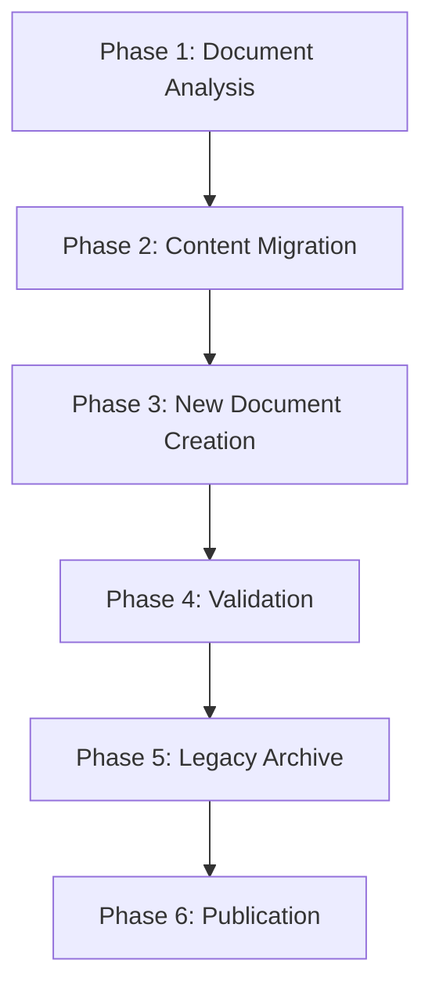

# Micro - Documentation Replacement Plan

## Executive Overview

This document outlines a comprehensive plan for replacing legacy documentation with new autonomous agent-focused documentation. The plan ensures a smooth transition from reactive to autonomous documentation while maintaining continuity and preserving valuable information.

## Current Documentation Inventory

### Existing Documents Analysis

#### Primary Documents
1. **MICRO_IMPLEMENTATION_PLAN.md** - 16-week reactive implementation plan
2. **MICRO_ARCHITECTURE_COMPLETE.md** - Basic reactive architecture
3. **MICRO_DEVELOPMENT_GUIDE.md** - Reactive development guidelines
4. **MICRO_MOBILE_OPTIMIZATION_AND_TECHNICAL_SPECS.md** - Basic mobile optimization

#### Reference Documents
1. **MICRO_AUTONOMOUS_AGENT_ARCHITECTURE.md** - Autonomous architecture (KEEP)
2. **MICRO_AUTONOMOUS_AGENT_ARCHITECTURE_SUMMARY.md** - Architecture summary (KEEP)
3. **MICRO_ARCHITECTURE_DIAGRAMS.md** - Architecture diagrams (ENHANCE)

#### New Autonomous Documents Created
1. **MICRO_AUTONOMOUS_IMPLEMENTATION_ROADMAP.md** - Comprehensive 24-week autonomous roadmap
2. **MICRO_AUTONOMOUS_TECHNICAL_SPECIFICATIONS.md** - Detailed technical specifications
3. **MICRO_AUTONOMOUS_MIGRATION_STRATEGY.md** - Migration from reactive to autonomous
4. **MICRO_AUTONOMOUS_TESTING_STRATEGY.md** - Comprehensive testing strategy

## Documentation Replacement Strategy

### Replacement Principles
1. **Preserve Valuable Information**: Extract and migrate useful content from legacy documents
2. **Maintain Continuity**: Ensure smooth transition for developers
3. **Eliminate Redundancy**: Remove outdated and conflicting information
4. **Establish Single Source of Truth**: Create clear documentation hierarchy
5. **Version Control**: Maintain proper versioning and change tracking

### Replacement Timeline


## Detailed Replacement Plan

### Phase 1: Document Analysis (Week 1)

#### Content Analysis Matrix
| Document | Status | Action | Valuable Content | Conflicts | Gaps |
|----------|--------|--------|------------------|-----------|------|
| MICRO_IMPLEMENTATION_PLAN.md | Replace | Archive | Project structure, dependencies | Timeline, scope | Autonomous features |
| MICRO_ARCHITECTURE_COMPLETE.md | Replace | Archive | Basic architecture patterns | Layer definitions | Autonomous layers |
| MICRO_DEVELOPMENT_GUIDE.md | Replace | Archive | Coding standards, setup | Development workflow | Autonomous development |
| MICRO_MOBILE_OPTIMIZATION.md | Enhance | Update | Mobile constraints | Performance targets | Autonomous optimization |

#### Content Extraction Plan
```dart
class ContentExtractor {
  Future<ExtractedContent> extractValuableContent(String documentPath) async {
    final document = await _loadDocument(documentPath);
    
    return ExtractedContent(
      projectStructure: _extractProjectStructure(document),
      dependencies: _extractDependencies(document),
      codingStandards: _extractCodingStandards(document),
      setupInstructions: _extractSetupInstructions(document),
      architecturePatterns: _extractArchitecturePatterns(document),
      mobileConstraints: _extractMobileConstraints(document),
    );
  }
  
  List<String> identifyConflicts(Document legacyDoc, Document newDoc) {
    final conflicts = <String>[];
    
    // Check for conflicting timelines
    if (legacyDoc.timeline != newDoc.timeline) {
      conflicts.add('Timeline conflict between ${legacyDoc.title} and ${newDoc.title}');
    }
    
    // Check for conflicting architectures
    if (legacyDoc.architecture != newDoc.architecture) {
      conflicts.add('Architecture conflict between ${legacyDoc.title} and ${newDoc.title}');
    }
    
    return conflicts;
  }
}
```

### Phase 2: Content Migration (Week 2)

#### Migration Mapping

#### From MICRO_IMPLEMENTATION_PLAN.md → MICRO_AUTONOMOUS_IMPLEMENTATION_ROADMAP.md
**Content to Migrate:**
- Project structure and organization
- Dependencies and third-party libraries
- Basic Flutter setup instructions
- Team collaboration guidelines

**Content to Update:**
- Replace 16-week timeline with 24-week autonomous roadmap
- Update phases to include autonomous components
- Add mobile optimization considerations
- Include security and privacy requirements

#### From MICRO_ARCHITECTURE_COMPLETE.md → Enhanced Architecture Documents
**Content to Migrate:**
- Basic layer definitions
- Clean architecture principles
- State management patterns

**Content to Update:**
- Add 9-layer autonomous architecture
- Include autonomous component definitions
- Add integration points and interfaces
- Include mobile optimization layers

#### From MICRO_DEVELOPMENT_GUIDE.md → Enhanced Development Guide
**Content to Migrate:**
- Coding standards and conventions
- Git workflow and branching
- Testing guidelines
- Code review process

**Content to Update:**
- Add autonomous development patterns
- Include testing strategies for autonomous components
- Add security development guidelines
- Include performance optimization practices

#### From MICRO_MOBILE_OPTIMIZATION_AND_TECHNICAL_SPECS.md → Enhanced Mobile Optimization
**Content to Migrate:**
- Basic mobile constraints
- Performance targets
- Battery optimization basics

**Content to Update:**
- Add autonomous-specific optimization strategies
- Include resource management for autonomous operations
- Add thermal management for continuous processing
- Include network optimization for agent communication

### Phase 3: New Document Creation (Week 3)

#### Document Hierarchy Structure
```
MICRO_DOCUMENTATION/
├── 01_ARCHITECTURE/
│   ├── MICRO_AUTONOMOUS_AGENT_ARCHITECTURE.md (KEEP)
│   ├── MICRO_AUTONOMOUS_AGENT_ARCHITECTURE_SUMMARY.md (KEEP)
│   ├── MICRO_ARCHITECTURE_DIAGRAMS.md (ENHANCE)
│   └── MICRO_AUTONOMOUS_TECHNICAL_SPECIFICATIONS.md (NEW)
├── 02_IMPLEMENTATION/
│   ├── MICRO_AUTONOMOUS_IMPLEMENTATION_ROADMAP.md (NEW)
│   ├── MICRO_AUTONOMOUS_MIGRATION_STRATEGY.md (NEW)
│   └── MICRO_PHASE_IMPLEMENTATION_GUIDES/ (NEW FOLDER)
│       ├── PHASE_0_FOUNDATION.md
│       ├── PHASE_1_CORE_AUTONOMOUS.md
│       ├── PHASE_2_PROACTIVE_BEHAVIOR.md
│       ├── PHASE_2_5_UNIVERSAL_MCP.md
│       ├── PHASE_3_DOMAIN_DISCOVERY.md
│       ├── PHASE_3_5_AGENT_COMMUNICATION.md
│       ├── PHASE_4_LEARNING_SYSTEM.md
│       ├── PHASE_5_ADVANCED_OPERATIONS.md
│       └── PHASE_6_PRODUCTION_DEPLOYMENT.md
├── 03_DEVELOPMENT/
│   ├── MICRO_AUTONOMOUS_DEVELOPMENT_GUIDE.md (NEW)
│   ├── MICRO_AUTONOMOUS_TESTING_STRATEGY.md (NEW)
│   ├── MICRO_MOBILE_OPTIMIZATION_AND_TECHNICAL_SPECS.md (ENHANCED)
│   └── MICRO_AUTONOMOUS_SECURITY_GUIDE.md (NEW)
├── 04_OPERATIONS/
│   ├── MICRO_DEPLOYMENT_GUIDE.md (NEW)
│   ├── MICRO_MONITORING_GUIDE.md (NEW)
│   └── MICRO_TROUBLESHOOTING_GUIDE.md (NEW)
└── LEGACY_ARCHIVE/
    ├── ARCHIVED_MICRO_IMPLEMENTATION_PLAN.md
    ├── ARCHIVED_MICRO_ARCHITECTURE_COMPLETE.md
    ├── ARCHIVED_MICRO_DEVELOPMENT_GUIDE.md
    └── MIGRATION_NOTES.md
```

#### New Document Templates

#### Phase Implementation Guide Template
```markdown
# Micro - Phase X: [Phase Name] Implementation Guide

## Overview
[Brief description of phase objectives and scope]

## Objectives
- [Objective 1]
- [Objective 2]
- [Objective 3]

## Duration
- **Timeline**: X weeks
- **Start Date**: [Date]
- **End Date**: [Date]

## Prerequisites
- [Prerequisite 1]
- [Prerequisite 2]

## Key Components
### Component 1: [Component Name]
- **Purpose**: [Component purpose]
- **Implementation**: [Implementation details]
- **Integration**: [Integration points]

## Implementation Tasks
### Week X: [Week Focus]
- [Task 1]
- [Task 2]
- [Task 3]

## Integration Points
- [Integration point 1]
- [Integration point 2]

## Testing Strategy
- [Testing approach]
- [Test cases]
- [Validation criteria]

## Success Metrics
- [Metric 1]: [Target]
- [Metric 2]: [Target]

## Risks and Mitigations
- [Risk 1]: [Mitigation]
- [Risk 2]: [Mitigation]

## Dependencies
- [Dependency 1]
- [Dependency 2]

## Deliverables
- [Deliverable 1]
- [Deliverable 2]
```

### Phase 4: Validation (Week 4)

#### Validation Checklist

#### Content Completeness Validation
```dart
class DocumentValidator {
  Future<ValidationResult> validateDocumentCompleteness(String documentPath) async {
    final document = await _loadDocument(documentPath);
    final issues = <ValidationIssue>[];
    
    // Check for required sections
    final requiredSections = [
      'Overview',
      'Objectives',
      'Implementation',
      'Testing',
      'Success Metrics',
    ];
    
    for (final section in requiredSections) {
      if (!document.hasSection(section)) {
        issues.add(ValidationIssue.missingSection(section));
      }
    }
    
    // Check for technical specifications
    if (!document.hasTechnicalSpecifications) {
      issues.add(ValidationIssue.missingTechnicalSpecs());
    }
    
    // Check for integration points
    if (!document.hasIntegrationPoints) {
      issues.add(ValidationIssue.missingIntegrationPoints());
    }
    
    return ValidationResult(
      documentPath: documentPath,
      isValid: issues.isEmpty,
      issues: issues,
    );
  }
  
  Future<ValidationResult> validateDocumentConsistency() async {
    final documents = await _loadAllDocuments();
    final issues = <ValidationIssue>[];
    
    // Check for consistent terminology
    final terminologyIssues = _checkTerminologyConsistency(documents);
    issues.addAll(terminologyIssues);
    
    // Check for consistent architecture references
    final architectureIssues = _checkArchitectureConsistency(documents);
    issues.addAll(architectureIssues);
    
    // Check for consistent timeline references
    final timelineIssues = _checkTimelineConsistency(documents);
    issues.addAll(timelineIssues);
    
    return ValidationResult(
      isValid: issues.isEmpty,
      issues: issues,
    );
  }
}
```

#### Quality Assurance Validation
- **Technical Accuracy**: Verify all technical specifications are correct
- **Clarity and Readability**: Ensure documents are clear and easy to understand
- **Completeness**: Verify all required sections and content are present
- **Consistency**: Ensure consistent terminology and references across documents
- **Actionability**: Verify all guidance is actionable and specific

### Phase 5: Legacy Archive (Week 5)

#### Archiving Strategy

#### Archive Structure
```
LEGACY_ARCHIVE/
├── ARCHIVED_DOCUMENTS/
│   ├── 2024_01_ARCHIVED_MICRO_IMPLEMENTATION_PLAN.md
│   ├── 2024_01_ARCHIVED_MICRO_ARCHITECTURE_COMPLETE.md
│   ├── 2024_01_ARCHIVED_MICRO_DEVELOPMENT_GUIDE.md
│   └── 2024_01_ARCHIVED_MICRO_MOBILE_OPTIMIZATION.md
├── MIGRATION_NOTES/
│   ├── IMPLEMENTATION_PLAN_MIGRATION_NOTES.md
│   ├── ARCHITECTURE_MIGRATION_NOTES.md
│   ├── DEVELOPMENT_GUIDE_MIGRATION_NOTES.md
│   └── MOBILE_OPTIMIZATION_MIGRATION_NOTES.md
├── EXTRACTED_CONTENT/
│   ├── VALUABLE_PATTERNS.md
│   ├── CODING_STANDARDS.md
│   ├── PROJECT_STRUCTURE.md
│   └── DEPENDENCIES.md
└── INDEX.md
```

#### Migration Notes Template
```markdown
# Document Migration Notes

## Source Document
- **Name**: [Original Document Name]
- **Path**: [Original Path]
- **Last Modified**: [Date]
- **Version**: [Version]

## Migration Information
- **Migration Date**: [Date]
- **Migrated By**: [Name]
- **Reason for Migration**: [Reason]

## Content Mapping
### Migrated Content
| Original Section | New Location | Status |
|------------------|--------------|--------|
| [Section Name] | [New Document/Section] | [Migrated/Updated/Removed] |

### Removed Content
| Original Section | Reason for Removal |
|------------------|-------------------|
| [Section Name] | [Reason] |

### Updated Content
| Original Section | Changes Made | New Location |
|------------------|--------------|--------------|
| [Section Name] | [Description of changes] | [New Document/Section] |

## Migration Issues
- [Issue 1]: [Description and resolution]
- [Issue 2]: [Description and resolution]

## Lessons Learned
- [Lesson 1]
- [Lesson 2]
```

#### Archiving Process
```dart
class DocumentArchiver {
  Future<void> archiveDocument(String documentPath, ArchiveMetadata metadata) async {
    // Create archive entry
    final archiveEntry = ArchiveEntry(
      originalPath: documentPath,
      archivePath: _generateArchivePath(documentPath),
      metadata: metadata,
      archivedAt: DateTime.now(),
    );
    
    // Move document to archive
    await _moveToArchive(documentPath, archiveEntry.archivePath);
    
    // Create migration notes
    await _createMigrationNotes(archiveEntry);
    
    // Update archive index
    await _updateArchiveIndex(archiveEntry);
    
    // Verify archive integrity
    await _verifyArchiveIntegrity(archiveEntry);
  }
  
  String _generateArchivePath(String originalPath) {
    final timestamp = DateTime.now().toIso8601String().split('T')[0];
    final filename = basename(originalPath);
    return 'LEGACY_ARCHIVE/ARCHIVED_DOCUMENTS/${timestamp}_ARCHIVED_$filename';
  }
}
```

### Phase 6: Publication (Week 6)

#### Publication Strategy

#### Publication Checklist
- [ ] All new documents created and validated
- [ ] All legacy documents archived with migration notes
- [ ] Document index updated
- [ ] Cross-references updated
- [ ] Table of contents updated
- [ ] Documentation website updated
- [ ] Team notification sent
- [ ] Training materials prepared

#### Publication Process
```dart
class DocumentPublisher {
  Future<void> publishDocumentation() async {
    // Validate final documentation set
    final validationResult = await _validateFinalDocumentation();
    if (!validationResult.isValid) {
      throw PublicationException('Documentation validation failed');
    }
    
    // Update documentation index
    await _updateDocumentationIndex();
    
    // Update cross-references
    await _updateCrossReferences();
    
    // Generate documentation website
    await _generateDocumentationWebsite();
    
    // Create publication announcement
    await _createPublicationAnnouncement();
    
    // Notify team members
    await _notifyTeamMembers();
    
    // Prepare training materials
    await _prepareTrainingMaterials();
  }
  
  Future<void> _updateDocumentationIndex() async {
    final index = DocumentationIndex(
      architecture: [
        'MICRO_AUTONOMOUS_AGENT_ARCHITECTURE.md',
        'MICRO_AUTONOMOUS_AGENT_ARCHITECTURE_SUMMARY.md',
        'MICRO_ARCHITECTURE_DIAGRAMS.md',
        'MICRO_AUTONOMOUS_TECHNICAL_SPECIFICATIONS.md',
      ],
      implementation: [
        'MICRO_AUTONOMOUS_IMPLEMENTATION_ROADMAP.md',
        'MICRO_AUTONOMOUS_MIGRATION_STRATEGY.md',
      ],
      development: [
        'MICRO_AUTONOMOUS_DEVELOPMENT_GUIDE.md',
        'MICRO_AUTONOMOUS_TESTING_STRATEGY.md',
        'MICRO_MOBILE_OPTIMIZATION_AND_TECHNICAL_SPECS.md',
        'MICRO_AUTONOMOUS_SECURITY_GUIDE.md',
      ],
      phaseGuides: [
        'PHASE_0_FOUNDATION.md',
        'PHASE_1_CORE_AUTONOMOUS.md',
        'PHASE_2_PROACTIVE_BEHAVIOR.md',
        'PHASE_2_5_UNIVERSAL_MCP.md',
        'PHASE_3_DOMAIN_DISCOVERY.md',
        'PHASE_3_5_AGENT_COMMUNICATION.md',
        'PHASE_4_LEARNING_SYSTEM.md',
        'PHASE_5_ADVANCED_OPERATIONS.md',
        'PHASE_6_PRODUCTION_DEPLOYMENT.md',
      ],
    );
    
    await _saveDocumentationIndex(index);
  }
}
```

## Risk Management

### Migration Risks

#### Content Loss Risk
- **Risk**: Valuable information lost during migration
- **Mitigation**: Comprehensive content extraction and verification
- **Monitoring**: Content audit before and after migration

#### Team Disruption Risk
- **Risk**: Team confusion during documentation transition
- **Mitigation**: Clear communication and training materials
- **Monitoring**: Team feedback and support requests

#### Consistency Risk
- **Risk**: Inconsistent information across documents
- **Mitigation**: Automated consistency validation
- **Monitoring**: Regular consistency checks

#### Access Risk
- **Risk**: Team members unable to find required information
- **Mitigation**: Clear documentation hierarchy and search functionality
- **Monitoring**: Documentation access analytics

### Rollback Strategy
```dart
class DocumentationRollbackManager {
  Future<void> rollbackToLegacyDocumentation() async {
    // Pause current documentation access
    await _pauseCurrentDocumentation();
    
    // Restore legacy documentation
    await _restoreLegacyDocumentation();
    
    // Notify team of rollback
    await _notifyTeamOfRollback();
    
    // Analyze rollback cause
    await _analyzeRollbackCause();
    
    // Create improvement plan
    await _createImprovementPlan();
  }
  
  Future<void> _pauseCurrentDocumentation() async {
    // Redirect documentation URLs to archive
    await _redirectDocumentationUrls();
    
    // Display rollback notice
    await _displayRollbackNotice();
    
    // Disable edits to new documentation
    await _disableNewDocumentationEdits();
  }
}
```

## Success Metrics

### Documentation Quality Metrics
- **Completeness**: 100% of required sections present
- **Accuracy**: 0 technical errors identified
- **Consistency**: 100% consistent terminology and references
- **Readability**: >90% readability score
- **Actionability**: 100% of guidance is actionable

### Team Adoption Metrics
- **Usage Rate**: >80% team members using new documentation
- **Satisfaction**: >4.5/5 satisfaction rating
- **Support Requests**: <5% increase in support requests
- **Training Completion**: >90% training completion rate

### Maintenance Metrics
- **Update Frequency**: Regular updates as needed
- **Version Control**: 100% proper versioning
- **Archive Integrity**: 100% archive integrity maintained
- **Search Success**: >95% search success rate

## Communication Plan

### Stakeholder Communication

#### Pre-Migration Communication
```markdown
Subject: Documentation Migration Announcement - Micro Autonomous Agent

Dear Team,

We are excited to announce the upcoming migration of Micro documentation to support our autonomous agent implementation. This migration will replace our current reactive documentation with comprehensive autonomous-focused documentation.

**Migration Timeline:**
- Week 1: Document Analysis
- Week 2: Content Migration
- Week 3: New Document Creation
- Week 4: Validation
- Week 5: Legacy Archive
- Week 6: Publication

**What to Expect:**
- New comprehensive autonomous implementation roadmap
- Detailed technical specifications for all autonomous components
- Migration strategy from reactive to autonomous
- Comprehensive testing and validation strategies
- Enhanced mobile optimization guidelines

**How to Prepare:**
- Review current documentation for personal references
- Bookmark important sections you frequently use
- Prepare for training on new documentation structure

**Support:**
- Documentation migration office hours: [Schedule]
- Questions and feedback: [Contact]
- Training sessions: [Schedule]

We appreciate your patience and cooperation during this transition.

Best regards,
Micro Development Team
```

#### Post-Migration Communication
```markdown
Subject: New Autonomous Documentation Now Available!

Dear Team,

We are pleased to announce that the new Micro autonomous agent documentation is now available! This comprehensive documentation suite provides everything you need to understand, implement, and maintain Micro's autonomous capabilities.

**New Documentation Highlights:**
- 24-week implementation roadmap with detailed phases
- Complete technical specifications for all autonomous components
- Step-by-step migration strategy
- Comprehensive testing and validation strategies
- Enhanced mobile optimization guidelines

**Documentation Structure:**
- Architecture: Complete autonomous architecture documentation
- Implementation: Roadmap and migration guides
- Development: Development guidelines and testing strategies
- Phase Guides: Detailed implementation guides for each phase

**Getting Started:**
1. Read the Autonomous Implementation Roadmap
2. Review the Migration Strategy
3. Explore the Phase Implementation Guides
4. Attend training sessions: [Schedule]

**Legacy Documentation:**
All legacy documentation has been archived with migration notes. You can access the archive at: [Archive Link]

**Support:**
- Documentation navigation guide: [Link]
- Training sessions: [Schedule]
- Questions and feedback: [Contact]

We're excited to have you explore the new autonomous documentation and welcome your feedback!

Best regards,
Micro Development Team
```

## Conclusion

This documentation replacement plan ensures a smooth transition from reactive to autonomous documentation while preserving valuable information and maintaining team productivity. The plan provides:

1. **Systematic Approach**: Structured 6-phase replacement process
2. **Content Preservation**: Extraction and migration of valuable content
3. **Quality Assurance**: Comprehensive validation and verification
4. **Risk Management**: Proactive risk identification and mitigation
5. **Team Support**: Clear communication and training materials

Following this plan will result in a comprehensive, up-to-date documentation suite that fully supports Micro's transformation into an autonomous general-purpose agent while maintaining continuity and team productivity.