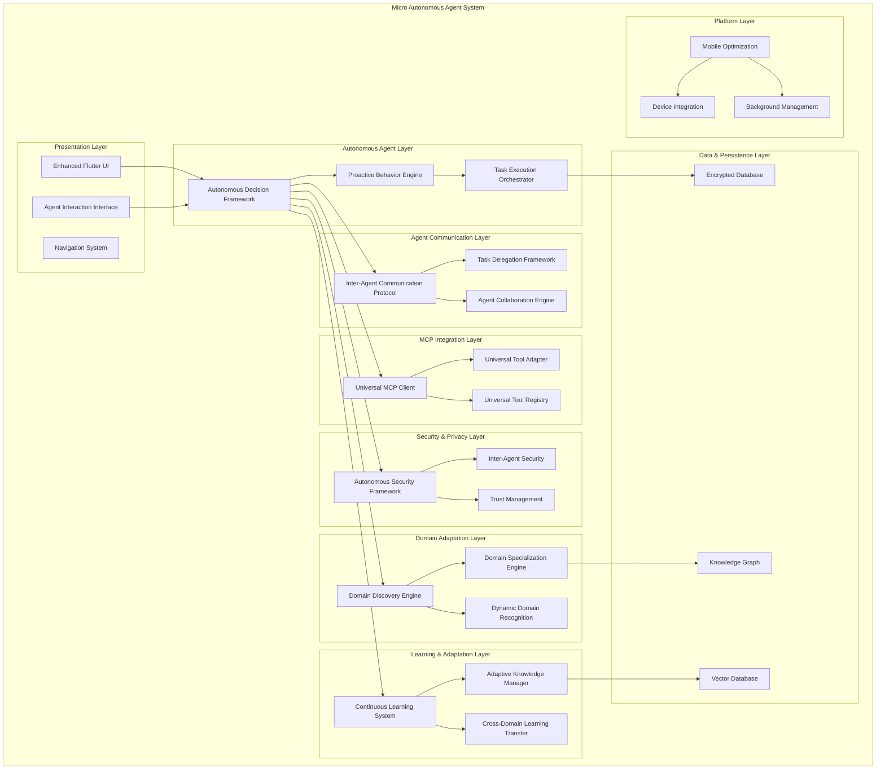
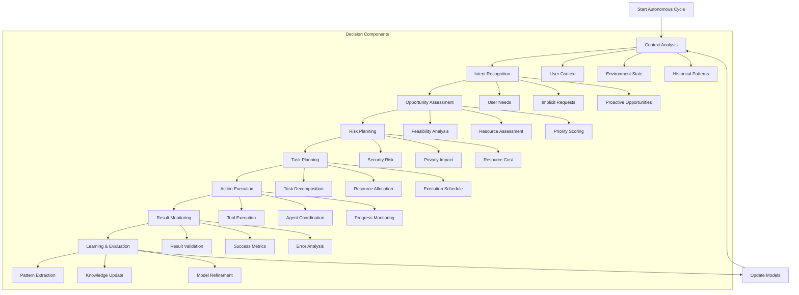
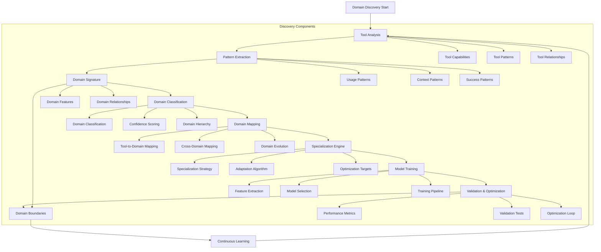
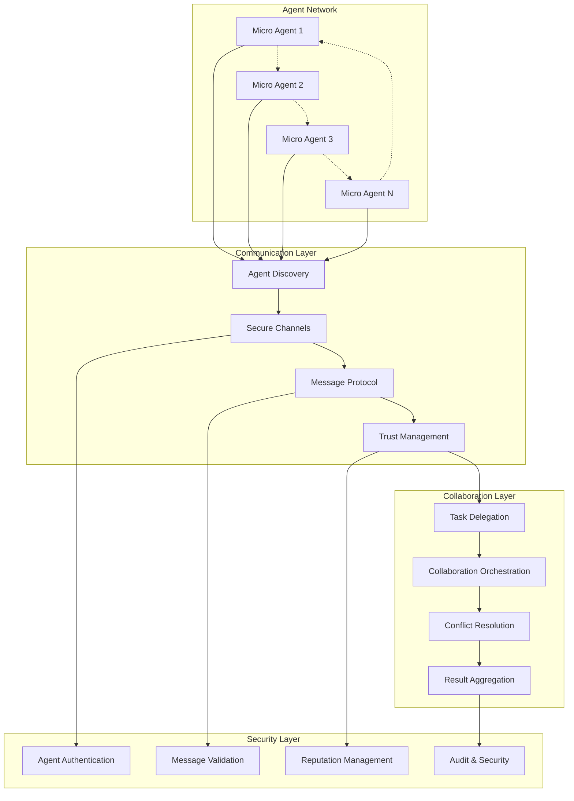
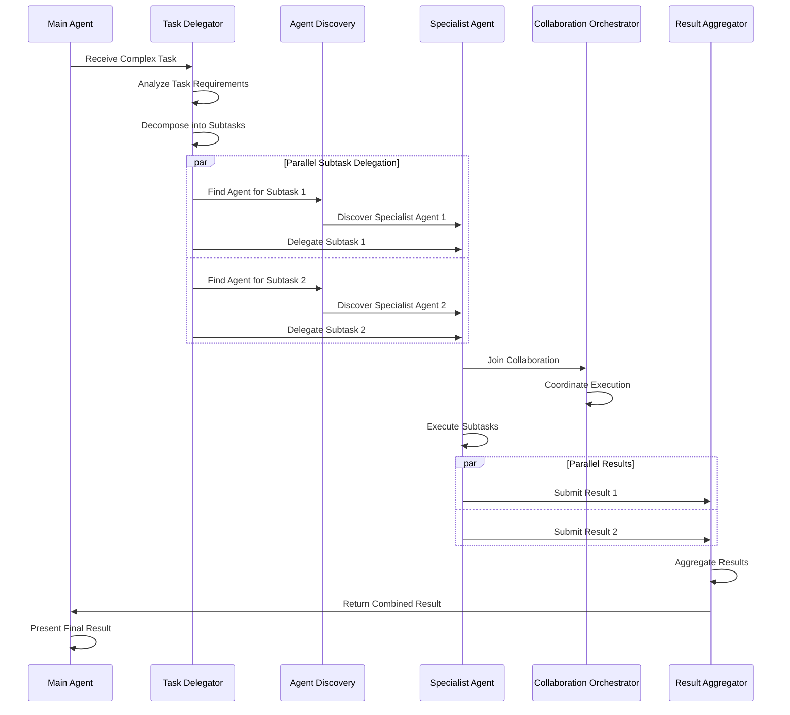
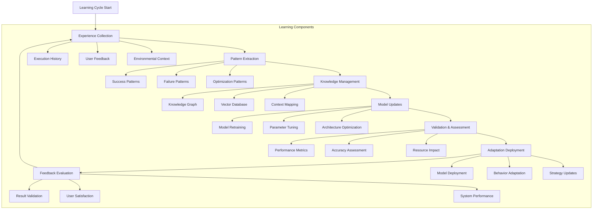
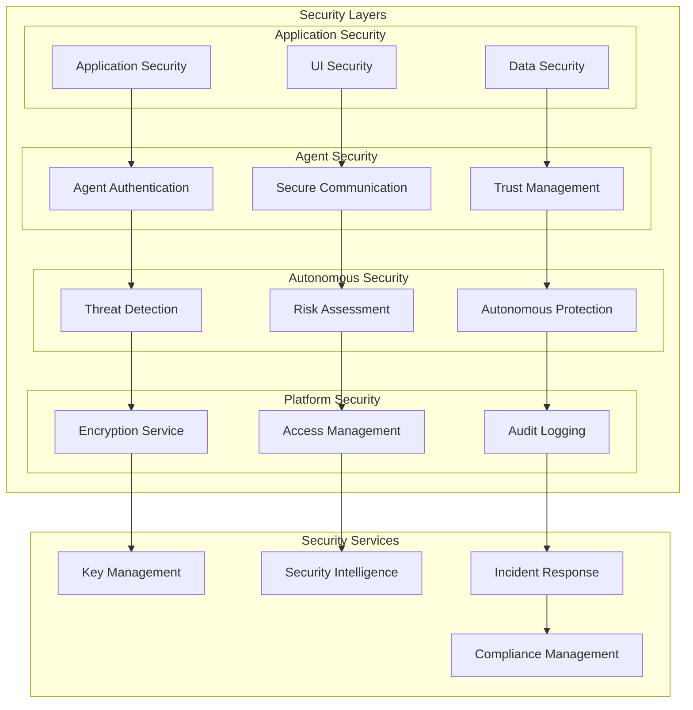
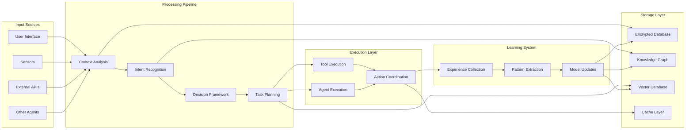
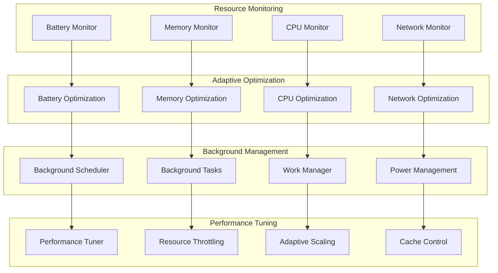
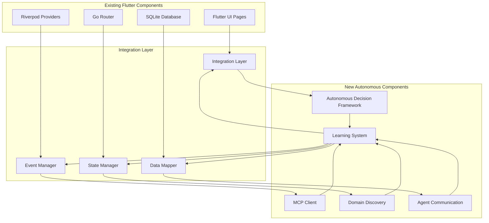

# Micro - Autonomous Agent Architecture Diagrams

## 1. High-Level System Architecture

## 2. Autonomous Decision Framework Flow

## 3. Domain Discovery and Specialization Flow

## 4. Agent-to-Agent Communication Architecture

## 5. Task Delegation and Collaboration Flow

## 6. Learning and Adaptation System Flow

## 7. Security Framework Architecture

## 8. Data Flow Architecture

## 9. Mobile Optimization Architecture

## 10. Integration with Existing Flutter Codebase

These diagrams provide a comprehensive visual representation of the Micro autonomous agent architecture, showing how all components interact and work together to create a universal, adaptive, and collaborative agent system.