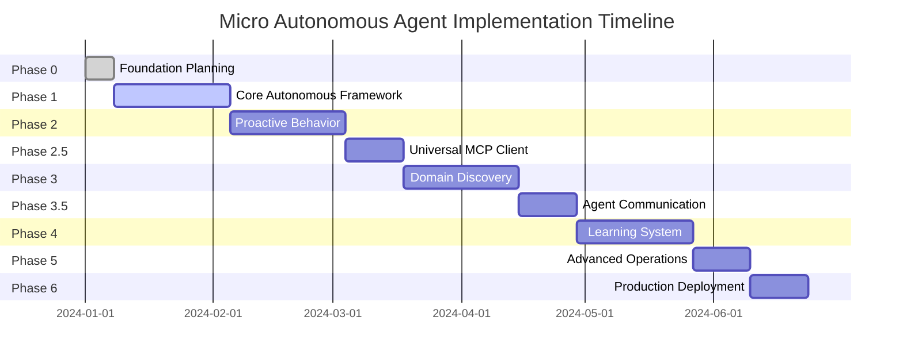

# Micro - Autonomous Agent Implementation Roadmap: Complete Summary

## Executive Summary

This document provides a comprehensive executive summary of the transformation journey for Micro from a basic reactive Flutter application into a sophisticated autonomous general-purpose agent. The transformation encompasses a 24-week implementation roadmap with 9 distinct phases, detailed technical specifications for 6 core autonomous components, and a complete migration strategy that ensures smooth transition while maintaining existing functionality.

The autonomous agent implementation will enable Micro to proactively identify and act on user needs without explicit commands, automatically specialize in any domain without hardcoded configurations, collaborate with other Micro agents through task delegation, continuously learn and adapt based on experience, operate efficiently within mobile device constraints, and maintain comprehensive security across all autonomous operations.

## Transformation Vision

### Current State
Micro exists as a basic reactive Flutter UI application with:
- Material Design 3 interface
- Riverpod state management framework
- GoRouter navigation system
- SQLCipher database dependencies
- Basic security dependencies
- Clean architecture foundation
- Most core functionality unimplemented

### Target State
Micro will evolve into a fully autonomous general-purpose agent capable of:
- **Fully Autonomous Operation**: Proactively identifying and acting on user needs without explicit commands
- **Universal Adaptability**: Automatically specializing in any domain without hardcoded configurations
- **Collaborative Intelligence**: Working with other Micro agents through task delegation and collaboration
- **Continuous Learning**: Improving and adapting based on experience and user interactions
- **Mobile Optimization**: Operating efficiently within mobile device constraints
- **Security-First Operations**: Maintaining comprehensive security across all autonomous operations

## Implementation Overview: 9-Phase Transformation

### Phase 0: Autonomous Foundation Planning (Week 0)
**Duration**: 1 Week (Pre-implementation)

**Objectives**: Establish comprehensive autonomous architecture foundation, define technical specifications, create development standards, and set up autonomous-specific testing frameworks.

**Key Deliverables**:
- Complete autonomous architecture specification
- Development standards document
- Testing framework setup
- Component interface definitions

### Phase 1: Core Autonomous Framework Implementation (Weeks 1-4)
**Duration**: 4 Weeks

**Objectives**: Implement autonomous decision framework, create proactive behavior engine, develop context analysis and intent recognition, and build basic security framework for autonomous operations.

**Key Components**:
- Context Analyzer for multi-modal data synthesis
- Intent Recognizer with ML-based classification
- Autonomous Decision Engine with risk assessment
- Basic Autonomous Security Framework

### Phase 2: Proactive Behavior and Context Analysis (Weeks 5-8)
**Duration**: 4 Weeks

**Objectives**: Enhance proactive behavior capabilities, implement advanced context analysis, create predictive behavior system, and develop autonomous task planning.

**Key Components**:
- Predictive Context Engine
- Advanced Pattern Recognition
- Autonomous Task Planner
- Context-Aware UI Adaptation

### Phase 2.5: Universal MCP Client Implementation (Weeks 9-10)
**Duration**: 2 Weeks

**Objectives**: Implement universal MCP client with tool discovery, create domain-agnostic tool adapter, build tool execution engine with security validation, and develop tool registry and management system.

**Key Components**:
- Universal MCP Client
- Tool Discovery Engine
- Universal Tool Adapter
- Tool Registry and Management

### Phase 3: Domain Discovery and Specialization Engine (Weeks 11-14)
**Duration**: 4 Weeks

**Objectives**: Implement domain discovery engine without hardcoded domains, create dynamic domain recognition system, build domain specialization engine, and develop cross-domain learning transfer.

**Key Components**:
- Dynamic Domain Discovery Engine
- Real-Time Domain Recognition
- Domain Specialization Engine
- Cross-Domain Learning Transfer

### Phase 3.5: Agent Communication Framework (Weeks 15-16)
**Duration**: 2 Weeks

**Objectives**: Implement inter-agent communication protocol, create task delegation framework, build agent collaboration engine, and develop security framework for agent communication.

**Key Components**:
- Inter-Agent Communication Protocol
- Task Delegation Framework
- Agent Collaboration Engine
- Secure Agent Discovery

### Phase 4: Learning and Adaptation System (Weeks 17-20)
**Duration**: 4 Weeks

**Objectives**: Implement continuous learning system, create adaptive knowledge management, build experience collection and pattern extraction, and develop model update mechanisms.

**Key Components**:
- Continuous Learning System
- Adaptive Knowledge Manager
- Model Update System
- Learning-Decision Integration

### Phase 5: Advanced Autonomous Operations (Weeks 21-22)
**Duration**: 2 Weeks

**Objectives**: Implement advanced autonomous operations, create sophisticated decision-making capabilities, build autonomous task orchestration, and develop advanced security and privacy features.

**Key Components**:
- Advanced Decision Making
- Autonomous Task Orchestration
- Enhanced Security Framework
- Privacy-First Autonomous Operations

### Phase 6: Production Deployment & Optimization (Weeks 23-24)
**Duration**: 2 Weeks

**Objectives**: Optimize autonomous operations for production, implement comprehensive monitoring and analytics, create deployment and update mechanisms, and prepare for production launch.

**Key Components**:
- Production Optimization
- Mobile Optimization Enhancement
- Production Deployment System
- Launch Preparation

## Technical Architecture Summary

### 9-Layer Autonomous Architecture
```
┌─────────────────────────────────────────────────────────────────────────────────┐
│                         Presentation Layer                                     │
│              (Enhanced Flutter UI + Agent Interaction Interface)                │
├─────────────────────────────────────────────────────────────────────────────────┤
│                      Autonomous Agent Layer                                    │
│                (Decision Making + Task Orchestration)                          │
├─────────────────────────────────────────────────────────────────────────────────┤
│                    Domain Adaptation Layer                                     │
│              (Domain Discovery + Specialization Engine)                        │
├─────────────────────────────────────────────────────────────────────────────────┤
│                  Agent Communication Layer                                      │
│              (Inter-Agent Protocol + Task Delegation)                          │
├─────────────────────────────────────────────────────────────────────────────────┤
│                  Learning & Adaptation Layer                                   │
│            (Continuous Learning + Knowledge Management)                        │
├─────────────────────────────────────────────────────────────────────────────────┤
│                     MCP Integration Layer                                       │
│           (Tool Discovery + Universal Execution Framework)                     │
├─────────────────────────────────────────────────────────────────────────────────┤
│                   Security & Privacy Layer                                      │
│             (Enhanced Security + Agent Trust Framework)                        │
├─────────────────────────────────────────────────────────────────────────────────┤
│                  Data & Persistence Layer                                       │
│                (Encrypted Storage + Knowledge Graph)                           │
├─────────────────────────────────────────────────────────────────────────────────┤
│                      Platform Layer                                             │
│               (Mobile Optimization + Device Integration)                        │
└─────────────────────────────────────────────────────────────────────────────────┘
```

### 6 Core Autonomous Components

#### 1. Autonomous Decision Framework
- **Context Analyzer**: Multi-modal context synthesis from sensor data, historical patterns, environmental factors, and behavioral analysis
- **Intent Recognizer**: ML-based intent classification with confidence scoring and validation
- **Autonomous Decision Engine**: Risk-assessed decision generation with execution planning

#### 2. Universal MCP Client
- **Tool Discovery Engine**: Automatic discovery and validation of available tools across domains
- **Universal Tool Adapter**: Domain-agnostic tool adaptation with security validation
- **Tool Registry**: Centralized management of discovered tools with capability tracking

#### 3. Domain Discovery Engine
- **Dynamic Domain Recognizer**: Real-time domain identification without hardcoded configurations
- **Domain Specialization Engine**: Automatic specialization creation for any discovered domain
- **Cross-Domain Learning**: Knowledge transfer between different domains

#### 4. Agent Communication Framework
- **Inter-Agent Communication Protocol**: Secure messaging and discovery between agents
- **Task Delegation Framework**: Intelligent task decomposition and agent assignment
- **Agent Collaboration Engine**: Coordinated multi-agent task execution

#### 5. Learning and Adaptation System
- **Continuous Learning System**: Experience collection and pattern extraction
- **Adaptive Knowledge Manager**: Vector-based knowledge storage and retrieval
- **Model Update System**: Incremental learning with validation and rollback

#### 6. Mobile Optimization Integration
- **Battery Optimization Manager**: Adaptive behavior based on battery state
- **Memory Management System**: Intelligent memory pressure handling
- **CPU Optimization Manager**: Thermal-aware processing optimization

## Key Milestones and Deliverables

### Major Milestones

#### Milestone 1: Autonomous Foundation (Week 4)
- Core autonomous decision framework implemented
- Basic proactive behavior capabilities established
- Security framework for autonomous operations created
- Integration with existing Flutter UI completed

#### Milestone 2: Proactive Operation (Week 8)
- Advanced context analysis and prediction implemented
- Autonomous task planning system operational
- Context-aware UI adaptation deployed
- User feedback integration established

#### Milestone 3: Universal Tool Integration (Week 10)
- Universal MCP client with tool discovery implemented
- Domain-agnostic tool adapter operational
- Tool execution engine with security validation deployed
- Tool registry and management system established

#### Milestone 4: Domain Specialization (Week 14)
- Dynamic domain discovery engine implemented
- Real-time domain recognition operational
- Domain specialization engine deployed
- Cross-domain learning transfer established

#### Milestone 5: Agent Collaboration (Week 16)
- Inter-agent communication protocol implemented
- Task delegation framework operational
- Agent collaboration engine deployed
- Secure agent discovery established

#### Milestone 6: Continuous Learning (Week 20)
- Continuous learning system implemented
- Adaptive knowledge manager operational
- Model update system deployed
- Learning-decision integration established

#### Milestone 7: Production Readiness (Week 24)
- Advanced autonomous operations optimized
- Production deployment system implemented
- Comprehensive monitoring and analytics deployed
- Launch preparation completed

### Key Deliverables by Phase

| Phase | Technical Deliverables | Documentation Deliverables |
|-------|------------------------|----------------------------|
| 0 | Architecture specifications, Development standards | Implementation roadmap, Technical specifications |
| 1 | Decision framework, Proactive behavior engine | Core framework documentation, Security guidelines |
| 2 | Context analysis, Task planning | Advanced behavior documentation, UI integration guide |
| 2.5 | MCP client, Tool adapter | Tool integration documentation, API references |
| 3 | Domain discovery, Specialization engine | Domain adaptation guide, Specialization documentation |
| 3.5 | Agent communication, Task delegation | Collaboration protocol, Communication API docs |
| 4 | Learning system, Knowledge management | Learning documentation, Knowledge base guide |
| 5 | Advanced operations, Enhanced security | Advanced features guide, Security documentation |
| 6 | Production optimization, Deployment | Deployment guide, Operations documentation |

## Resource Requirements and Timeline

### Timeline Overview



### Team Requirements

#### Core Development Team (6-8 members)
- **Autonomous Systems Engineer** (Lead): Architecture design and implementation oversight
- **Flutter/Mobile Developer**: UI integration and mobile optimization
- **ML/AI Engineer**: Intent recognition and learning systems
- **Backend/Systems Engineer**: MCP client and agent communication
- **Security Engineer**: Security framework and threat detection
- **DevOps Engineer**: Testing, deployment, and monitoring
- **QA Engineer**: Testing strategy and validation
- **Technical Writer**: Documentation and user guides

#### Supporting Team (3-4 members)
- **Product Manager**: Requirements and milestone management
- **UX Designer**: Autonomous interaction design
- **Performance Engineer**: Optimization and benchmarking
- **Security Analyst**: Security assessment and validation

### Technical Infrastructure Requirements

#### Development Environment
- Flutter 3.16+ development environment
- ML/AI development tools and frameworks
- Testing automation infrastructure
- Code analysis and quality tools
- Documentation generation system

#### Testing Environment
- Automated testing pipeline
- Performance testing infrastructure
- Security testing tools
- Device testing matrix
- Simulation environment for autonomous behavior

#### Production Infrastructure
- Monitoring and analytics system
- Update deployment mechanism
- Security monitoring and alerting
- Performance tracking and optimization
- User feedback collection system

## Risk Management and Mitigation

### Technical Risks

#### Risk 1: Autonomous Decision Errors
- **Description**: Incorrect autonomous decisions causing user issues or system problems
- **Probability**: Medium
- **Impact**: High
- **Mitigation Strategy**: 
  - Comprehensive testing with realistic scenarios
  - Confidence thresholds for autonomous actions
  - User override mechanisms for high-impact decisions
  - Continuous monitoring of decision accuracy
- **Monitoring**: Decision accuracy tracking, user feedback collection, error rate monitoring

#### Risk 2: Performance Degradation
- **Description**: Autonomous operations impacting app performance and user experience
- **Probability**: Medium
- **Impact**: High
- **Mitigation Strategy**: 
  - Resource monitoring and adaptive performance scaling
  - Mobile optimization throughout implementation
  - Performance testing at each phase
  - Graceful degradation under resource constraints
- **Monitoring**: Performance metrics, resource usage tracking, user experience metrics

#### Risk 3: Security Vulnerabilities
- **Description**: Autonomous operations creating security risks or vulnerabilities
- **Probability**: Low
- **Impact**: Critical
- **Mitigation Strategy**: 
  - Security-first design principles
  - Comprehensive security testing
  - Threat modeling and mitigation
  - Regular security audits
- **Monitoring**: Security audit logs, threat detection, vulnerability scanning

### Project Risks

#### Risk 1: Complexity Management
- **Description**: Autonomous system complexity becoming unmanageable
- **Probability**: Medium
- **Impact**: Medium
- **Mitigation Strategy**: 
  - Modular design with clear interfaces
  - Comprehensive documentation
  - Regular architecture reviews
  - Incremental implementation approach
- **Monitoring**: Code complexity metrics, integration testing, team feedback

#### Risk 2: Timeline Delays
- **Description**: Autonomous features taking longer to implement than planned
- **Probability**: Medium
- **Impact**: Medium
- **Mitigation Strategy**: 
  - Parallel development where possible
  - MVP approach for complex features
  - Regular milestone tracking
  - Contingency planning
- **Monitoring**: Progress tracking, milestone completion rates, team velocity

#### Risk 3: User Adoption
- **Description**: Users not adopting or accepting autonomous features
- **Probability**: Low
- **Impact**: High
- **Mitigation Strategy**: 
  - Gradual rollout with user education
  - User control and customization options
  - Transparent autonomous behavior
  - Continuous user feedback collection
- **Monitoring**: Feature adoption metrics, user satisfaction surveys, feedback analysis

## Success Metrics and Validation

### Technical Metrics

#### Performance Metrics
- **Autonomous Decision Latency**: <100ms for 95% of decisions
- **Proactive Action Accuracy**: >90% accuracy for proactive suggestions
- **Domain Specialization Time**: <30 seconds for new domains
- **Agent Discovery Time**: <10 seconds for agent discovery
- **Learning Adaptation Rate**: >85% improvement over baseline

#### Quality Metrics
- **Code Coverage**: >90% for autonomous components
- **Test Success Rate**: >95% for all test suites
- **Bug Detection Rate**: >90% of bugs caught in testing
- **Security Vulnerabilities**: 0 critical vulnerabilities
- **Performance Regression**: <5% performance degradation

### User Experience Metrics

#### Adoption Metrics
- **Autonomous Feature Adoption**: >70% user adoption rate
- **Feature Engagement**: >60% regular feature usage
- **Feature Retention**: >80% continued usage after initial adoption

#### Satisfaction Metrics
- **User Satisfaction**: >4.5/5 for autonomous features
- **Autonomous Action Approval**: >80% approval rate for suggested actions
- **Error Tolerance**: <5% user-reported errors from autonomous operations

### Business Metrics

#### Development Metrics
- **Development Timeline**: 24-week completion target
- **Quality Gates**: All phases pass validation criteria
- **Performance Targets**: All performance benchmarks met
- **Security Compliance**: Zero critical vulnerabilities

#### Operational Metrics
- **System Reliability**: >99.5% availability
- **Recovery Time**: <30 seconds for failure recovery
- **Resource Efficiency**: <20% overhead for autonomous operations
- **Scalability**: Support for >1000 concurrent users

### Validation Process

#### Phase Validation
Each implementation phase includes:
- Technical validation of all components
- Performance benchmarking against targets
- Security assessment and testing
- User acceptance testing
- Documentation completeness review

#### Milestone Validation
Each major milestone includes:
- End-to-end system testing
- Integration validation across components
- Performance validation under load
- Security penetration testing
- User experience validation

#### Final Validation
The completed system includes:
- Comprehensive system testing
- Production environment validation
- Security audit and certification
- Performance optimization validation
- User acceptance and satisfaction validation

## Next Steps and Recommendations

### Immediate Actions (First 4 Weeks)

1. **Establish Autonomous Foundation**
   - Finalize 9-layer autonomous architecture design
   - Define component interfaces and contracts
   - Create development standards and guidelines
   - Set up autonomous-specific testing frameworks

2. **Assemble Implementation Team**
   - Recruit autonomous systems engineer
   - Assign Flutter developer for UI integration
   - Engage ML/AI engineer for learning systems
   - Establish security engineering oversight

3. **Set Up Development Infrastructure**
   - Configure autonomous development environment
   - Establish testing automation pipeline
   - Set up monitoring and analytics infrastructure
   - Create documentation generation system

### Short-term Recommendations (First 12 Weeks)

1. **Focus on Core Autonomous Framework**
   - Implement context analyzer with multi-modal data synthesis
   - Develop intent recognizer with ML-based classification
   - Create autonomous decision engine with risk assessment
   - Integrate with existing Flutter UI

2. **Establish Security Foundation**
   - Implement basic security framework for autonomous operations
   - Create threat detection and risk assessment systems
   - Establish audit logging for autonomous actions
   - Develop user control mechanisms

3. **Enable Proactive Behavior**
   - Develop proactive behavior engine with pattern recognition
   - Create context-aware UI adaptation
   - Implement predictive action suggestions
   - Establish user feedback integration

### Medium-term Recommendations (Weeks 13-20)

1. **Expand Autonomous Capabilities**
   - Implement universal MCP client with tool discovery
   - Develop domain discovery and specialization engine
   - Create agent communication framework
   - Establish continuous learning system

2. **Optimize for Mobile Environment**
   - Implement battery optimization strategies
   - Create memory management for autonomous operations
   - Develop thermal-aware processing
   - Optimize network usage for agent communication

3. **Enhance User Experience**
   - Create transparent autonomous behavior display
   - Implement user education and onboarding
   - Develop customization and control options
   - Establish continuous feedback collection

### Long-term Recommendations (Weeks 21-24+)

1. **Prepare for Production Deployment**
   - Optimize autonomous operations for production
   - Implement comprehensive monitoring and analytics
   - Create deployment and update mechanisms
   - Prepare customer support systems

2. **Plan for Continuous Improvement**
   - Establish metrics for ongoing evaluation
   - Create feedback loops for system improvement
   - Plan for future feature enhancements
   - Develop community and ecosystem strategy

3. **Consider Strategic Extensions**
   - Evaluate integration with other systems and platforms
   - Consider enterprise deployment options
   - Explore API for third-party integration
   - Assess potential for commercialization

### Critical Success Factors

1. **Technical Excellence**
   - Maintain high code quality and testing standards
   - Focus on mobile optimization throughout implementation
   - Prioritize security in all autonomous operations
   - Ensure performance requirements are met

2. **User-Centric Approach**
   - Keep user control and transparency at the forefront
   - Design intuitive autonomous interactions
   - Provide clear explanations for autonomous actions
   - Offer comprehensive customization options

3. **Incremental Implementation**
   - Follow phased approach with clear milestones
   - Validate each phase before proceeding
   - Maintain backward compatibility during transition
   - Enable gradual feature adoption

4. **Comprehensive Testing**
   - Test autonomous behavior thoroughly
   - Validate security at each implementation step
   - Ensure performance requirements are met
   - Conduct extensive user acceptance testing

## Conclusion

The transformation of Micro from a basic reactive Flutter application into a sophisticated autonomous general-purpose agent represents a significant advancement in mobile intelligent agents. This comprehensive 24-week implementation roadmap provides a structured approach to developing all six core autonomous components while maintaining the existing Flutter UI foundation.

The 9-phase implementation plan ensures systematic development with clear milestones and deliverables. The technical specifications provide detailed guidance for implementation while maintaining flexibility for innovation. The migration strategy ensures smooth transition while preserving existing functionality. The testing strategy guarantees quality and reliability throughout the implementation.

Upon completion, Micro will be capable of truly autonomous operation across any domain while maintaining the highest standards of security, privacy, and user experience. The autonomous agent will proactively identify and act on user needs, automatically specialize in any domain, collaborate with other agents, continuously learn and adapt, and operate efficiently within mobile device constraints.

This transformation positions Micro as a leader in autonomous mobile agents and establishes a foundation for future innovation in intelligent mobile applications. The comprehensive approach ensures technical excellence, user satisfaction, and business success throughout the implementation journey.