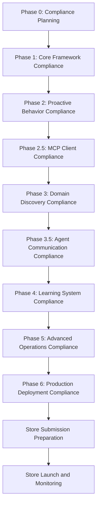

# Micro - Store Compliance Requirements for Autonomous Agents

## Executive Overview

This document outlines comprehensive Google Play Store and iOS App Store compliance requirements specifically for autonomous agent implementations in Micro. It addresses the unique challenges that autonomous agents face regarding background execution, data privacy, user consent, and proactive behavior while ensuring full compliance with both store policies.

## 1. Google Play Store Compliance Requirements

### 1.1 Device and Network Abuse Policy

#### Background Execution Limitations
```
dart
class GooglePlayBackgroundComplianceManager {
  // Compliance Requirements
  static const Duration maxBackgroundExecution = Duration(minutes: 10);
  static const int maxDailyBackgroundTasks = 20;
  static const bool requireUserVisibleNotification = true;
  static const bool requireExplicitUserConsent = true;
  
  Future<BackgroundComplianceResult> validateBackgroundExecution(AutonomousTask task) async {
    // Check if task requires background execution
    if (task.requiresBackgroundExecution) {
      // Validate against Google Play policies
      final compliance = await _checkBackgroundExecutionPolicies(task);
      
      if (!compliance.isAllowed) {
        return BackgroundComplianceResult.denied(
          reason: compliance.reason,
          alternative: _suggestForegroundAlternative(task),
        );
      }
      
      // Ensure user notification
      await _showUserNotification(task);
      
      // Log for audit
      await _logBackgroundExecution(task, compliance);
    }
    
    return BackgroundComplianceResult.allowed();
  }
  
  Future<void> _showUserNotification(AutonomousTask task) async {
    // Show persistent notification for background task
    final notification = Notification(
      id: 'autonomous_${task.id}',
      title: 'Micro Autonomous Task',
      body: 'Running: ${task.description}',
      ongoing: true,
      importance: NotificationImportance.high,
    );
    
    await _notificationManager.showPersistentNotification(notification);
  }
}
```

#### Foreground Service Requirements
```
dart
class GooglePlayForegroundServiceCompliance {
  // Foreground Service Compliance
  static const bool requirePersistentNotification = true;
  static const Duration maxServiceStartupTime = Duration(seconds: 5);
  static const String requiredNotificationChannel = 'autonomous_service';
  
  Future<ForegroundServiceComplianceResult> validateForegroundService(
    AutonomousService service
  ) async {
    // Check service requirements
    if (service.requiresForegroundExecution) {
      // Validate notification requirements
      final notificationValid = await _validateServiceNotification(service);
      
      if (!notificationValid) {
        return ForegroundServiceComplianceResult.denied(
          reason: 'Invalid or missing persistent notification',
        );
      }
      
      // Check service startup time
      final startupTime = await _measureServiceStartup(service);
      if (startupTime > maxServiceStartupTime) {
        return ForegroundServiceComplianceResult.denied(
          reason: 'Service startup time exceeds limit',
        );
      }
    }
    
    return ForegroundServiceComplianceResult.allowed();
  }
  
  Future<bool> _validateServiceNotification(AutonomousService service) async {
    // Ensure persistent notification is shown
    final notification = await _notificationManager.getActiveNotification(
      service.notificationId,
    );
    
    return notification != null && 
           notification.isPersistent && 
           notification.isVisibleToUser;
  }
}
```

### 1.2 User Data Policy Compliance

#### Data Collection and Processing
```
dart
class GooglePlayDataComplianceManager {
  // Data Compliance Requirements
  static const bool requireExplicitConsent = true;
  static const bool requireDataMinimization = true;
  static const bool requirePurposeLimitation = true;
  static const Duration dataRetentionLimit = Duration(days: 30);
  
  Future<DataComplianceResult> validateDataCollection(
    DataCollectionRequest request
  ) async {
    // Check user consent
    final hasConsent = await _consentManager.hasConsent(
      ConsentType.dataCollection,
      request.purpose,
    );
    
    if (!hasConsent) {
      return DataComplianceResult.denied(
        reason: 'User consent not obtained for data collection',
      );
    }
    
    // Validate data minimization
    final isMinimized = await _validateDataMinimization(request);
    if (!isMinimized) {
      return DataComplianceResult.denied(
        reason: 'Data collection exceeds minimization requirements',
      );
    }
    
    // Check purpose limitation
    final isPurposeLimited = await _validatePurposeLimitation(request);
    if (!isPurposeLimited) {
      return DataComplianceResult.denied(
        reason: 'Data collection purpose is too broad',
      );
    }
    
    return DataComplianceResult.allowed();
  }
  
  Future<void> logDataCollection(DataCollectionRequest request) async {
    // Comprehensive audit logging
    await _auditLogger.logDataCollection({
      'timestamp': DateTime.now().toIso8601String(),
      'purpose': request.purpose,
      'dataTypes': request.dataTypes,
      'consentObtained': true,
      'retentionPeriod': dataRetentionLimit.inDays,
    });
  }
}
```

#### Privacy Policy Requirements
```
dart
class GooglePlayPrivacyPolicyCompliance {
  // Privacy Policy Requirements
  static const bool requireAccessiblePrivacyPolicy = true;
  static const bool requireDataDisclosure = true;
  static const bool requireUserRightsExplanation = true;
  static const bool requireContactInformation = true;
  
  Future<PrivacyPolicyComplianceResult> validatePrivacyPolicy() async {
    // Check privacy policy accessibility
    final policyAccessible = await _checkPrivacyPolicyAccessibility();
    if (!policyAccessible) {
      return PrivacyPolicyComplianceResult.denied(
        reason: 'Privacy policy not easily accessible',
      );
    }
    
    // Validate data disclosure
    final dataDisclosed = await _validateDataDisclosure();
    if (!dataDisclosed) {
      return PrivacyPolicyComplianceResult.denied(
        reason: 'Data collection not properly disclosed',
      );
    }
    
    // Check user rights explanation
    final rightsExplained = await _validateUserRightsExplanation();
    if (!rightsExplained) {
      return PrivacyPolicyComplianceResult.denied(
        reason: 'User rights not clearly explained',
      );
    }
    
    return PrivacyPolicyComplianceResult.allowed();
  }
}
```

### 1.3 Permissions Policy Compliance

#### Permission Request and Justification
```
dart
class GooglePlayPermissionsCompliance {
  // Permissions Compliance Requirements
  static const bool requirePermissionJustification = true;
  static const bool requireGranularPermissions = true;
  static const bool requireRuntimePermissionRequest = true;
  static const List<String> prohibitedPermissions = [
    'READ_SMS',
    'SEND_SMS',
    'READ_CALL_LOG',
    'WRITE_CALL_LOG',
    'READ_CONTACTS',
    'WRITE_CONTACTS',
  ];
  
  Future<PermissionComplianceResult> validatePermissionRequest(
    PermissionRequest request
  ) async {
    // Check if permission is prohibited
    if (prohibitedPermissions.contains(request.permission)) {
      return PermissionComplianceResult.denied(
        reason: 'Permission is prohibited for autonomous agents',
        alternative: _suggestAlternativePermission(request),
      );
    }
    
    // Validate permission justification
    final hasJustification = await _validatePermissionJustification(request);
    if (!hasJustification) {
      return PermissionComplianceResult.denied(
        reason: 'Permission request lacks proper justification',
      );
    }
    
    // Check granular permission request
    final isGranular = await _validateGranularPermission(request);
    if (!isGranular) {
      return PermissionComplianceResult.denied(
        reason: 'Permission request is not granular enough',
      );
    }
    
    return PermissionComplianceResult.allowed();
  }
  
  Future<void> requestPermissionWithCompliance(PermissionRequest request) async {
    // Show permission request dialog with justification
    await _permissionRequester.showPermissionDialog(
      permission: request.permission,
      justification: request.justification,
      purpose: request.purpose,
      alternatives: request.alternatives,
    );
    
    // Log permission request
    await _auditLogger.logPermissionRequest({
      'permission': request.permission,
      'justification': request.justification,
      'purpose': request.purpose,
      'timestamp': DateTime.now().toIso8601String(),
    });
  }
}
```

### 1.4 App Content Policy Compliance

#### Autonomous Agent Content Restrictions
```
dart
class GooglePlayContentCompliance {
  // Content Compliance Requirements
  static const bool requireContentModeration = true;
  static const bool requireUserGeneratedContentControl = true;
  static const bool requireAutonomousActionLimitation = true;
  
  Future<ContentComplianceResult> validateAutonomousContent(
    AutonomousContent content
  ) async {
    // Check content moderation
    final isModerated = await _moderateContent(content);
    if (!isModerated) {
      return ContentComplianceResult.denied(
        reason: 'Autonomous content requires moderation',
      );
    }
    
    // Validate user-generated content control
    final hasUGCControl = await _validateUGCControl(content);
    if (!hasUGCControl) {
      return ContentComplianceResult.denied(
        reason: 'User-generated content lacks proper controls',
      );
    }
    
    // Check autonomous action limitations
    final hasActionLimitation = await _validateActionLimitation(content);
    if (!hasActionLimitation) {
      return ContentComplianceResult.denied(
        reason: 'Autonomous actions lack proper limitations',
      );
    }
    
    return ContentComplianceResult.allowed();
  }
}
```

### 1.5 Technical Requirements Compliance

#### API Levels and Target SDK
```
dart
class GooglePlayTechnicalCompliance {
  // Technical Requirements
  static const int minTargetSdkVersion = 33; // Android 13
  static const int minCompileSdkVersion = 33;
  static const bool require64BitArchitecture = true;
  static const bool requireAppBundle = true; // .aab instead of .apk
  
  Future<TechnicalComplianceResult> validateTechnicalRequirements() async {
    // Check target SDK version
    final currentTargetSdk = await _getTargetSdkVersion();
    if (currentTargetSdk < minTargetSdkVersion) {
      return TechnicalComplianceResult.denied(
        reason: 'Target SDK version below minimum requirement',
        recommendation: 'Update target SDK to $minTargetSdkVersion',
      );
    }
    
    // Check 64-bit architecture
    final is64Bit = await _checkArchitectureSupport();
    if (!is64Bit) {
      return TechnicalComplianceResult.denied(
        reason: 'App must support 64-bit architecture',
      );
    }
    
    // Check app bundle format
    final isAppBundle = await _checkAppBundleFormat();
    if (!isAppBundle) {
      return TechnicalComplianceResult.denied(
        reason: 'App must be published as Android App Bundle',
      );
    }
    
    return TechnicalComplianceResult.allowed();
  }
}
```

## 2. iOS App Store Compliance Requirements

### 2.1 App Store Review Guidelines Compliance

#### Human Interface Guidelines for Autonomous Agents
```
dart
class iOSAppStoreCompliance {
  // iOS App Store Requirements
  static const bool requireHumanInterfaceCompliance = true;
  static const bool requirePerformanceOptimization = true;
  static const bool requireBatteryOptimization = true;
  static const bool requirePrivacyCompliance = true;
  
  Future<iOSComplianceResult> validateAutonomousAgentUI() async {
    // Check Human Interface Guidelines compliance
    final uiCompliant = await _validateHumanInterface();
    if (!uiCompliant) {
      return iOSComplianceResult.denied(
        reason: 'UI does not comply with Human Interface Guidelines',
      );
    }
    
    // Check performance optimization
    final performanceOptimized = await _validatePerformanceOptimization();
    if (!performanceOptimized) {
      return iOSComplianceResult.denied(
        reason: 'App performance not optimized for iOS',
      );
    }
    
    // Check battery optimization
    final batteryOptimized = await _validateBatteryOptimization();
    if (!batteryOptimized) {
      return iOSComplianceResult.denied(
        reason: 'App does not optimize battery usage',
      );
    }
    
    return iOSComplianceResult.allowed();
  }
}
```

### 2.2 Background App Refresh and Task Execution

#### iOS Background Execution Limitations
```
dart
class iOSBackgroundCompliance {
  // iOS Background Requirements
  static const Duration maxBackgroundExecution = Duration(minutes: 30);
  static const List<String> allowedBackgroundModes = [
    'background_fetch',
    'background_processing',
  ];
  static const bool requireUserNotification = true;
  
  Future<BackgroundComplianceResult> validateiOSBackgroundExecution(
    AutonomousTask task
  ) async {
    // Check background mode
    if (task.requiresBackgroundExecution) {
      final modeAllowed = allowedBackgroundModes.contains(task.backgroundMode);
      if (!modeAllowed) {
        return BackgroundComplianceResult.denied(
          reason: 'Background mode not allowed for autonomous agents',
        );
      }
      
      // Check execution time limit
      if (task.estimatedDuration > maxBackgroundExecution) {
        return BackgroundComplianceResult.denied(
          reason: 'Background execution time exceeds limit',
        );
      }
      
      // Ensure user notification
      await _showUserNotification(task);
    }
    
    return BackgroundComplianceResult.allowed();
  }
}
```

### 2.3 Privacy and Data Handling Requirements

#### iOS Privacy Compliance
```
dart
class iOSPrivacyCompliance {
  // iOS Privacy Requirements
  static const bool requireAppTrackingTransparency = true;
  static const bool requirePrivacyNutrition = true;
  static const bool requireDataMinimization = true;
  static const bool requireSecureStorage = true;
  
  Future<PrivacyComplianceResult> validateiOSPrivacyCompliance() async {
    // Check App Tracking Transparency
    final attCompliant = await _validateAppTrackingTransparency();
    if (!attCompliant) {
      return PrivacyComplianceResult.denied(
        reason: 'App Tracking Transparency not properly implemented',
      );
    }
    
    // Check Privacy Nutrition
    final nutritionCompliant = await _validatePrivacyNutrition();
    if (!nutritionCompliant) {
      return PrivacyComplianceResult.denied(
        reason: 'Privacy Nutrition labels not provided',
      );
    }
    
    // Check data minimization
    final minimizationCompliant = await _validateDataMinimization();
    if (!minimizationCompliant) {
      return PrivacyComplianceResult.denied(
        reason: 'Data minimization principles not followed',
      );
    }
    
    return PrivacyComplianceResult.allowed();
  }
}
```

### 2.4 Security and Encryption Requirements

#### iOS Security Compliance
```
dart
class iOSSecurityCompliance {
  // iOS Security Requirements
  static const bool requireAppTransportSecurity = true;
  static const bool requireSecureCoding = true;
  static const bool requireKeychainStorage = true;
  static const bool requireCertificatePinning = true;
  
  Future<SecurityComplianceResult> validateiOSSecurity() async {
    // Check App Transport Security
    final atsCompliant = await _validateAppTransportSecurity();
    if (!atsCompliant) {
      return SecurityComplianceResult.denied(
        reason: 'App Transport Security not properly implemented',
      );
    }
    
    // Check secure coding practices
    final secureCodingCompliant = await _validateSecureCoding();
    if (!secureCodingCompliant) {
      return SecurityComplianceResult.denied(
        reason: 'Secure coding practices not followed',
      );
    }
    
    // Check Keychain storage
    final keychainCompliant = await _validateKeychainStorage();
    if (!keychainCompliant) {
      return SecurityComplianceResult.denied(
        reason: 'Sensitive data not stored in Keychain',
      );
    }
    
    return SecurityComplianceResult.allowed();
  }
}
```

## 3. Autonomous Agent Specific Compliance Considerations

### 3.1 Proactive Behavior Disclosure and User Control

#### Transparent Autonomous Operations
```
dart
class AutonomousBehaviorCompliance {
  // Autonomous Behavior Requirements
  static const bool requireTransparency = true;
  static const bool requireUserControl = true;
  static const bool requireActionExplanation = true;
  static const bool requireOptOutMechanism = true;
  
  Future<BehaviorComplianceResult> validateAutonomousBehavior(
    AutonomousAction action
  ) async {
    // Check transparency
    final isTransparent = await _validateActionTransparency(action);
    if (!isTransparent) {
      return BehaviorComplianceResult.denied(
        reason: 'Autonomous action lacks transparency',
      );
    }
    
    // Check user control
    final hasUserControl = await _validateUserControl(action);
    if (!hasUserControl) {
      return BehaviorComplianceResult.denied(
        reason: 'User control mechanisms not provided',
      );
    }
    
    // Check action explanation
    final hasExplanation = await _validateActionExplanation(action);
    if (!hasExplanation) {
      return BehaviorComplianceResult.denied(
        reason: 'Autonomous action not explained to user',
      );
    }
    
    // Check opt-out mechanism
    final hasOptOut = await _validateOptOutMechanism(action);
    if (!hasOptOut) {
      return BehaviorComplianceResult.denied(
        reason: 'Opt-out mechanism not available',
      );
    }
    
    return BehaviorComplianceResult.allowed();
  }
  
  Future<void> showAutonomousActionDialog(AutonomousAction action) async {
    // Show comprehensive action dialog
    await _dialogService.showActionDialog(
      title: 'Autonomous Action Proposed',
      content: '''
        Micro proposes to: ${action.description}
        
        Purpose: ${action.purpose}
        Data used: ${action.dataUsed}
        Duration: ${action.estimatedDuration}
        
        You can: 
        - Approve this action
        - Approve all similar actions
        - Decline this action
        - Adjust autonomous settings
      ''',
      actions: [
        DialogAction.approve(action),
        DialogAction.approveAll(),
        DialogAction.decline(action),
        DialogAction.settings(),
      ],
    );
  }
}
```

### 3.2 Background Task Execution Transparency

#### Background Task Monitoring and Control
```
dart
class BackgroundTaskCompliance {
  // Background Task Requirements
  static const bool requireTaskVisibility = true;
  static const bool requireExecutionLimits = true;
  static const bool requireResourceMonitoring = true;
  static const bool requireUserCancellation = true;
  
  Future<BackgroundTaskComplianceResult> validateBackgroundTask(
    BackgroundTask task
  ) async {
    // Check task visibility
    final isVisible = await _validateTaskVisibility(task);
    if (!isVisible) {
      return BackgroundTaskComplianceResult.denied(
        reason: 'Background task not visible to user',
      );
    }
    
    // Check execution limits
    final withinLimits = await _validateExecutionLimits(task);
    if (!withinLimits) {
      return BackgroundTaskComplianceResult.denied(
        reason: 'Background task exceeds execution limits',
      );
    }
    
    // Check resource monitoring
    final isMonitored = await _validateResourceMonitoring(task);
    if (!isMonitored) {
      return BackgroundTaskComplianceResult.denied(
        reason: 'Background task resource usage not monitored',
      );
    }
    
    // Check user cancellation
    final canCancel = await _validateUserCancellation(task);
    if (!canCancel) {
      return BackgroundTaskComplianceResult.denied(
        reason: 'User cannot cancel background task',
      );
    }
    
    return BackgroundTaskComplianceResult.allowed();
  }
  
  Future<void> showBackgroundTaskStatus(BackgroundTask task) async {
    // Show persistent background task status
    await _notificationManager.showPersistentNotification(
      Notification(
        id: 'background_${task.id}',
        title: 'Micro Background Task',
        body: '${task.description} - Tap to manage',
        ongoing: true,
        actions: [
          NotificationAction.cancel('Cancel Task'),
          NotificationAction.settings('Manage Settings'),
        ],
      ),
    );
  }
}
```

### 3.3 Data Collection and Processing Disclosure

#### Comprehensive Data Disclosure
```
dart
class DataDisclosureCompliance {
  // Data Disclosure Requirements
  static const bool requireDataInventory = true;
  static const bool requirePurposeSpecification = true;
  static const bool requireRetentionSpecification = true;
  static const bool requireSharingDisclosure = true;
  
  Future<DataDisclosureComplianceResult> validateDataDisclosure() async {
    // Check data inventory
    final hasInventory = await _validateDataInventory();
    if (!hasInventory) {
      return DataDisclosureComplianceResult.denied(
        reason: 'Data inventory not provided',
      );
    }
    
    // Check purpose specification
    final hasPurposeSpec = await _validatePurposeSpecification();
    if (!hasPurposeSpec) {
      return DataDisclosureComplianceResult.denied(
        reason: 'Data collection purposes not specified',
      );
    }
    
    // Check retention specification
    final hasRetentionSpec = await _validateRetentionSpecification();
    if (!hasRetentionSpec) {
      return DataDisclosureComplianceResult.denied(
        reason: 'Data retention periods not specified',
      );
    }
    
    // Check sharing disclosure
    final hasSharingSpec = await _validateSharingDisclosure();
    if (!hasSharingSpec) {
      return DataDisclosureComplianceResult.denied(
        reason: 'Data sharing practices not disclosed',
      );
    }
    
    return DataDisclosureComplianceResult.allowed();
  }
  
  Future<void> generateDataDisclosureReport() async {
    // Generate comprehensive data disclosure report
    final report = DataDisclosureReport(
      dataInventory: await _getDataInventory(),
      collectionPurposes: await _getCollectionPurposes(),
      retentionPeriods: await _getRetentionPeriods(),
      sharingPractices: await _getSharingPractices(),
      userRights: await _getUserRights(),
      contactInfo: await _getContactInformation(),
    );
    
    await _disclosureManager.saveReport(report);
  }
}
```

### 3.4 Agent-to-Agent Communication Security

#### Secure Agent Communication
```
dart
class AgentCommunicationCompliance {
  // Agent Communication Requirements
  static const bool requireEndToEndEncryption = true;
  static const bool requireMutualAuthentication = true;
  static const bool requireMessageLogging = true;
  static const bool requireUserConsent = true;
  
  Future<CommunicationComplianceResult> validateAgentCommunication(
    AgentCommunication communication
  ) async {
    // Check end-to-end encryption
    final isEncrypted = await _validateEndToEndEncryption(communication);
    if (!isEncrypted) {
      return CommunicationComplianceResult.denied(
        reason: 'Agent communication not end-to-end encrypted',
      );
    }
    
    // Check mutual authentication
    final isAuthenticated = await _validateMutualAuthentication(communication);
    if (!isAuthenticated) {
      return CommunicationComplianceResult.denied(
        reason: 'Agent communication lacks mutual authentication',
      );
    }
    
    // Check message logging
    final isLogged = await _validateMessageLogging(communication);
    if (!isLogged) {
      return CommunicationComplianceResult.denied(
        reason: 'Agent communication not properly logged',
      );
    }
    
    // Check user consent
    final hasConsent = await _validateUserConsent(communication);
    if (!hasConsent) {
      return CommunicationComplianceResult.denied(
        reason: 'User consent not obtained for agent communication',
      );
    }
    
    return CommunicationComplianceResult.allowed();
  }
}
```

### 3.5 Automated Decision-Making Explainability

#### Explainable Autonomous Decisions
```
dart
class DecisionExplainabilityCompliance {
  // Decision Explainability Requirements
  static const bool requireDecisionExplanation = true;
  static const bool requireFactorDisclosure = true;
  static const bool requireConfidenceScoring = true;
  static const bool requireAppealMechanism = true;
  
  Future<ExplainabilityComplianceResult> validateDecisionExplainability(
    AutonomousDecision decision
  ) async {
    // Check decision explanation
    final hasExplanation = await _validateDecisionExplanation(decision);
    if (!hasExplanation) {
      return ExplainabilityComplianceResult.denied(
        reason: 'Autonomous decision lacks explanation',
      );
    }
    
    // Check factor disclosure
    final hasFactorDisclosure = await _validateFactorDisclosure(decision);
    if (!hasFactorDisclosure) {
      return ExplainabilityComplianceResult.denied(
        reason: 'Decision factors not disclosed',
      );
    }
    
    // Check confidence scoring
    final hasConfidence = await _validateConfidenceScoring(decision);
    if (!hasConfidence) {
      return ExplainabilityComplianceResult.denied(
        reason: 'Decision confidence not provided',
      );
    }
    
    // Check appeal mechanism
    final hasAppeal = await _validateAppealMechanism(decision);
    if (!hasAppeal) {
      return ExplainabilityComplianceResult.denied(
        reason: 'No appeal mechanism for decisions',
      );
    }
    
    return ExplainabilityComplianceResult.allowed();
  }
  
  Future<void> showDecisionExplanationDialog(AutonomousDecision decision) async {
    // Show comprehensive decision explanation
    await _dialogService.showDecisionDialog(
      title: 'Autonomous Decision Made',
      content: '''
        Micro decided to: ${decision.action}
        
        Why: ${decision.reasoning}
        Factors considered: ${decision.factors}
        Confidence: ${decision.confidence}%
        
        Data used: ${decision.dataUsed}
        Alternatives considered: ${decision.alternatives}
        
        You can:
        - Accept this decision
        - Modify decision parameters
        - Reject this decision
        - Review decision factors
      ''',
      actions: [
        DialogAction.accept(decision),
        DialogAction.modify(decision),
        DialogAction.reject(decision),
        DialogAction.review(decision),
      ],
    );
  }
}
```

## 4. Store Compliance Integration Strategy

### 4.1 Compliance-First Development Approach

#### Compliance Integration in Development Lifecycle
```
dart
class ComplianceFirstDevelopment {
  // Compliance Integration Requirements
  static const bool requireComplianceTesting = true;
  static const bool requireComplianceDocumentation = true;
  static const bool requireComplianceReview = true;
  static const bool requireComplianceMonitoring = true;
  
  Future<void> integrateComplianceInDevelopment() async {
    // Phase 0: Compliance Planning
    await _planComplianceRequirements();
    
    // Phase 1-6: Compliance Integration
    await _integrateComplianceInAllPhases();
    
    // Continuous: Compliance Monitoring
    await _setupComplianceMonitoring();
  }
  
  Future<void> _planComplianceRequirements() async {
    // Identify all compliance requirements
    final googlePlayRequirements = await _identifyGooglePlayRequirements();
    final iosRequirements = await _identifyiOSRequirements();
    final autonomousRequirements = await _identifyAutonomousRequirements();
    
    // Create compliance specification
    final complianceSpec = ComplianceSpecification(
      googlePlay: googlePlayRequirements,
      ios: iosRequirements,
      autonomous: autonomousRequirements,
    );
    
    await _complianceManager.saveSpecification(complianceSpec);
  }
  
  Future<void> _integrateComplianceInAllPhases() async {
    // Integrate compliance into each implementation phase
    for (final phase in implementationPhases) {
      await _integrateComplianceInPhase(phase);
    }
  }
  
  Future<void> _setupComplianceMonitoring() async {
    // Setup continuous compliance monitoring
    await _complianceMonitor.initialize();
    await _complianceMonitor.setupAlerts();
    await _complianceMonitor.startContinuousMonitoring();
  }
}
```

### 4.2 Compliance Testing Framework

#### Automated Compliance Testing
```
dart
class ComplianceTestingFramework {
  // Compliance Testing Requirements
  static const bool requireAutomatedTesting = true;
  static const bool requirePreSubmissionTesting = true;
  static const bool requireContinuousComplianceTesting = true;
  static const bool requireComplianceReporting = true;
  
  Future<ComplianceTestResult> runComplianceTests() async {
    // Google Play compliance tests
    final googlePlayTests = await _runGooglePlayComplianceTests();
    
    // iOS App Store compliance tests
    final iosTests = await _runiOSComplianceTests();
    
    // Autonomous agent compliance tests
    final autonomousTests = await _runAutonomousComplianceTests();
    
    // Generate comprehensive report
    final report = ComplianceTestReport(
      googlePlay: googlePlayTests,
      ios: iosTests,
      autonomous: autonomousTests,
      overall: _calculateOverallCompliance(googlePlayTests, iosTests, autonomousTests),
    );
    
    return ComplianceTestResult(
      passed: report.overall.score > 0.9,
      report: report,
      recommendations: _generateRecommendations(report),
    );
  }
  
  Future<GooglePlayComplianceTests> _runGooglePlayComplianceTests() async {
    return GooglePlayComplianceTests(
      backgroundExecution: await _testBackgroundExecutionCompliance(),
      dataPolicy: await _testDataPolicyCompliance(),
      permissions: await _testPermissionsCompliance(),
      contentPolicy: await _testContentPolicyCompliance(),
      technical: await _testTechnicalCompliance(),
    );
  }
  
  Future<iOSComplianceTests> _runiOSComplianceTests() async {
    return iOSComplianceTests(
      humanInterface: await _testHumanInterfaceCompliance(),
      backgroundExecution: await _testBackgroundExecutionCompliance(),
      privacy: await _testPrivacyCompliance(),
      security: await _testSecurityCompliance(),
      performance: await _testPerformanceCompliance(),
    );
  }
  
  Future<AutonomousComplianceTests> _runAutonomousComplianceTests() async {
    return AutonomousComplianceTests(
      proactiveBehavior: await _testProactiveBehaviorCompliance(),
      dataCollection: await _testDataCollectionCompliance(),
      decisionMaking: await _testDecisionMakingCompliance(),
      agentCommunication: await _testAgentCommunicationCompliance(),
      explainability: await _testExplainabilityCompliance(),
    );
  }
}
```

## 5. Implementation Recommendations

### 5.1 Store Compliance Integration Timeline

#### Compliance Milestones Integration


### 5.2 Critical Compliance Success Factors

#### Store Approval Success Criteria
1. **Background Execution Compliance**
   - Proper foreground service implementation with persistent notifications
   - Background task time limits and user controls
   - Resource usage monitoring and optimization
   - User-visible background activity indicators

2. **Data Privacy Compliance**
   - Comprehensive privacy policy with clear data disclosure
   - User consent mechanisms for all data collection
   - Data minimization and purpose limitation
   - Secure storage and transmission practices

3. **Permissions Compliance**
   - Granular permission requests with clear justifications
   - Runtime permission requests with user education
   - Prohibited permissions avoidance
   - Permission usage audit logging

4. **Autonomous Behavior Transparency**
   - Clear action explanations and reasoning disclosure
   - User control and override mechanisms
   - Opt-out options for all autonomous features
   - Decision confidence scoring and factor disclosure

5. **Technical Compliance**
   - Latest API levels and target SDK versions
   - 64-bit architecture support
   - App bundle format compliance
   - Security best practices implementation

## Conclusion

This comprehensive store compliance framework ensures that Micro's autonomous agent implementation meets all Google Play Store and iOS App Store requirements while maintaining the powerful autonomous capabilities. The compliance-first approach integrates store requirements throughout the development lifecycle, ensuring successful store submission and user trust.

Key compliance areas addressed:
1. **Background Execution**: Proper foreground services and background task management
2. **Data Privacy**: Comprehensive privacy policies and user consent
3. **Permissions**: Granular permission requests and justifications
4. **Autonomous Behavior**: Transparent operations with user control
5. **Technical Requirements**: Latest standards and security practices
6. **Agent Communication**: Secure inter-agent communication protocols
7. **Decision Making**: Explainable autonomous decisions with user oversight

Following this compliance framework will ensure successful store approval and user acceptance of Micro's autonomous agent capabilities.