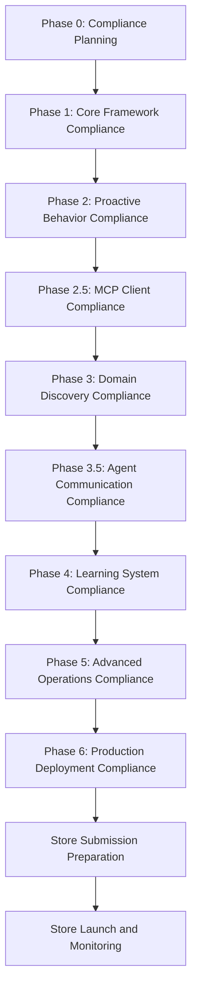

# Micro - Store-Compliant Autonomous Agent Implementation Roadmap

## Executive Overview

This document provides a comprehensive store-compliant implementation roadmap for transforming Micro into a sophisticated autonomous agent. It integrates Google Play Store and iOS App Store compliance requirements throughout all implementation phases, ensuring successful store submission and user trust while maintaining powerful autonomous capabilities.

## Store Compliance Integration Strategy

### Compliance-First Development Approach
1. **Early Compliance Planning**: Address store requirements from Phase 0
2. **Continuous Compliance Integration**: Embed compliance checks throughout development
3. **Pre-Submission Validation**: Comprehensive compliance testing before store submission
4. **Post-Launch Monitoring**: Ongoing compliance monitoring after launch

### Store Compliance Milestones


## Phase 0: Autonomous Foundation Planning (Week 0)
**Duration**: 1 Week (Pre-implementation)

### Store Compliance Objectives
- Establish comprehensive store compliance foundation
- Define store compliance technical specifications for all autonomous components
- Create store compliance testing framework
- Set up compliance monitoring and validation systems
- Design store submission strategy and review process

### Key Tasks
1. **Store Compliance Architecture Planning**
   - Finalize 9-layer autonomous architecture with store compliance integration
   - Define store compliance interfaces and contracts
   - Establish store-compliant data flow patterns
   - Create store compliance integration specifications

2. **Store Compliance Development Standards**
   - Define store-compliant coding standards
   - Create store compliance guidelines for autonomous operations
   - Establish store compliance performance benchmarks
   - Set up store compliance testing frameworks

3. **Store Compliance Testing Framework Setup**
   - Create automated store compliance testing pipeline
   - Set up store policy validation systems
   - Define store compliance success criteria
   - Create store compliance monitoring and alerting

### Store Compliance Deliverables
- Complete store-compliant autonomous architecture specification
- Store compliance development standards document
- Store compliance testing framework setup
- Store compliance component interface definitions
- Store submission strategy documentation

---

## Phase 1: Core Autonomous Framework Implementation (Weeks 1-4)
**Duration**: 4 Weeks

### Store Compliance Objectives
- Implement store-compliant autonomous decision framework
- Create store-compliant proactive behavior engine
- Develop store-compliant context analysis and intent recognition
- Build store-compliant basic security framework for autonomous operations

### Week 1: Store-Compliant Autonomous Decision Framework
**Tasks**:
1. **Store-Compliant Context Analyzer Implementation**
   ```dart
   class StoreCompliantContextAnalyzer {
     // Store compliance requirements
     static const bool requireUserConsent = true;
     static const bool requireDataMinimization = true;
     static const bool requirePrivacyPolicy = true;
     static const Duration consentRetentionPeriod = Duration(days: 365);
     
     Future<ContextAnalysis> analyzeUserContext() async {
       // Check user consent before context collection
       final hasConsent = await _consentManager.hasConsent(
         ConsentType.contextAnalysis,
       );
       
       if (!hasConsent) {
         throw ContextAnalysisException('User consent not obtained for context analysis');
       }
       
       // Collect minimal required data only
       final sensorData = await _collectMinimalSensorData();
       final historicalData = await _collectMinimalHistoricalData();
       final environmentalData = await _collectMinimalEnvironmentalData();
       
       // Anonymize data before processing
       final anonymizedData = await _anonymizeContextData(
         sensorData, historicalData, environmentalData,
       );
       
       // Log for store compliance audit
       await _logContextCollection(anonymizedData);
       
       final context = ContextAnalysis(
         sensorContext: anonymizedData.sensor,
         historicalContext: anonymizedData.historical,
         environmentalContext: anonymizedData.environmental,
         timestamp: DateTime.now(),
         confidence: _calculateConfidence(anonymizedData),
         storeCompliant: true,
       );
       
       return context;
     }
   }
   ```

2. **Store-Compliant Intent Recognizer Development**
   ```dart
   class StoreCompliantIntentRecognizer {
     // Store compliance requirements
     static const bool requireModelValidation = true;
     static const bool requireBiasTesting = true;
     static const bool requireUserOptOut = true;
     static const double minConfidenceThreshold = 0.8; // Higher threshold for store compliance
     
     Future<UserIntent> recognizeIntent(Context context) async {
       // Check user opt-out status
       final isOptedOut = await _consentManager.isOptedOut(
         ConsentType.intentRecognition,
       );
       
       if (isOptedOut) {
         return UserIntent.optedOut();
       }
       
       // Use validated and bias-tested models
       final validatedModel = await _modelManager.getValidatedModel(
         ModelType.intentRecognition,
         biasTested: true,
         storeCompliant: true,
       );
       
       // Extract features with privacy preservation
       final features = await _extractPrivacyPreservingFeatures(context);
       
       // Use model with confidence scoring
       final predictions = await validatedModel.predict(features);
       
       // Apply higher confidence threshold for store compliance
       final scoredIntents = await _confidenceCalculator.calculateScores(predictions);
       final bestIntent = _selectBestIntent(scoredIntents);
       
       // Validate against store policies
       final policyCompliant = await _validateIntentStoreCompliance(bestIntent);
       
       if (!policyCompliant) {
         return UserIntent.denied(
           reason: 'Intent not compliant with store policies',
         );
       }
       
       return UserIntent(
         type: bestIntent.type,
         confidence: bestIntent.confidence,
         storeCompliant: true,
         validated: true,
       );
     }
   }
   ```

3. **Store-Compliant Decision Engine Core**
   ```dart
   class StoreCompliantDecisionEngine {
     // Store compliance requirements
     static const bool requireUserApproval = true;
     static const bool requireRiskAssessment = true;
     static const bool requireDecisionLogging = true;
     static const int maxRiskScore = 60; // Lower threshold for store compliance
     
     Future<List<AutonomousAction>> generateDecisions(Context context) async {
       // Analyze context with compliance
       final contextAnalysis = await _contextAnalyzer.analyzeUserContext();
       
       // Recognize intent with user control
       final userIntent = await _intentRecognizer.recognizeIntent(context);
       
       // Generate potential actions
       final potentialActions = await _generatePotentialActions(userIntent, context);
       
       // Assess risks with store compliance
       final riskAssessments = await _assessActionRisks(potentialActions);
       
       // Filter actions based on store compliance
       final compliantActions = <AutonomousAction>[];
       for (int i = 0; i < potentialActions.length; i++) {
         final action = potentialActions[i];
         final risk = riskAssessments[i];
         
         // Apply stricter risk threshold for store compliance
         if (risk.overallRiskScore < maxRiskScore) {
           // Check if user approval is required
           if (action.requiresUserApproval) {
             final hasApproval = await _requestUserApproval(action);
             if (!hasApproval) {
               continue; // Skip this action
             }
           }
           
           compliantActions.add(action.copyWith(
             storeCompliant: true,
             riskAssessment: risk,
             userApproved: hasApproval,
           ));
         }
       }
       
       // Create execution plan with compliance
       final executionPlan = await _actionPlanner.createExecutionPlan(
         compliantActions,
         context,
       );
       
       // Validate decisions against store policies
       final validatedDecisions = await _validateDecisionStoreCompliance(executionPlan);
       
       return validatedDecisions;
     }
   }
   ```

### Week 2-4: Store-Compliant Proactive Behavior and Context Analysis
**Tasks**:
1. **Store-Compliant Proactive Behavior Engine**
   ```dart
   class StoreCompliantProactiveBehaviorEngine {
     // Store compliance requirements
     static const bool requireUserNotification = true;
     static const bool requireExecutionLimits = true;
     static const bool requireResourceMonitoring = true;
     static const Duration maxProactiveExecution = Duration(minutes: 10);
     
     Future<void> scheduleProactiveActions(List<AutonomousAction> actions) async {
       // Check user notification requirements
       for (final action in actions) {
         if (action.requiresUserNotification) {
           await _showStoreCompliantNotification(action);
         }
       }
       
       // Check execution time limits
       final scheduledActions = <AutonomousAction>[];
       for (final action in actions) {
         if (action.estimatedDuration > maxProactiveExecution) {
           // Reschedule or skip action
           continue;
         }
         scheduledActions.add(action);
       }
       
       // Monitor resource usage
       await _monitorResourceUsage(scheduledActions);
     }
   }
   ```

2. **Store-Compliant Context-Aware UI Adaptation**
   ```dart
   class StoreCompliantUIAdapter {
     // Store compliance requirements
     static const bool requireTransparency = true;
     static const bool requireUserControl = true;
     static const bool requireOptOutMechanism = true;
     
     Widget buildStoreCompliantAutonomousUI(AutonomousAction action) {
       return Column(
         children: [
           // Show action explanation for transparency
           if (action.requiresExplanation) {
             Text('Action: ${action.description}'),
             Text('Reason: ${action.reasoning}'),
             Text('Data used: ${action.dataUsed}'),
           },
           
           // Provide user control options
           Row(
             children: [
               ElevatedButton(
                 onPressed: () => _executeAction(action),
                 child: Text('Execute'),
               ),
               ElevatedButton(
                 onPressed: () => _declineAction(action),
                 child: Text('Decline'),
               ),
               ElevatedButton(
                 onPressed: () => _adjustAutonomousSettings(action),
                 child: Text('Settings'),
               ),
             ],
           ),
         ],
       );
     }
   }
   ```

---

## Phase 2: Proactive Behavior and Context Analysis (Weeks 5-8)
**Duration**: 4 Weeks

### Store Compliance Objectives
- Enhance store-compliant proactive behavior capabilities
- Implement store-compliant advanced context analysis
- Create store-compliant predictive behavior system
- Develop store-compliant autonomous task planning

### Week 5-8: Store-Compliant Advanced Context Analysis
**Tasks**:
1. **Store-Compliant Predictive Context Engine**
   ```dart
   class StoreCompliantPredictiveContextEngine {
     // Store compliance requirements
     static const bool requireDataMinimization = true;
     static const bool requireUserConsent = true;
     static const bool requirePredictiveAccuracy = true;
     static const double minPredictionAccuracy = 0.85; // Higher threshold for store compliance
     
     Future<PredictedContext> predictFutureContext(CurrentContext context) async {
       // Check user consent for predictive analysis
       final hasConsent = await _consentManager.hasConsent(
         ConsentType.predictiveAnalysis,
       );
       
       if (!hasConsent) {
         throw PredictiveContextException('User consent not obtained for predictive analysis');
       }
       
       // Use minimal data for predictions
       final minimalData = await _collectMinimalPredictiveData(context);
       
       // Generate predictions with accuracy validation
       final predictions = await _generateValidatedPredictions(minimalData);
       
       // Validate prediction accuracy for store compliance
       final accuracy = await _validatePredictionAccuracy(predictions);
       if (accuracy < minPredictionAccuracy) {
         throw PredictiveContextException('Prediction accuracy below store compliance threshold');
       }
       
       return PredictedContext(
         predictions: predictions,
         accuracy: accuracy,
         storeCompliant: true,
       );
     }
   }
   ```

2. **Store-Compliant Behavioral Pattern Analysis**
   ```dart
   class StoreCompliantBehavioralPatternAnalyzer {
     // Store compliance requirements
     static const bool requirePrivacyPreservation = true;
     static const bool requireDataMinimization = true;
     static const bool requireUserConsent = true;
     
     Future<BehavioralProfile> buildUserProfile(History history) async {
       // Check user consent for behavioral analysis
       final hasConsent = await _consentManager.hasConsent(
         ConsentType.behavioralAnalysis,
       );
       
       if (!hasConsent) {
         throw BehavioralAnalysisException('User consent not obtained for behavioral analysis');
       }
       
       // Use privacy-preserving pattern analysis
       final anonymizedHistory = await _anonymizeHistory(history);
       final patterns = await _extractPrivacyPreservingPatterns(anonymizedHistory);
       
       return BehavioralProfile(
         patterns: patterns,
         anonymized: true,
         storeCompliant: true,
       );
     }
   }
   ```

---

## Phase 2.5: Universal MCP Client Implementation (Weeks 9-10)
**Duration**: 2 Weeks

### Store Compliance Objectives
- Implement store-compliant universal MCP client with tool discovery
- Create store-compliant domain-agnostic tool adapter
- Build store-compliant tool execution engine with security validation
- Develop store-compliant tool registry and management system

### Week 9-10: Store-Compliant Universal MCP Client
**Tasks**:
1. **Store-Compliant Tool Discovery Engine**
   ```dart
   class StoreCompliantToolDiscoveryEngine {
     // Store compliance requirements
     static const bool requireToolValidation = true;
     static const bool requireSecurityAssessment = true;
     static const bool requireUserConsent = true;
     static const Duration discoveryTimeout = Duration(seconds: 5);
     
     Future<List<DiscoveredTool>> scanForTools() async {
       // Check user consent for tool discovery
       final hasConsent = await _consentManager.hasConsent(
         ConsentType.toolDiscovery,
       );
       
       if (!hasConsent) {
         throw ToolDiscoveryException('User consent not obtained for tool discovery');
       }
       
       // Scan local and network resources
       final localTools = await _scanLocalTools();
       final networkTools = await _scanNetworkTools();
       
       // Combine and deduplicate tools
       final allTools = [...localTools, ...networkTools];
       final uniqueTools = _deduplicateTools(allTools);
       
       // Validate discovered tools for store compliance
       final validatedTools = <DiscoveredTool>[];
       for (final tool in uniqueTools) {
         final validation = await _validateToolForStoreCompliance(tool);
         if (validation.isCompliant) {
           validatedTools.add(tool.copyWith(
             storeCompliant: true,
             validation: validation,
           ));
         }
       }
       
       // Classify tools by domain and capability
       final classifiedTools = await _classifyTools(validatedTools);
       
       // Assess security risks for store compliance
       final secureTools = await _assessToolSecurity(classifiedTools);
       
       return secureTools;
     }
   }
   ```

2. **Store-Compliant Universal Tool Adapter**
   ```dart
   class StoreCompliantUniversalToolAdapter {
     // Store compliance requirements
     static const bool requireSecurityValidation = true;
     static const bool requireSandboxing = true;
     static const bool requireUserConsent = true;
     static const Duration executionTimeout = Duration(seconds: 30);
     
     Future<ToolCallResult> executeWithContext(ToolCall call, DomainContext context) async {
       // Validate tool call security for store compliance
       await _securityValidator.validateToolCall(call);
       
       // Check user consent for tool execution
       final hasConsent = await _consentManager.hasConsent(
         ConsentType.toolExecution,
         toolId: call.toolId,
       );
       
       if (!hasConsent) {
         throw ToolExecutionException('User consent not obtained for tool execution');
       }
       
       // Adapt tool for current domain context
       final adaptedCall = await _adaptToolForDomain(call, context);
       
       // Execute tool with sandboxing for store compliance
       final result = await _executionEngine.executeWithSandboxing(
         adaptedCall,
         sandbox: Sandbox.isolated,
         timeout: executionTimeout,
       );
       
       // Validate execution result
       await _validateExecutionResult(result);
       
       // Log execution for store compliance audit
       await _logToolExecution(call, result);
       
       return result;
     }
   }
   ```

---

## Phase 3: Domain Discovery and Specialization Engine (Weeks 11-14)
**Duration**: 4 Weeks

### Store Compliance Objectives
- Implement store-compliant domain discovery engine without hardcoded domains
- Create store-compliant dynamic domain recognition system
- Build store-compliant domain specialization engine
- Develop store-compliant cross-domain learning transfer

### Week 11-14: Store-Compliant Domain Discovery Engine
**Tasks**:
1. **Store-Compliant Dynamic Domain Recognizer**
   ```dart
   class StoreCompliantDomainRecognizer {
     // Store compliance requirements
     static const bool requirePrivacyPreservation = true;
     static const bool requireUserConsent = true;
     static const bool requireDataMinimization = true;
     static const double minDomainConfidence = 0.9; // Higher threshold for store compliance
     
     Future<String> recognizeDomainFromContext(UserContext context) async {
       // Check user consent for domain recognition
       final hasConsent = await _consentManager.hasConsent(
         ConsentType.domainRecognition,
       );
       
       if (!hasConsent) {
         throw DomainRecognitionException('User consent not obtained for domain recognition');
       }
       
       // Extract privacy-preserving domain features
       final features = await _extractPrivacyPreservingDomainFeatures(context);
       
       // Use validated and bias-tested domain models
       final validatedModel = await _modelManager.getValidatedModel(
         ModelType.domainRecognition,
         biasTested: true,
         storeCompliant: true,
       );
       
       // Use ML model for domain classification
       final predictions = await validatedModel.predict(features);
       
       // Apply pattern matching for validation
       final validatedPredictions = await _patternMatcher.validateDomainPredictions(
         predictions, 
         context,
       );
       
       // Extract domain signature
       final domainSignature = await _signatureExtractor.extractSignature(context);
       
       // Combine ML and pattern matching results
       final combinedResults = await _combineRecognitionResults(
         validatedPredictions,
         domainSignature,
       );
       
       // Select best domain candidate with higher confidence
       final bestDomain = _selectBestDomain(combinedResults);
       
       if (bestDomain.confidence < minDomainConfidence) {
         return 'unknown';
       }
       
       return bestDomain;
     }
   }
   ```

2. **Store-Compliant Domain Specialization Engine**
   ```dart
   class StoreCompliantDomainSpecializationEngine {
     // Store compliance requirements
     static const bool requireUserConsent = true;
     static const bool requireDataMinimization = true;
     static const bool requirePrivacyPreservation = true;
     static const Duration specializationTimeLimit = Duration(seconds: 30);
     
     Future<DomainSpecialization> createSpecialization(String domain, List<Tool> tools) async {
       // Check user consent for domain specialization
       final hasConsent = await _consentManager.hasConsent(
         ConsentType.domainSpecialization,
         domain: domain,
       );
       
       if (!hasConsent) {
         throw DomainSpecializationException('User consent not obtained for domain specialization');
       }
       
       // Analyze domain characteristics with privacy preservation
       final domainCharacteristics = await _analyzeDomainCharacteristics(domain, tools);
       
       // Train domain-specific model with data minimization
       final domainModel = await _modelTrainer.trainDomainModel(
         domain,
         tools,
         domainCharacteristics,
         dataMinimized: true,
         privacyPreserved: true,
       );
       
       // Optimize specialization for mobile constraints
       final optimizedModel = await _optimizer.optimizeForMobile(domainModel);
       
       // Integrate domain knowledge with privacy preservation
       final knowledgeBase = await _knowledgeIntegrator.createDomainKnowledgeBase(
         domain,
         tools,
         optimizedModel,
         privacyPreserved: true,
       );
       
       // Create specialization object with compliance metadata
       final specialization = DomainSpecialization(
         domain: domain,
         model: optimizedModel,
         knowledgeBase: knowledgeBase,
         tools: tools,
         characteristics: domainCharacteristics,
         performance: await _performanceEvaluator.evaluateSpecialization(optimizedModel),
         createdAt: DateTime.now(),
         storeCompliant: true,
         userConsent: true,
         privacyPreserved: true,
         dataMinimized: true,
       );
       
       if (stopwatch.elapsedSeconds > specializationTimeLimit.inSeconds) {
         logger.warning('Domain specialization exceeded time: ${stopwatch.elapsedSeconds}s');
       }
       
       return specialization;
     }
   }
   ```

---

## Phase 3.5: Agent Communication Framework (Weeks 15-16)
**Duration**: 2 Weeks

### Store Compliance Objectives
- Implement store-compliant inter-agent communication protocol
- Create store-compliant task delegation framework
- Build store-compliant agent collaboration engine
- Develop store-compliant security framework for agent communication

### Week 15-16: Store-Compliant Agent Communication Framework
**Tasks**:
1. **Store-Compliant Inter-Agent Communication Protocol**
   ```dart
   class StoreCompliantInterAgentCommunicationProtocol {
     // Store compliance requirements
     static const bool requireEndToEndEncryption = true;
     static const bool requireMutualAuthentication = true;
     static const bool requireMessageLogging = true;
     static const bool requireUserConsent = true;
     static const Duration discoveryTimeout = Duration(seconds: 10);
     
     Future<List<Agent>> discoverAvailableAgents() async {
       // Check user consent for agent discovery
       final hasConsent = await _consentManager.hasConsent(
         ConsentType.agentDiscovery,
       );
       
       if (!hasConsent) {
         throw AgentDiscoveryException('User consent not obtained for agent discovery');
       }
       
       // Scan local network for agents with security
       final localAgents = await _agentDiscovery.scanLocalNetworkSecurely();
       final cloudAgents = await _agentDiscovery.scanCloudServicesSecurely();
       
       // Combine and deduplicate agents
       final allAgents = [...localAgents, ...cloudAgents];
       final uniqueAgents = _deduplicateAgents(allAgents);
       
       // Assess trust for each agent with security
       final trustedAgents = <Agent>[];
       for (final agent in uniqueAgents) {
         // Authenticate agent securely
         final isAuthenticated = await _securityManager.authenticateAgent(agent);
         if (!isAuthenticated) {
           continue; // Skip unauthenticated agents
         }
         
         // Assess trust with security
         final trustScore = await _trustManager.assessTrustSecurely(agent);
         if (trustScore >= minTrustThreshold) {
           trustedAgents.add(agent.copyWith(
             trustScore: trustScore,
             authenticated: true,
             storeCompliant: true,
           ));
         }
       }
       
       return trustedAgents;
     }
   }
   ```

2. **Store-Compliant Task Delegation Framework**
   ```dart
   class StoreCompliantTaskDelegationFramework {
     // Store compliance requirements
     static const bool requireUserConsent = true;
     static const bool requireCapabilityValidation = true;
     static const bool requireSecureDelegation = true;
     static const bool requireResultValidation = true;
     static const Duration delegationLatency = Duration(seconds: 2);
     
     Future<DelegationResult> delegateTask(Task task, List<Agent> availableAgents) async {
       // Check user consent for task delegation
       final hasConsent = await _consentManager.hasConsent(
         ConsentType.taskDelegation,
         taskId: task.id,
       );
       
       if (!hasConsent) {
         throw TaskDelegationException('User consent not obtained for task delegation');
       }
       
       // Decompose task into subtasks
       final subtasks = await _taskDecomposer.decomposeTask(task);
       
       // Find capable agents with security validation
       final agentAssignments = <SubTask, Agent>{};
       for (final subtask in subtasks) {
         final capableAgents = await _capabilityMatcher.findCapableAgents(
           subtask, 
           availableAgents,
         );
         
         // Validate agent capabilities for store compliance
         final validatedAgents = <Agent>[];
         for (final agent in capableAgents) {
           final validation = await _validateAgentCapabilities(agent, subtask);
           if (validation.isCompliant) {
             validatedAgents.add(agent.copyWith(
               storeCompliant: true,
               validation: validation,
             ));
           }
         }
         
         if (validatedAgents.isEmpty) {
           throw TaskDelegationException('No compliant agent found for subtask: ${subtask.id}');
         }
         
         // Select best agent based on capability and trust
         final bestAgent = _selectBestAgent(validatedAgents, subtask);
         agentAssignments[subtask] = bestAgent;
       }
       
       // Delegate subtasks to agents with security
       final delegationResults = <SubTask, TaskResult>{};