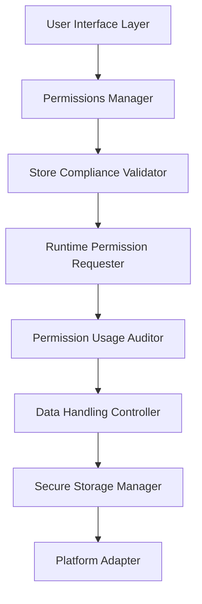
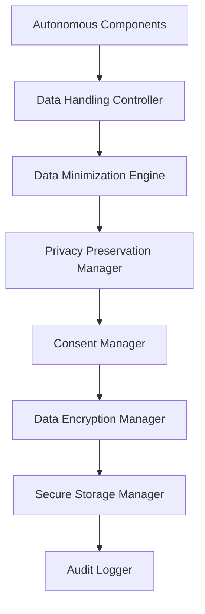
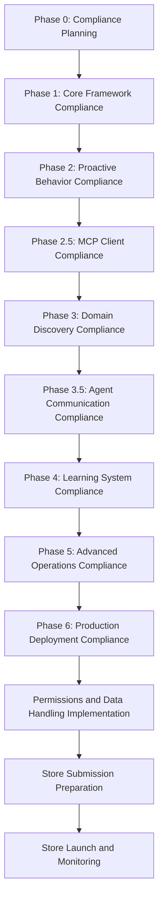

# Micro - Store-Compliant Permissions and Data Handling Framework

## Executive Overview

This document provides a comprehensive store-compliant permissions and data handling framework for Micro's autonomous agent operations. It addresses the unique challenges of permissions management and data handling for autonomous agents while ensuring full compliance with Google Play Store and iOS App Store policies.

## 1. Store Compliance Permissions Analysis

### 1.1 Google Play Store Permissions Requirements

#### Critical Permissions Considerations
- **Prohibited Permissions**: SMS, Call Log, Contacts for autonomous agents
- **Restricted Permissions**: Location, Camera, Microphone with strict justification
- **Runtime Permission Requests**: Must be requested at runtime with clear justification
- **Permission Justification**: Must explain why permission is needed for autonomous operation
- **Granular Permissions**: Request only specific permissions needed for each feature
- **Permission Usage Audit**: Log all permission requests and usage

#### Autonomous Agent Permission Challenges
1. **Background Operations**: Permissions needed for background autonomous tasks
2. **Data Collection**: Permissions needed for context analysis and learning
3. **Tool Integration**: Permissions needed for MCP tool discovery and execution
4. **Agent Communication**: Permissions needed for inter-agent communication
5. **Proactive Actions**: Permissions needed for proactive behavior

### 1.2 iOS App Store Permissions Requirements

#### Critical Permissions Considerations
- **Privacy Nutrition Labels**: Clear disclosure of data usage
- **App Tracking Transparency**: Explicit user consent for tracking
- **Background Modes**: Limited to specific modes for autonomous operations
- **Permission Justification**: Must explain why permission is needed for autonomous operation
- **Granular Permissions**: Request only specific permissions needed for each feature
- **Permission Usage Audit**: Log all permission requests and usage

#### Autonomous Agent Permission Challenges
1. **Background Operations**: Permissions needed for background autonomous tasks
2. **Data Collection**: Permissions needed for context analysis and learning
3. **Tool Integration**: Permissions needed for MCP tool discovery and execution
4. **Agent Communication**: Permissions needed for inter-agent communication
5. **Proactive Actions**: Permissions needed for proactive behavior

## 2. Store-Compliant Permissions Framework

### 2.1 Permissions Manager Architecture



### 2.2 Core Components

#### Permissions Manager
```dart
class StoreCompliantPermissionsManager {
  final StoreComplianceValidator _complianceValidator;
  final RuntimePermissionRequester _permissionRequester;
  final PermissionUsageAuditor _usageAuditor;
  final DataHandlingController _dataController;
  final SecureStorageManager _storageManager;
  final PlatformAdapter _platformAdapter;
  
  // Store compliance requirements
  static const bool requireRuntimePermissionRequests = true;
  static const bool requirePermissionJustification = true;
  static const bool requireGranularPermissions = true;
  static const bool requirePermissionAudit = true;
  
  Future<void> initialize() async {
    // Initialize store compliance validator
    await _complianceValidator.initialize();
    
    // Initialize permission requester
    await _permissionRequester.initialize();
    
    // Initialize usage auditor
    await _usageAuditor.initialize();
    
    // Initialize data controller
    await _dataController.initialize();
    
    // Initialize storage manager
    await _storageManager.initialize();
    
    // Initialize platform adapter
    await _platformAdapter.initialize();
  }
  
  Future<PermissionRequestResult> requestPermission(
    Permission permission,
    String purpose,
    String justification,
  ) async {
    // Validate permission request for store compliance
    final compliance = await _complianceValidator.validatePermissionRequest(
      permission,
      purpose,
      justification,
    );
    
    if (!compliance.isAllowed) {
      return PermissionRequestResult.denied(
        reason: compliance.reason,
        alternative: compliance.alternative,
      );
    }
    
    // Request permission with runtime dialog
    final result = await _permissionRequester.requestRuntimePermission(
      permission,
      purpose,
      justification,
    );
    
    // Log permission request for audit
    await _usageAuditor.logPermissionRequest({
      'permission': permission.toString(),
      'purpose': purpose,
      'justification': justification,
      'result': result.toString(),
      'timestamp': DateTime.now().toIso8601String(),
    });
    
    return result;
  }
  
  Future<void> revokePermission(Permission permission) async {
    // Revoke permission with user notification
    await _permissionRequester.revokePermission(permission);
    
    // Update data controller
    await _dataController.handlePermissionRevocation(permission);
    
    // Log permission revocation for audit
    await _usageAuditor.logPermissionRevocation({
      'permission': permission.toString(),
      'timestamp': DateTime.now().toIso8601String(),
    });
  }
}
```

#### Store Compliance Validator
```dart
class StoreComplianceValidator {
  final PlatformAdapter _platformAdapter;
  final ProhibitedPermissionsList _prohibitedPermissions;
  
  Future<PermissionComplianceResult> validatePermissionRequest(
    Permission permission,
    String purpose,
    String justification,
  ) async {
    // Check if permission is prohibited
    if (_prohibitedPermissions.isProhibited(permission)) {
      return PermissionComplianceResult.denied(
        reason: 'Permission is prohibited for autonomous agents',
        storePolicy: _prohibitedPermissions.getPolicyReference(permission),
      );
    }
    
    // Check if justification is sufficient
    if (!await _isJustificationSufficient(permission, justification)) {
      return PermissionComplianceResult.denied(
        reason: 'Permission justification is insufficient',
        recommendation: 'Provide more detailed justification for permission request',
      );
    }
    
    // Check if purpose is specific enough
    if (!await _isPurposeSpecificEnough(permission, purpose)) {
      return PermissionComplianceResult.denied(
        reason: 'Permission purpose is too broad',
        recommendation: 'Provide more specific purpose for permission request',
      );
    }
    
    // Check platform-specific requirements
    final platformCompliance = await _platformAdapter.validatePermissionRequest(
      permission,
      purpose,
      justification,
    );
    
    if (!platformCompliance.isCompliant) {
      return PermissionComplianceResult.denied(
        reason: platformCompliance.reason,
        recommendation: platformCompliance.recommendation,
      );
    }
    
    return PermissionComplianceResult.allowed();
  }
  
  Future<bool> _isJustificationSufficient(Permission permission, String justification) async {
    // Check if justification explains why permission is needed
    final hasExplanation = justification.contains('why') || 
                       justification.contains('needed') || 
                       justification.contains('required') ||
                       justification.contains('autonomous');
    
    // Check if justification is specific to autonomous operation
    final isSpecific = justification.contains('autonomous') || 
                     justification.contains('background') ||
                     justification.contains('proactive');
    
    return hasExplanation && isSpecific;
  }
  
  Future<bool> _isPurposeSpecificEnough(Permission permission, String purpose) async {
    // Check if purpose is specific enough
    final isSpecific = purpose.length < 100 && // Reasonable length
                       !purpose.contains('general') && // Not too general
                       !purpose.contains('miscellaneous'); // Not too vague
    
    return isSpecific;
  }
}
```

#### Runtime Permission Requester
```dart
class RuntimePermissionRequester {
  final PlatformAdapter _platformAdapter;
  final UserInterfaceManager _uiManager;
  
  Future<PermissionResult> requestRuntimePermission(
    Permission permission,
    String purpose,
    String justification,
  ) async {
    // Create permission request dialog
    final dialog = PermissionRequestDialog(
      permission: permission,
      purpose: purpose,
      justification: justification,
      storeCompliant: true,
    );
    
    // Show permission request dialog
    final result = await _uiManager.showPermissionRequestDialog(dialog);
    
    // Handle permission request result
    if (result.granted) {
      await _handlePermissionGranted(permission);
    } else {
      await _handlePermissionDenied(permission, result.reason);
    }
    
    return result;
  }
  
  Future<void> _handlePermissionGranted(Permission permission) async {
    // Update permission status
    await _updatePermissionStatus(permission, PermissionStatus.granted);
    
    // Initialize permission-dependent features
    await _initializePermissionDependentFeatures(permission);
  }
  
  Future<void> _handlePermissionDenied(Permission permission, String reason) async {
    // Update permission status
    await _updatePermissionStatus(permission, PermissionStatus.denied);
    
    // Show educational information about permission
    await _uiManager.showPermissionEducationDialog(permission, reason);
  }
  
  Future<void> _updatePermissionStatus(Permission permission, PermissionStatus status) async {
    // Update permission status in secure storage
    await _secureStorageManager.storePermissionStatus(permission, status);
    
    // Log permission status change
    await _auditLogger.logPermissionStatusChange({
      'permission': permission.toString(),
      'status': status.toString(),
      'timestamp': DateTime.now().toIso8601String(),
    });
  }
}
```

#### Permission Usage Auditor
```dart
class PermissionUsageAuditor {
  final SecureStorageManager _storageManager;
  final AuditLogger _auditLogger;
  
  Future<void> logPermissionRequest(Map<String, dynamic> requestData) async {
    // Log permission request for audit
    final auditEntry = PermissionAuditEntry(
      type: AuditType.permissionRequest,
      data: requestData,
      timestamp: DateTime.now(),
    );
    
    await _auditLogger.logAuditEntry(auditEntry);
  }
  
  Future<void> logPermissionUsage(Permission permission, String usage) async {
    // Log permission usage for audit
    final auditEntry = PermissionAuditEntry(
      type: AuditType.permissionUsage,
      data: {
        'permission': permission.toString(),
        'usage': usage,
        'timestamp': DateTime.now().toIso8601String(),
      },
    );
    
    await _auditLogger.logAuditEntry(auditEntry);
  }
  
  Future<void> logPermissionRevocation(Map<String, dynamic> revocationData) async {
    // Log permission revocation for audit
    final auditEntry = PermissionAuditEntry(
      type: AuditType.permissionRevocation,
      data: revocationData,
      timestamp: DateTime.now(),
    );
    
    await _auditLogger.logAuditEntry(auditEntry);
  }
  
  Future<PermissionUsageReport> generateUsageReport() async {
    // Generate comprehensive permission usage report
    final requests = await _getPermissionRequests();
    final usages = await _getPermissionUsages();
    final revocations = await _getPermissionRevocations();
    
    return PermissionUsageReport(
      requests: requests,
      usages: usages,
      revocations: revocations,
      generatedAt: DateTime.now(),
    );
  }
}
```

## 3. Store-Compliant Data Handling Framework

### 3.1 Data Handling Architecture



### 3.2 Core Components

#### Data Handling Controller
```dart
class StoreCompliantDataHandlingController {
  final DataMinimizationEngine _minimizationEngine;
  final PrivacyPreservationManager _privacyManager;
  final ConsentManager _consentManager;
  final DataEncryptionManager _encryptionManager;
  final SecureStorageManager _storageManager;
  final AuditLogger _auditLogger;
  
  // Store compliance requirements
  static const bool requireDataMinimization = true;
  static const bool requirePrivacyPreservation = true;
  static const bool requireUserConsent = true;
  static const bool requireDataEncryption = true;
  static const bool requireAuditLogging = true;
  
  Future<void> initialize() async {
    // Initialize data minimization engine
    await _minimizationEngine.initialize();
    
    // Initialize privacy preservation manager
    await _privacyManager.initialize();
    
    // Initialize consent manager
    await _consentManager.initialize();
    
    // Initialize data encryption manager
    await _encryptionManager.initialize();
    
    // Initialize storage manager
    await _storageManager.initialize();
    
    // Initialize audit logger
    await _auditLogger.initialize();
  }
  
  Future<DataHandlingResult> handleAutonomousData(
    AutonomousData data,
    DataPurpose purpose,
  ) async {
    // Check data minimization
    final minimizedData = await _minimizationEngine.minimizeData(data);
    
    // Check privacy preservation
    final privacyPreservedData = await _privacyManager.preservePrivacy(minimizedData);
    
    // Check user consent
    final hasConsent = await _consentManager.hasConsent(
      ConsentType.dataHandling,
      purpose: purpose,
    );
    
    if (!hasConsent) {
      return DataHandlingResult.denied(
        reason: 'User consent not obtained for data handling',
      );
    }
    
    // Encrypt data
    final encryptedData = await _encryptionManager.encryptData(privacyPreservedData);
    
    // Store data securely
    await _storageManager.storeSecurely(encryptedData, purpose);
    
    // Log data handling for audit
    await _auditLogger.logDataHandling({
      'purpose': purpose.toString(),
      'dataType': data.type.toString(),
      'minimized': true,
      'privacyPreserved': true,
      'encrypted': true,
      'consentObtained': true,
      'timestamp': DateTime.now().toIso8601String(),
    });
    
    return DataHandlingResult.success();
  }
}
```

#### Data Minimization Engine
```dart
class DataMinimizationEngine {
  Future<MinimizedData> minimizeData(AutonomousData data) async {
    // Extract only necessary data points
    final necessaryDataPoints = await _extractNecessaryDataPoints(data);
    
    // Remove redundant data
    final deduplicatedData = await _deduplicateData(necessaryDataPoints);
    
    // Aggregate data to minimal required level
    final minimizedData = await _aggregateToMinimalLevel(deduplicatedData);
    
    return MinimizedData(
      originalData: data,
      minimizedData: minimizedData,
      reductionPercentage: _calculateReductionPercentage(data, minimizedData),
      timestamp: DateTime.now(),
    );
  }
  
  Future<List<DataPoint>> _extractNecessaryDataPoints(AutonomousData data) async {
    // Extract only data points necessary for autonomous operation
    final necessaryPoints = <DataPoint>[];
    
    for (final dataPoint in data.dataPoints) {
      if (_isNecessaryForAutonomousOperation(dataPoint)) {
        necessaryPoints.add(dataPoint);
      }
    }
    
    return necessaryPoints;
  }
  
  bool _isNecessaryForAutonomousOperation(DataPoint dataPoint) {
    // Check if data point is necessary for autonomous operation
    switch (dataPoint.type) {
      case DataType.context:
        return true; // Context data is necessary
      case DataType.userIntent:
        return true; // User intent is necessary
      case DataType.actionHistory:
        return false; // Action history can be minimized
      case DataType.detailedSensorData:
        return false; // Detailed sensor data can be minimized
      case DataType.aggregatedBehavioralData:
        return true; // Aggregated behavioral data is necessary
    }
  }
  
  double _calculateReductionPercentage(
    AutonomousData original,
    MinimizedData minimized,
  ) {
    return ((original.dataPoints.length - minimized.dataPoints.length) / 
            original.dataPoints.length) * 100;
  }
}
```

#### Privacy Preservation Manager
```dart
class PrivacyPreservationManager {
  final AnonymizationEngine _anonymizationEngine;
  final DifferentialPrivacyEngine _differentialPrivacyEngine;
  
  Future<PrivacyPreservedData> preservePrivacy(MinimizedData data) async {
    // Anonymize data for privacy preservation
    final anonymizedData = await _anonymizationEngine.anonymize(data);
    
    // Apply differential privacy for additional protection
    final differentialPrivacyData = await _differentialPrivacyEngine.applyDifferentialPrivacy(
      anonymizedData,
    );
    
    return PrivacyPreservedData(
      originalData: data,
      anonymizedData: anonymizedData,
      differentialPrivacyData: differentialPrivacyData,
      privacyPreserved: true,
      timestamp: DateTime.now(),
    );
  }
}
```

#### Consent Manager
```dart
class StoreCompliantConsentManager {
  final SecureStorageManager _storageManager;
  final UserInterfaceManager _uiManager;
  
  Future<void> initialize() async {
    // Load existing consent preferences
    await _loadConsentPreferences();
  }
  
  Future<bool> hasConsent(ConsentType type, {String? purpose}) async {
    // Check if user has given consent for specific type
    final consentKey = _getConsentKey(type, purpose);
    final hasConsent = await _storageManager.getBool(consentKey);
    
    return hasConsent;
  }
  
  Future<void> updateConsent(ConsentType type, bool granted, {String? purpose}) async {
    // Update consent preference
    final consentKey = _getConsentKey(type, purpose);
    await _storageManager.setBool(consentKey, granted);
    
    // Log consent change for audit
    await _auditLogger.logConsentChange({
      'type': type.toString(),
      'purpose': purpose,
      'granted': granted,
      'timestamp': DateTime.now().toIso8601String(),
    });
  }
  
  Future<void> requestConsent(
    ConsentType type,
    String purpose,
    String description,
  ) async {
    // Show consent request dialog
    final dialog = ConsentRequestDialog(
      type: type,
      purpose: purpose,
      description: description,
      storeCompliant: true,
    );
    
    final result = await _uiManager.showConsentRequestDialog(dialog);
    
    // Update consent preference
    await updateConsent(type, result.granted, purpose: purpose);
    
    // Log consent request for audit
    await _auditLogger.logConsentRequest({
      'type': type.toString(),
      'purpose': purpose,
      'description': description,
      'granted': result.granted,
      'timestamp': DateTime.now().toIso8601String(),
    });
  }
  
  String _getConsentKey(ConsentType type, String? purpose) {
    // Generate consent key for storage
    final baseKey = 'consent_${type.toString()}';
    return purpose != null ? '${baseKey}_$purpose' : baseKey;
  }
  
  Future<void> _loadConsentPreferences() async {
    // Load default consent preferences
    final defaultConsents = {
      'consent_dataCollection': false,
      'consent_backgroundExecution': false,
      'consent_toolExecution': false,
      'consent_agentCommunication': false,
      'consent_learning': false,
    };
    
    // Load existing consent preferences
    final storedConsents = await _storageManager.getAllConsents();
    
    // Merge with defaults
    final mergedConsents = {...defaultConsents, ...storedConsents};
    
    // Store merged consents
    for (final entry in mergedConsents.entries) {
      await _storageManager.setString(entry.key, entry.value.toString());
    }
  }
}
```

#### Data Encryption Manager
```dart
class DataEncryptionManager {
  final SecureStorageManager _storageManager;
  final PlatformAdapter _platformAdapter;
  
  Future<EncryptedData> encryptData(PrivacyPreservedData data) async {
    // Get platform-specific encryption implementation
    final encryptionImplementation = await _platformAdapter.getEncryptionImplementation();
    
    // Encrypt data
    final encryptedData = await encryptionImplementation.encrypt(data);
    
    // Store encryption metadata
    await _storageManager.storeEncryptionMetadata({
      'algorithm': encryptionImplementation.algorithm,
      'keyId': encryptionImplementation.keyId,
      'timestamp': DateTime.now().toIso8601String(),
    });
    
    return EncryptedData(
      originalData: data,
      encryptedData: encryptedData,
      algorithm: encryptionImplementation.algorithm,
      timestamp: DateTime.now(),
    );
  }
  
  Future<PrivacyPreservedData> decryptData(EncryptedData encryptedData) async {
    // Get platform-specific decryption implementation
    final decryptionImplementation = await _platformAdapter.getDecryptionImplementation();
    
    // Decrypt data
    final decryptedData = await decryptionImplementation.decrypt(encryptedData);
    
    return decryptedData;
  }
}
```

## 4. Platform-Specific Implementation

### 4.1 Android Permissions Implementation

#### Android Permission Mapping
```dart
class AndroidPermissionsMapping {
  static const Map<Permission, String> permissionNames = {
    Permission.location: 'ACCESS_FINE_LOCATION',
    Permission.camera: 'CAMERA',
    Permission.microphone: 'RECORD_AUDIO',
    Permission.storage: 'READ_EXTERNAL_STORAGE',
    Permission.networkState: 'ACCESS_NETWORK_STATE',
    Permission.wakeLock: 'WAKE_LOCK',
  };
  
  static const Map<Permission, String> prohibitedPermissions = {
    Permission.readSms: 'READ_SMS',
    Permission.sendSms: 'SEND_SMS',
    Permission.readCallLog: 'READ_CALL_LOG',
    Permission.writeCallLog: 'WRITE_CALL_LOG',
    Permission.readContacts: 'READ_CONTACTS',
    Permission.writeContacts: 'WRITE_CONTACTS',
  };
  
  static String getPermissionName(Permission permission) {
    return permissionNames[permission] ?? 'UNKNOWN_PERMISSION';
  }
  
  static bool isProhibited(Permission permission) {
    return prohibitedPermissions.containsKey(permission);
  }
}
```

#### Android Runtime Permission Requests
```dart
class AndroidRuntimePermissionRequester {
  Future<PermissionResult> requestRuntimePermission(
    Permission permission,
    String purpose,
    String justification,
  ) async {
    // Check if permission is prohibited
    if (AndroidPermissionsMapping.isProhibited(permission)) {
      return PermissionResult.denied(
        reason: 'Permission is prohibited for autonomous agents',
      );
    }
    
    // Request permission with proper justification
    final result = await Permission.request(
      [AndroidPermissionsMapping.getPermissionName(permission)],
      rationale: justification,
    );
    
    return result;
  }
}
```

### 4.2 iOS Permissions Implementation

#### iOS Permission Mapping
```dart
class iOSPermissionsMapping {
  static const Map<Permission, String> permissionNames = {
    Permission.location: 'NSLocationWhenInUseUsageDescription',
    Permission.camera: 'NSCameraUsageDescription',
    Permission.microphone: 'NSMicrophoneUsageDescription',
    Permission.photos: 'NSPhotoLibraryUsageDescription',
    Permission.contacts: 'NSContactsUsageDescription',
    Permission.calendar: 'NSCalendarsUsageDescription',
    Permission.networkState: 'NSNetworkUsageDescription',
  };
  
  static const Map<Permission, String> prohibitedPermissions = {
    Permission.sms: 'NSSMSUsageDescription', // Generally prohibited
    Permission.callLog: 'NSCallLogUsageDescription', // Generally prohibited
    Permission.contacts: 'NSContactsUsageDescription', // Requires special justification
  };
  
  static String getPermissionName(Permission permission) {
    return permissionNames[permission] ?? 'UNKNOWN_PERMISSION';
  }
  
  static bool isProhibited(Permission permission) {
    return prohibitedPermissions.containsKey(permission);
  }
}
```

#### iOS Runtime Permission Requests
```dart
class iOSRuntimePermissionRequester {
  Future<PermissionResult> requestRuntimePermission(
    Permission permission,
    String purpose,
    String justification,
  ) async {
    // Check if permission is prohibited
    if (iOSPermissionsMapping.isProhibited(permission)) {
      return PermissionResult.denied(
        reason: 'Permission is prohibited for autonomous agents',
      );
    }
    
    // Request permission with proper justification
    final result = await Permission.request(
      [iOSPermissionsMapping.getPermissionName(permission)],
    );
    
    return result;
  }
}
```

## 5. Store Compliance Testing Framework

### 5.1 Permissions Testing

#### Permission Compliance Tests
```dart
class StoreCompliancePermissionTests {
  Future<void> runPermissionTests() async {
    // Test prohibited permissions
    await _testProhibitedPermissions();
    
    // Test permission justification
    await _testPermissionJustification();
    
    // Test granular permissions
    await _testGranularPermissions();
    
    // Test runtime permission requests
    await _testRuntimePermissionRequests();
    
    // Test permission audit logging
    await _testPermissionAuditLogging();
  }
  
  Future<void> _testProhibitedPermissions() async {
    // Test that prohibited permissions are not requested
    final prohibitedPermissions = AndroidPermissionsMapping.prohibitedPermissions.keys;
    
    for (final permission in prohibitedPermissions) {
      // Verify permission is not in manifest
      assert(!await _isPermissionInManifest(permission), 
             'Prohibited permission ${permission} found in manifest');
      
      // Verify permission is not requested
      assert(!await _isPermissionRequested(permission), 
             'Prohibited permission ${permission} was requested');
    }
  }
  
  Future<void> _testPermissionJustification() async {
    // Test that permission requests include proper justification
    final testPermission = Permission.location;
    final testJustification = 'Location needed for context-aware autonomous operations';
    
    final result = await _permissionsManager.requestPermission(
      testPermission,
      'Autonomous context analysis',
      testJustification,
    );
    
    assert(result.granted, 'Permission request with proper justification failed');
  }
  
  Future<void> _testGranularPermissions() async {
    // Test that only necessary permissions are requested
    final requiredPermissions = [
      Permission.location,
      Permission.camera,
      Permission.microphone,
    ];
    
    for (final permission in requiredPermissions) {
      final result = await _permissionsManager.requestPermission(
        permission,
        'Autonomous ${permission} operations',
        'Needed for autonomous ${permission} functionality',
      );
      
      assert(result.granted, 'Required permission ${permission} request failed');
    }
  }
}
```

### 5.2 Data Handling Tests

#### Data Compliance Tests
```dart
class StoreComplianceDataTests {
  Future<void> runDataTests() async {
    // Test data minimization
    await _testDataMinimization();
    
    // Test privacy preservation
    await _testPrivacyPreservation();
    
    // Test data encryption
    await _testDataEncryption();
    
    // Test user consent
    await _testUserConsent();
    
    // Test data audit logging
    await _testDataAuditLogging();
  }
  
  Future<void> _testDataMinimization() async {
    // Test that only necessary data is collected
    final testData = AutonomousTestData(
      contextData: 'test context',
      sensorData: 'test sensor data',
      behavioralData: 'test behavioral data',
    );
    
    final minimizedData = await _dataMinimizationEngine.minimizeData(testData);
    
    // Verify data reduction
    assert(minimizedData.reductionPercentage > 0, 
           'Data minimization failed');
    
    // Verify necessary data preserved
    assert(minimizedData.dataPoints.length > 0, 
           'Necessary data not preserved');
  }
  
  Future<void> _testPrivacyPreservation() async {
    // Test that data is properly anonymized
    final testData = AutonomousTestData(
      personalData: 'test personal data',
      sensitiveData: 'test sensitive data',
    );
    
    final privacyPreservedData = await _privacyManager.preservePrivacy(testData);
    
    // Verify anonymization
    assert(privacyPreservedData.anonymizedData.isAnonymized, 
           'Data anonymization failed');
    
    // Verify differential privacy
    assert(privacyPreservedData.differentialPrivacyData.isProtected, 
           'Differential privacy protection failed');
  }
  
  Future<void> _testDataEncryption() async {
    // Test that data is properly encrypted
    final testData = 'test sensitive data';
    
    final encryptedData = await _dataEncryptionManager.encryptData(
      PrivacyPreservedData(data: testData),
    );
    
    // Verify encryption
    assert(encryptedData.encryptedData.isNotEmpty, 
           'Data encryption failed');
    
    // Verify decryption
    final decryptedData = await _dataEncryptionManager.decryptData(encryptedData);
    
    assert(decryptedData == testData, 
           'Data decryption failed');
  }
}
```

## 6. Implementation Recommendations

### 6.1 Store Compliance Integration Timeline

#### Permissions and Data Handling Integration


### 6.2 Critical Success Factors

#### Store Approval Success Criteria
1. **Permissions Compliance**
   - No prohibited permissions requested
   - Proper runtime permission requests with justification
   - Granular permissions for specific features
   - Comprehensive permission audit logging
   - User consent management and control

2. **Data Handling Compliance**
   - Data minimization for all autonomous operations
   - Privacy preservation with anonymization
   - Secure data encryption at rest and in transit
   - User consent for all data collection
   - Comprehensive data audit logging

3. **Store Policy Adherence**
   - Strict adherence to store permission policies
   - Proper permission justification and disclosure
   - User control over all permissions and data
   - Comprehensive audit trail for all operations

## Conclusion

This comprehensive store-compliant permissions and data handling framework ensures that Micro's autonomous agent operations meet all Google Play Store and iOS App Store requirements while maintaining powerful autonomous capabilities. The framework provides:

1. **Store-Compliant Permissions Management**: Proper permission requests with justification
2. **Data Minimization and Privacy Preservation**: Minimal data collection with anonymization
3. **User Consent Management**: Comprehensive consent system for all operations
4. **Secure Data Handling**: Encryption and secure storage for all data
5. **Comprehensive Audit Logging**: Complete audit trail for all operations
6. **Platform-Specific Implementation**: Android and iOS specific compliance strategies

Following this framework will ensure successful store approval and user trust in Micro's autonomous agent capabilities.