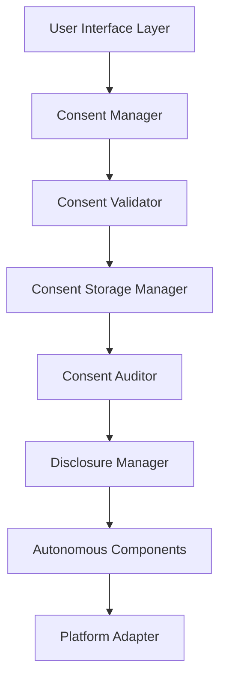
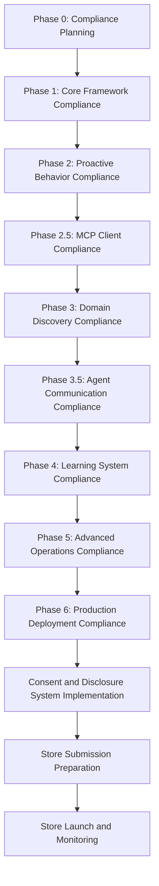

# Micro - Store-Compliant User Consent and Disclosure System for Autonomous Behavior

## Executive Overview

This document provides a comprehensive store-compliant user consent and disclosure system for Micro's autonomous agent operations. It addresses the unique challenges of user consent and disclosure for autonomous agents while ensuring full compliance with Google Play Store and iOS App Store policies.

## 1. Store Consent and Disclosure Requirements Analysis

### 1.1 Google Play Store Consent Requirements

#### Key Consent and Disclosure Requirements
- **Explicit Consent**: Required for all autonomous operations
- **Granular Consent**: Separate consent for each autonomous feature
- **Informed Consent**: Clear explanation of what data is collected and why
- **Easy Withdrawal**: Simple mechanism to withdraw consent
- **Consent Persistence**: Consent must be stored securely and persist across app updates
- **Consent Audit**: Complete audit trail of all consent changes

#### Autonomous Agent Consent Challenges
1. **Complex Operations**: Multiple autonomous features requiring consent
2. **Dynamic Behavior**: Changing autonomous behavior requiring ongoing consent
3. **Data Collection**: Various data types collected for autonomous operations
4. **Background Operations**: Background autonomous tasks requiring consent
5. **Learning Systems**: Machine learning requiring user data consent

### 1.2 iOS App Store Consent Requirements

#### Key Consent and Disclosure Requirements
- **App Tracking Transparency**: Explicit consent for tracking across apps and websites
- **Privacy Nutrition Labels**: Clear disclosure of data practices
- **Granular Consent**: Separate consent for each autonomous feature
- **Informed Consent**: Clear explanation of what data is collected and why
- **Easy Withdrawal**: Simple mechanism to withdraw consent
- **Consent Persistence**: Consent must be stored securely and persist across app updates
- **Consent Audit**: Complete audit trail of all consent changes

#### Autonomous Agent Consent Challenges
1. **Complex Operations**: Multiple autonomous features requiring consent
2. **Dynamic Behavior**: Changing autonomous behavior requiring ongoing consent
3. **Data Collection**: Various data types collected for autonomous operations
4. **Background Operations**: Background autonomous tasks requiring consent
5. **Learning Systems**: Machine learning requiring user data consent

## 2. Store-Compliant Consent and Disclosure Framework

### 2.1 Consent Management Architecture



### 2.2 Core Components

#### Consent Manager
```dart
class StoreCompliantConsentManager {
  final ConsentStorageManager _storageManager;
  final ConsentValidator _validator;
  final ConsentAuditor _auditor;
  final DisclosureManager _disclosureManager;
  final PlatformAdapter _platformAdapter;
  
  // Store compliance requirements
  static const bool requireExplicitConsent = true;
  static const bool requireGranularConsent = true;
  static const bool requireInformedConsent = true;
  static const bool requireEasyWithdrawal = true;
  static const bool requireConsentPersistence = true;
  static const bool requireConsentAudit = true;
  
  Future<void> initialize() async {
    // Load existing consent preferences
    await _loadConsentPreferences();
    
    // Initialize consent validator
    await _validator.initialize();
    
    // Initialize consent auditor
    await _auditor.initialize();
    
    // Initialize disclosure manager
    await _disclosureManager.initialize();
    
    // Initialize platform adapter
    await _platformAdapter.initialize();
  }
  
  Future<ConsentResult> requestConsent(
    ConsentType type,
    String purpose,
    String description,
    Map<String, dynamic> dataTypes,
  ) async {
    // Validate consent request for store compliance
    final validation = await _validator.validateConsentRequest(
      type,
      purpose,
      description,
      dataTypes,
    );
    
    if (!validation.isCompliant) {
      return ConsentResult.denied(
        reason: validation.reason,
        recommendation: validation.recommendation,
      );
    }
    
    // Show consent request dialog
    final result = await _showConsentRequestDialog(
      type,
      purpose,
      description,
      dataTypes,
    );
    
    // Store consent result
    await _storageManager.storeConsentResult(type, result);
    
    // Log consent request for audit
    await _auditor.logConsentRequest({
      'type': type.toString(),
      'purpose': purpose,
      'description': description,
      'dataTypes': dataTypes,
      'result': result.toString(),
      'timestamp': DateTime.now().toIso8601String(),
    });
    
    return result;
  }
  
  Future<bool> hasConsent(ConsentType type, {String? purpose}) async {
    // Check if user has given consent
    final consentKey = _getConsentKey(type, purpose);
    final hasConsent = await _storageManager.getBool(consentKey);
    
    return hasConsent;
  }
  
  Future<void> updateConsent(ConsentType type, bool granted, {String? purpose}) async {
    // Update consent preference
    final consentKey = _getConsentKey(type, purpose);
    await _storageManager.setBool(consentKey, granted);
    
    // Log consent change for audit
    await _auditor.logConsentChange({
      'type': type.toString(),
      'purpose': purpose,
      'granted': granted,
      'timestamp': DateTime.now().toIso8601String(),
    });
  }
  
  Future<void> revokeConsent(ConsentType type, {String? purpose}) async {
    // Revoke consent with user notification
    final consentKey = _getConsentKey(type, purpose);
    await _storageManager.remove(consentKey);
    
    // Log consent revocation for audit
    await _auditor.logConsentRevocation({
      'type': type.toString(),
      'purpose': purpose,
      'timestamp': DateTime.now().toIso8601String(),
    });
    
    // Update autonomous components based on consent revocation
    await _updateAutonomousComponentsForConsentRevocation(type);
  }
  
  Future<ConsentRequestDialogResult> _showConsentRequestDialog(
    ConsentType type,
    String purpose,
    String description,
    Map<String, dynamic> dataTypes,
  ) async {
    // Create platform-specific consent dialog
    if (Platform.isAndroid) {
      return await _showAndroidConsentDialog(type, purpose, description, dataTypes);
    } else if (Platform.isIOS) {
      return await _showiOSConsentDialog(type, purpose, description, dataTypes);
    }
    
    return ConsentRequestDialogResult.cancelled();
  }
  
  String _getConsentKey(ConsentType type, String? purpose) {
    // Generate consent key for storage
    final baseKey = 'consent_${type.toString()}';
    return purpose != null ? '${baseKey}_$purpose' : baseKey;
  }
  
  Future<void> _updateAutonomousComponentsForConsentRevocation(ConsentType type) async {
    // Update autonomous components based on consent revocation
    switch (type) {
      case ConsentType.autonomousDecisions:
        await _updateAutonomousDecisionEngine(false);
        break;
      case ConsentType.proactiveBehavior:
        await _updateProactiveBehaviorEngine(false);
        break;
      case ConsentType.backgroundExecution:
        await _updateBackgroundExecutionController(false);
        break;
      case ConsentType.dataCollection:
        await _updateDataCollectionSystem(false);
        break;
      case ConsentType.toolExecution:
        await _updateToolExecutionSystem(false);
        break;
      case ConsentType.agentCommunication:
        await _updateAgentCommunicationSystem(false);
        break;
      case ConsentType.learningSystem:
        await _updateLearningSystem(false);
        break;
    }
  }
}
```

#### Consent Validator
```dart
class ConsentValidator {
  final PlatformAdapter _platformAdapter;
  final DisclosureManager _disclosureManager;
  
  Future<ConsentValidationResult> validateConsentRequest(
    ConsentType type,
    String purpose,
    String description,
    Map<String, dynamic> dataTypes,
  ) async {
    // Check if purpose is specific enough
    if (!await _isPurposeSpecificEnough(purpose)) {
      return ConsentValidationResult.denied(
        reason: 'Consent purpose is too broad',
        recommendation: 'Provide more specific purpose for consent request',
      );
    }
    
    // Check if description is clear enough
    if (!await _isDescriptionClearEnough(description)) {
      return ConsentValidationResult.denied(
        reason: 'Consent description is not clear enough',
        recommendation: 'Provide clearer description of what consent is for',
      );
    }
    
    // Check if data types are properly disclosed
    final dataTypesValid = await _validateDataTypes(dataTypes);
    
    if (!dataTypesValid) {
      return ConsentValidationResult.denied(
        reason: 'Data types are not properly disclosed',
        recommendation: 'Provide clearer disclosure of data types to be collected',
      );
    }
    
    // Check platform-specific requirements
    final platformCompliance = await _platformAdapter.validateConsentRequest(
      type,
      purpose,
      description,
      dataTypes,
    );
    
    if (!platformCompliance.isCompliant) {
      return ConsentValidationResult.denied(
        reason: platformCompliance.reason,
        recommendation: platformCompliance.recommendation,
      );
    }
    
    return ConsentValidationResult.compliant();
  }
  
  Future<bool> _isPurposeSpecificEnough(String purpose) async {
    // Check if purpose is specific enough
    return purpose.length < 100 && // Reasonable length
           !purpose.contains('general') && // Not too general
           !purpose.contains('miscellaneous'); // Not too vague
  }
  
  Future<bool> _isDescriptionClearEnough(String description) async {
    // Check if description is clear enough
    return description.length < 200 && // Reasonable length
           description.contains('why') || // Explains why
           description.contains('what'); // Explains what
  }
  
  Future<bool> _validateDataTypes(Map<String, dynamic> dataTypes) async {
    // Check if all data types are properly disclosed
    for (final entry in dataTypes.entries) {
      final dataType = entry.key;
      final dataDescription = entry.value;
      
      if (!await _isDataTypeProperlyDisclosed(dataType, dataDescription)) {
        return false;
      }
    }
    
    return true;
  }
  
  Future<bool> _isDataTypeProperlyDisclosed(String dataType, dynamic dataDescription) async {
    // Check if data type is properly disclosed
    switch (dataType) {
      case 'location':
        return dataDescription is Map && 
               dataDescription.containsKey('precision') &&
               dataDescription.containsKey('frequency');
      case 'behavioral':
        return dataDescription is Map && 
               dataDescription.containsKey('anonymization') &&
               dataDescription.containsKey('retention');
      case 'contacts':
        return false; // Generally prohibited for autonomous agents
      case 'sms':
        return false; // Generally prohibited for autonomous agents
      default:
        return true; // Allow other data types with proper disclosure
    }
  }
}
```

#### Consent Storage Manager
```dart
class ConsentStorageManager {
  final SecureStorageManager _secureStorage;
  final PlatformAdapter _platformAdapter;
  
  Future<void> storeConsentResult(ConsentType type, ConsentResult result) async {
    // Store consent result securely
    final consentData = {
      'type': type.toString(),
      'granted': result.granted,
      'timestamp': result.timestamp.toIso8601String(),
      'purpose': result.purpose,
      'description': result.description,
      'dataTypes': result.dataTypes,
    };
    
    // Store in platform-specific secure storage
    await _secureStorage.storeSecurely(
      'consent_${type.toString()}',
      consentData,
    );
  }
  
  Future<bool> getBool(String key) async {
    // Get boolean value from secure storage
    return await _secureStorage.getBool(key);
  }
  
  Future<void> setBool(String key, bool value) async {
    // Set boolean value in secure storage
    await _secureStorage.setBool(key, value);
  }
  
  Future<void> remove(String key) async {
    // Remove value from secure storage
    await _secureStorage.remove(key);
  }
}
```

#### Consent Auditor
```dart
class ConsentAuditor {
  final SecureStorageManager _storageManager;
  final PlatformAdapter _platformAdapter;
  
  Future<void> logConsentRequest(Map<String, dynamic> requestData) async {
    // Log consent request for audit
    final auditEntry = ConsentAuditEntry(
      type: AuditType.consentRequest,
      data: requestData,
      timestamp: DateTime.now(),
    );
    
    await _storageManager.storeAuditEntry(auditEntry);
  }
  
  Future<void> logConsentChange(Map<String, dynamic> changeData) async {
    // Log consent change for audit
    final auditEntry = ConsentAuditEntry(
      type: AuditType.consentChange,
      data: changeData,
      timestamp: DateTime.now(),
    );
    
    await _storageManager.storeAuditEntry(auditEntry);
  }
  
  Future<void> logConsentRevocation(Map<String, dynamic> revocationData) async {
    // Log consent revocation for audit
    final auditEntry = ConsentAuditEntry(
      type: AuditType.consentRevocation,
      data: revocationData,
      timestamp: DateTime.now(),
    );
    
    await _storageManager.storeAuditEntry(auditEntry);
  }
  
  Future<ConsentAuditReport> generateAuditReport() async {
    // Generate comprehensive consent audit report
    final requests = await _getConsentRequests();
    final changes = await _getConsentChanges();
    final revocations = await _getConsentRevocations();
    
    return ConsentAuditReport(
      requests: requests,
      changes: changes,
      revocations: revocations,
      generatedAt: DateTime.now(),
    );
  }
}
```

#### Disclosure Manager
```dart
class DisclosureManager {
  final ConsentManager _consentManager;
  final PrivacyPolicyManager _privacyPolicyManager;
  
  Future<void> generateDisclosureStatement() async {
    // Generate comprehensive disclosure statement
    final disclosure = await _generateComprehensiveDisclosure();
    
    // Store disclosure statement
    await _privacyPolicyManager.updateDisclosureStatement(disclosure);
  }
  
  Future<void> updateDisclosureStatement() async {
    // Update disclosure statement based on current consent
    final currentConsents = await _getCurrentConsents();
    
    final disclosure = await _generateDynamicDisclosure(currentConsents);
    
    // Store updated disclosure statement
    await _privacyPolicyManager.updateDisclosureStatement(disclosure);
  }
  
  Future<DisclosureStatement> _generateComprehensiveDisclosure() async {
    return DisclosureStatement(
      dataCollection: await _generateDataCollectionDisclosure(),
      dataUsage: await _generateDataUsageDisclosure(),
      dataSharing: await _generateDataSharingDisclosure(),
      dataRetention: await _generateDataRetentionDisclosure(),
      userRights: await _generateUserRightsDisclosure(),
      contactInfo: await _generateContactInfoDisclosure(),
      lastUpdated: DateTime.now(),
    );
  }
  
  Future<DisclosureStatement> _generateDynamicDisclosure(Map<ConsentType, bool> currentConsents) async {
    // Generate dynamic disclosure based on current consents
    return DisclosureStatement(
      dataCollection: await _generateDynamicDataCollectionDisclosure(currentConsents),
      dataUsage: await _generateDynamicDataUsageDisclosure(currentConsents),
      dataSharing: await _generateDynamicDataSharingDisclosure(currentConsents),
      dataRetention: await _generateDynamicDataRetentionDisclosure(currentConsents),
      userRights: await _generateDynamicUserRightsDisclosure(currentConsents),
      contactInfo: await _generateContactInfoDisclosure(),
      lastUpdated: DateTime.now(),
    );
  }
  
  Future<String> _generateDataCollectionDisclosure() async {
    // Generate data collection disclosure
    return '''
      Micro collects various types of data to provide autonomous agent functionality:
      
      1. Context Data: Location, device state, time of day, and environmental conditions
      2. Behavioral Data: App usage patterns, interaction history, and preferences
      3. Performance Data: Device performance metrics and resource usage
      4. Autonomous Operations Data: Decisions made, actions taken, and outcomes
      
      All data collection is based on explicit user consent and can be controlled through the app settings.
    ''';
  }
  
  Future<String> _generateDataUsageDisclosure() async {
    // Generate data usage disclosure
    return '''
      Micro uses collected data for the following purposes:
      
      1. Autonomous Decision Making: To make intelligent decisions based on user context and preferences
      2. Proactive Behavior: To suggest helpful actions and automate routine tasks
      3. Context Analysis: To understand user needs and provide relevant assistance
      4. Learning and Adaptation: To improve performance and personalize experience
      5. Tool Integration: To discover and integrate external tools and services
      6. Agent Communication: To collaborate with other Micro agents for complex tasks
      
      Data usage is limited to what is necessary for each purpose and is based on user consent.
    ''';
  }
  
  Future<String> _generateDataSharingDisclosure() async {
    // Generate data sharing disclosure
    return '''
      Micro may share collected data in the following circumstances:
      
      1. Agent Communication: With other Micro agents for task delegation and collaboration
      2. Tool Integration: With external tool providers for enhanced functionality
      3. Analytics: Anonymous usage analytics for app improvement
      4. Compliance: With app stores and regulatory bodies when required
      
      All data sharing is based on explicit user consent and is limited to what is necessary for each purpose.
    ''';
  }
  
  Future<String> _generateDataRetentionDisclosure() async {
    // Generate data retention disclosure
    return '''
      Micro retains collected data for the following periods:
      
      1. Context Data: Retained for 30 days, then anonymized and aggregated
      2. Behavioral Data: Retained for 90 days, then anonymized and aggregated
      3. Performance Data: Retained for 7 days, then aggregated and anonymized
      4. Autonomous Operations Data: Retained for 180 days, then anonymized and aggregated
      5. Learning Data: Retained for 365 days, then anonymized and used for model training
      
      Data retention is based on necessity and user consent, with automatic deletion after retention periods.
    ''';
  }
  
  Future<String> _generateUserRightsDisclosure() async {
    // Generate user rights disclosure
    return '''
      Micro users have the following rights regarding their data:
      
      1. Access: Right to access all data collected about them
      2. Correction: Right to correct inaccurate or incomplete data
      3. Deletion: Right to request deletion of their data
      4. Portability: Right to request a copy of their data in a machine-readable format
      5. Withdrawal: Right to withdraw consent for data collection and processing
      6. Information: Right to clear information about data collection and processing practices
      7. Control: Right to control how their data is used and shared
      
      These rights can be exercised through the app settings or by contacting support.
    ''';
  }
  
  Future<String> _generateContactInfoDisclosure() async {
    // Generate contact information disclosure
    return '''
      Micro can be contacted through the following channels:
      
      1. In-App Support: Through the help and support section of the app
      2. Email: support@micro.app
      3. Website: https://micro.app/support
      4. Privacy Policy: https://micro.app/privacy
      
      For data privacy inquiries, GDPR-related requests, or other regulatory compliance matters, please contact our privacy team at privacy@micro.app.
    ''';
  }
}
```

## 3. Platform-Specific Implementation

### 3.1 Android Consent and Disclosure Implementation

#### Android Consent Dialog
```dart
class AndroidConsentDialog {
  final ConsentManager _consentManager;
  final PlatformAdapter _platformAdapter;
  
  Future<ConsentRequestDialogResult> showConsentRequestDialog(
    ConsentType type,
    String purpose,
    String description,
    Map<String, dynamic> dataTypes,
  ) async {
    // Create Android consent dialog
    final dialog = AlertDialog(
      title: 'Micro Consent Request',
      content: Column(
        children: [
          // Consent purpose
          Text(
            'Purpose: $purpose',
            style: TextStyle(fontWeight: FontWeight.bold),
          ),
          
          // Consent description
          Text(description),
          
          // Data types disclosure
          ExpansionTile(
            title: 'Data Collection',
            children: dataTypes.entries.map((entry) {
              return ListTile(
                title: entry.key,
                subtitle: entry.value.toString(),
              );
            }).toList(),
          ),
          
          // Consent options
          RadioListTile<ConsentOption>(
            title: 'Consent Options',
            value: _selectedOption,
            onChanged: (value) => _selectedOption = value,
            children: [
              RadioListTile(
                title: 'Allow Once',
                value: ConsentOption.allowOnce,
              ),
              RadioListTile(
                title: 'Allow Always',
                value: ConsentOption.allowAlways,
              ),
              RadioListTile(
                title: 'Deny',
                value: ConsentOption.deny,
              ),
            ],
          ),
          
          // Additional information
          ListTile(
            title: 'Learn More',
            subtitle: 'View our privacy policy for detailed information',
            onTap: () => _openPrivacyPolicy(),
          ),
        ],
      ),
      actions: [
        // Deny action
        TextButton(
          onPressed: () => _handleConsentDecision(ConsentOption.deny),
          child: Text('Deny'),
        ),
        
        // Allow once action
        TextButton(
          onPressed: () => _handleConsentDecision(ConsentOption.allowOnce),
          child: Text('Allow Once'),
        ),
        
        // Allow always action
        TextButton(
          onPressed: () => _handleConsentDecision(ConsentOption.allowAlways),
          child: Text('Allow Always'),
        ),
      ],
    );
    
    // Show dialog
    final result = await _showDialog(dialog);
    
    // Handle consent decision
    return await _handleConsentDecisionResult(result);
  }
  
  Future<void> _handleConsentDecision(ConsentOption option) async {
    // Update consent based on user decision
    final granted = option != ConsentOption.deny;
    
    await _consentManager.updateConsent(
      ConsentType.autonomousOperations,
      granted,
    );
    
    // Show confirmation message
    if (granted) {
      await _showConsentGrantedMessage(option);
    } else {
      await _showConsentDeniedMessage();
    }
  }
  
  Future<void> _showConsentGrantedMessage(ConsentOption option) async {
    // Show consent granted message
    final message = option == ConsentOption.allowOnce
        ? 'Consent granted for this session only'
        : 'Consent granted for all future operations';
    
    await _notificationManager.showInfoNotification(
      'Consent Granted',
      message,
    );
  }
  
  Future<void> _showConsentDeniedMessage() async {
    // Show consent denied message
    await _notificationManager.showInfoNotification(
      'Consent Denied',
      'Some features may be limited without consent',
    );
  }
}
```

### 3.2 iOS Consent and Disclosure Implementation

#### iOS Consent Dialog
```dart
class iOSConsentDialog {
  final ConsentManager _consentManager;
  final PlatformAdapter _platformAdapter;
  
  Future<ConsentRequestDialogResult> showConsentRequestDialog(
    ConsentType type,
    String purpose,
    String description,
    Map<String, dynamic> dataTypes,
  ) async {
    // Create iOS consent dialog
    final dialog = CupertinoAlertDialog(
      title: 'Micro Consent Request',
      content: Column(
        children: [
          // Consent purpose
          Text(
            'Purpose: $purpose',
            style: TextStyle(fontWeight: FontWeight.bold),
          ),
          
          // Consent description
          Text(description),
          
          // Data types disclosure
          ExpansionTile(
            title: 'Data Collection',
            children: dataTypes.entries.map((entry) {
              return CupertinoListTile(
                title: entry.key,
                subtitle: entry.value.toString(),
              );
            }).toList(),
          ),
          
          // Consent options
          CupertinoSegmentedControl<ConsentOption>(
            groupValue: _selectedOption,
            onValueChanged: (value) => _selectedOption = value,
            children: [
              Segment(
                value: ConsentOption.allowOnce,
                label: 'Allow Once',
              ),
              Segment(
                value: ConsentOption.allowAlways,
                label: 'Allow Always',
              ),
              Segment(
                value: ConsentOption.deny,
                label: 'Deny',
              ),
            ],
          ),
          
          // Additional information
          CupertinoListTile(
            title: 'Learn More',
            subtitle: 'View our privacy policy for detailed information',
            onTap: () => _openPrivacyPolicy(),
          ),
        ],
      ),
      actions: [
        // Deny action
        CupertinoDialogAction(
          onPressed: () => _handleConsentDecision(ConsentOption.deny),
          child: Text('Deny'),
        ),
        
        // Allow once action
        CupertinoDialogAction(
          onPressed: () => _handleConsentDecision(ConsentOption.allowOnce),
          child: Text('Allow Once'),
        ),
        
        // Allow always action
        CupertinoDialogAction(
          onPressed: () => _handleConsentDecision(ConsentOption.allowAlways),
          child: Text('Allow Always'),
        ),
      ],
    );
    
    // Show dialog
    final result = await _showDialog(dialog);
    
    // Handle consent decision
    return await _handleConsentDecisionResult(result);
  }
  
  Future<void> _handleConsentDecision(ConsentOption option) async {
    // Update consent based on user decision
    final granted = option != ConsentOption.deny;
    
    await _consentManager.updateConsent(
      ConsentType.autonomousOperations,
      granted,
    );
    
    // Show confirmation message
    if (granted) {
      await _showConsentGrantedMessage(option);
    } else {
      await _showConsentDeniedMessage();
    }
  }
  
  Future<void> _showConsentGrantedMessage(ConsentOption option) async {
    // Show consent granted message
    final message = option == ConsentOption.allowOnce
        ? 'Consent granted for this session only'
        : 'Consent granted for all future operations';
    
    await _notificationManager.showInfoNotification(
      'Consent Granted',
      message,
    );
  }
  
  Future<void> _showConsentDeniedMessage() async {
    // Show consent denied message
    await _notificationManager.showInfoNotification(
      'Consent Denied',
      'Some features may be limited without consent',
    );
  }
}
```

## 4. Store Compliance Testing Framework

### 4.1 Consent and Disclosure Testing

#### Consent System Tests
```dart
class StoreCompliantConsentTests {
  Future<void> runConsentTests() async {
    // Test explicit consent requirements
    await _testExplicitConsent();
    
    // Test granular consent options
    await _testGranularConsent();
    
    // Test informed consent disclosure
    await _testInformedConsent();
    
    // Test easy withdrawal mechanism
    await _testEasyWithdrawal();
    
    // Test consent persistence
    await _testConsentPersistence();
    
    // Test consent audit logging
    await _testConsentAuditLogging();
  }
  
  Future<void> _testExplicitConsent() async {
    // Test that explicit consent is required
    final noConsentTask = AutonomousTask(
      id: 'test_no_consent',
      description: 'Test task without consent',
      requiresConsent: true,
    );
    
    final result = await _autonomousController.executeTask(noConsentTask);
    
    assert(result.isDenied, 'Task executed without explicit consent');
  }
  
  Future<void> _testGranularConsent() async {
    // Test that granular consent options are available
    final consentTypes = [
      ConsentType.autonomousDecisions,
      ConsentType.proactiveBehavior,
      ConsentType.backgroundExecution,
      ConsentType.dataCollection,
      ConsentType.toolExecution,
      ConsentType.agentCommunication,
      ConsentType.learningSystem,
    ];
    
    for (final type in consentTypes) {
      final hasConsent = await _consentManager.hasConsent(type);
      
      // Verify consent can be controlled independently
      assert(hasConsent != null, 'Granular consent not available for type: $type');
    }
  }
  
  Future<void> _testInformedConsent() async {
    // Test that informed consent is provided
    final consentRequest = ConsentRequest(
      type: ConsentType.dataCollection,
      purpose: 'Test informed consent',
      description: 'Test description',
      dataTypes: {'test': 'test data'},
    );
    
    final validation = await _consentValidator.validateConsentRequest(consentRequest);
    
    assert(validation.isCompliant, 'Informed consent validation failed');
  }
  
  Future<void> _testEasyWithdrawal() async {
    // Test that consent can be easily withdrawn
    final hasConsent = await _consentManager.hasConsent(ConsentType.dataCollection);
    
    if (hasConsent) {
      // Revoke consent
      await _consentManager.revokeConsent(ConsentType.dataCollection);
      
      // Verify consent is revoked
      final consentRevoked = !(await _consentManager.hasConsent(ConsentType.dataCollection));
      
      assert(consentRevoked, 'Consent withdrawal failed');
    }
  }
  
  Future<void> _testConsentPersistence() async {
    // Test that consent persists across app updates
    // Store consent
    await _consentManager.updateConsent(ConsentType.dataCollection, true);
    
    // Simulate app restart
    await _consentManager.initialize();
    
    // Verify consent is still granted
    final consentPersisted = await _consentManager.hasConsent(ConsentType.dataCollection);
    
    assert(consentPersisted, 'Consent persistence failed');
  }
  
  Future<void> _testConsentAuditLogging() async {
    // Test that consent changes are logged
    final initialConsentState = await _consentManager.hasConsent(ConsentType.dataCollection);
    
    // Change consent state
    await _consentManager.updateConsent(ConsentType.dataCollection, false);
    
    // Verify consent change is logged
    final auditLog = await _consentAuditor.generateAuditReport();
    
    assert(auditLog.changes.isNotEmpty, 'Consent audit logging failed');
  }
}
```

## 5. Implementation Recommendations

### 5.1 Store Compliance Integration Timeline

#### Consent and Disclosure Integration


### 5.2 Critical Success Factors

#### Store Approval Success Criteria
1. **Explicit Consent Management**
   - Clear consent requests for all autonomous operations
   - Granular consent options for different feature types
   - Informed consent with comprehensive data disclosure
   - Easy withdrawal mechanism for all consents
   - Secure consent storage and persistence

2. **Comprehensive Disclosure**
   - Clear data collection and usage disclosure
   - Dynamic disclosure based on current consent state
   - User rights disclosure with control options
   - Contact information disclosure for support

3. **Store Policy Adherence**
   - Strict adherence to store consent policies
   - Platform-specific consent implementation (Android/iOS)
   - Comprehensive consent audit logging
   - User control over all autonomous features

## Conclusion

This comprehensive store-compliant consent and disclosure system ensures that Micro's autonomous agent operations meet all Google Play Store and iOS App Store requirements while maintaining powerful autonomous capabilities. The system provides:

1. **Store-Compliant Consent Management**: Explicit, granular, and informed consent
2. **Comprehensive Disclosure**: Clear data collection and usage disclosure
3. **User Control**: Easy withdrawal and control mechanisms
4. **Platform-Specific Implementation**: Android and iOS specific consent dialogs
5. **Consent Audit Logging**: Complete audit trail for all consent changes
6. **Dynamic Disclosure**: Disclosure that adapts to current consent state

Following this system will ensure successful store approval and user trust in Micro's autonomous agent capabilities.